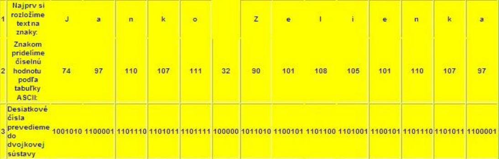

Ľudia pracujú s informáciami. Informácie uložené v počítači sa stávajú údajmi. S údajmi pracujú počítače. Keď potom človek údaje opäť použije pre svoj zámer stávajú sa znova informáciami. Ak pomocou textového editora píšeme list, na obrazovke ho vidíme v čitateľnom tvare – vidíme a vnímame jeho informačný obsah. Súčasne s touto čitateľnou podobou však program vytvára aj vnútornú podobu nášho listu – binárne zakódovaný tvar dokumentu vhodný pre počítač.

Sú to údaje, ktoré v počítači zodpovedajú nášmu listu. Ak sa rozhodneme list v počítači zachovať, zadáme editoru príkaz Ulož dokument ako ... a vtedy sa údaje, ktoré reprezentujú náš list, zapíšu do súboru. Je to pomenovaná skupina údajov, ktoré spolu súvisia a sú uložené v počítači na niektorom pamäťovom médiu.

## Postup digitalizácie

- **1. fáza** – rozdelenia textu na znaky
- **2. fáza** - znaky sú pomocou medzinárodne dohodnutej kódovacej tabuľky (v ktorej sú očíslované všetky použité znaky) prekódované na bajty resp. bity.

Každý znak (aj medzera) má svoj kód. Priradenie binárnych kódov znakom sa nazýva **kódová tabuľka**. Abecedy znakov, ktoré používame pri písaní textu, obyčajne obsahujú viac ako 128 ($2^7$) a menej ako 256 ($2^8$) prvkov. Preto, ako **binárny kód znaku** použijeme **8 bitov**, čiže jeden bajt. 

Text sa v počítači zvyčajne ukladá tak, že sa postupne zakódujú jeho znaky.

**Napríklad:**

Meno **Janko Zelienka** zakódujeme takto:

Všimnime si, že aj medzera má číselnú hodnotu (32), ktorá sa digitalizuje!

**Takže Janko Zelienka v "reči počítača" je:**

> 1001010110000111011101101011110111110000010110101100101110110011010011100101110111011010111100001

**Pre veľkosť textového súboru **bez formátovacích znakov platí:

> **veľkosť súboru (v B) = počet znakov x počet bajtov použitého kódu na znak**.

## ASCII

Zložitejšie texty obsahujú v počítači aj informácie o svojom formáte, teda o farbe a type písma, o veľkosti strany, veľkosti okrajov a pod.

Tieto informácie sa tiež v digitálnej forme ukladajú do súboru.

Najrozšírenejší kód na kódovanie znakov je **ASCII (American Standard Code for Information Interchange)** kód. Je 7 bitový, teda umožňuje zakódovať iba 128 znakov.

Pridaním jedného bitu umožňuje zakódovať aj znaky národných abecied, takto upravený sa nazýva **rozšírený ASCII kód**. Znaky jednotlivých národných abecied tvoria kódové stránky. Každá národná abeceda má svoju kódovú stránku.

- 8 bitový, t.j. 1 znak je zakódovaný v 1 bajte; 8 bitov umožňuje zakódovať 28 = 256 rôznych znakov;
- prvých 128 znakov je pevne daných (z písmen len anglická abeceda; stačil by 7 bitový kód),
-  zvyšných 128 znakov sa mení podľa nastaveného jazyka (národné abecedy).

**Tabuľka základných znakov ASCII (128 znakov):**

## Unicode

Univerzálny kód, ktorý umožňuje zakódovať rôzne znaky zo všetkých bežných jazykov, sa nazýva **Unicode**. Je 16 bitový a obsahuje $2^{16}$ = 65 536 znakov.

16 bitový, t.j. 1 znak je zakódovaný v 2 bajtoch; 16 bitov umožňuje zakódovať 216 = 65 536 rôznych znakov; pozri napr. Word Vložiť – Symbol... – Symboly - Písmo: (normálny text)

**Príklad:**

V programe Word otvorte jednoduchý textový dokument (bez obrázkov, tabuliek, hlavičky a päty a pod.) a cez Súbor – Vlastnosti – Štatistika - Štatistika: Znakov (vrátane medzier) zistite počet znakov v texte. Text prekopírujte do aplikácie Poznámkový blok a uložte ako textový súbor (*.txt). Presvedčte sa, že veľkosť súboru je len málo väčšia (pri jednoriadkovom súbore priamo zodpovedá) súčinu: počet znakov krát bajt.

Aký kód je použitý v textovom súbore? Ako by sa zmenila veľkosť súboru pri použití druhého kódu?

**Pre veľkosť textového súboru** bez formátovacích znakov platí:

> **veľkosť súboru [v B] = počet znakov x počet bajtov použitého kódu na znak [B/znak]**

Ak by boli v texte vytvorené odseky, každé stlačenie klávesu Enter je v textovom súbore zakódované dvoma znakmi – CR (Carriage Return/na začiatok riadka), riadiaci kód 1310 ($D_{16}$) a LF (Line Feed/nový riadok), riadiaci kód 1010 ($A_{16}$).

## Otázky a úlohy

1. Čo je to digitalizácia textu?
2. Aký je rozdiel medzi ASCII a Unicode tabuľkou?
3. Vysvetli ako vypočítame veľkosť textového súboru bez formátovania?
4. Vysvetlite ako vyzerá kódová tabuľka ASCII (koľko znakov obsahuje, koľkými bitmi zapisuje jednotlivé znaky, aké znaky našej abecedy tam nie sú).
5. Vysvetlite ako vyzerá kódová tabuľka Unicode (koľkými bitmi sa zapisuje každý znak, koľko znakov umožní zapísať táto tabuľka, koľko pamäte zaberú znaky v porovnaní s kódovaním ASCII).