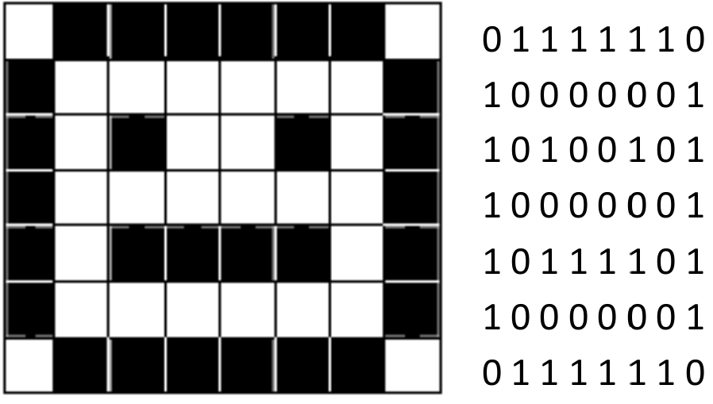
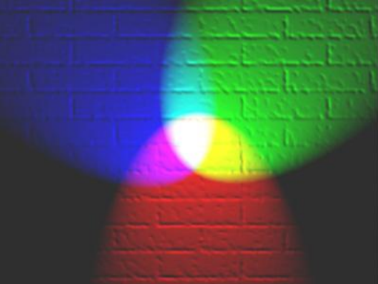
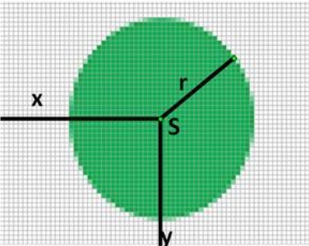

---
title: Digitalizácia obrazu
slug: obraz
publish: true 
--- 

Digitalizácia obrazu je vo všeobecnosti prevedenie grafickej (analógovej) informácie do digitálneho tvaru (do zápisu pomocou čísel). Podľa spôsobu vzniku a záznamu grafickej informácie, t.j. obrázka, kresby, fotografie a pod. v digitálnom tvare, poznáme **rastrovú a vektorovú grafiku**.

## Postup digitalizácie

**1. fáza** – rozdelenie obrázka na body, preloženie mriežky (rastra) cez obrázok
Bitová mapa (bitmapa, bmp):

0 znamená biely bod
1 znamená čierny bod

Náš obrázok sa skladá z 8 x 7 bodov.

**2. fáza** – očíslovanie všetkých možností, u obrázka to najčastejšie znamená očíslovanie všetkých použitých farieb. Opäť platí: n bitov umožňuje zakódovať $2^n$ farieb.

Napr.: 

- 2 farby ( = $2^1$)                                potrebujeme 1 bit
- 3 alebo 4 farby ( = $2^2$)                        potrebujeme 2 bity
- 5 až 8 farieb ( = $2^3$)                          potrebujeme 3 bity
- 16 farieb ( = $2^4$)                              potrebujeme 4 bity
- 256 farieb ( = $2^8$)                             potrebujeme 8 bitov
- High Colour, 65 536 farieb ( = $2^{16}$)          potrebujeme 16 bitov
- True Colour, 16,7 mil. farieb ( = $2^{24}$)       potrebujeme 24 bitov

Pre veľkosť súboru, v ktorom je uložený rastrový obrázok vo formáte bmp platí:

> **veľkosť súboru [v bitoch] = počet bodov obrázka x počet bitov použitej farebnej palety [b]**

**Príklad:**

V aplikácii Skicár v nastavení Obrázok – Atribúty... nastavte Šírka: 800 Výška: 600 pixelov a uložte (Súbor – Uložiť ako...) v rôznych bmp formátoch – zmenou farebnej palety. Veľkosti získaných súborov potvrďte výpočtom.

Napr. pre 256 farebnú bitovú mapu veľkosť súboru = 800 x 600 x 1 B = 480 000 B = 468,75 KiB.

Pripomíname, že v informatike predpony Ki, Mi a Gi znamenajú $2^{10}$ = 1024, $2^20$ = $1024{^2}$ = 1 048 576 a $2^{30}$ = $1024^{3}$ ≈ 1,07 mld.

Ako sa zmení veľkosť súboru, ak obrázok uložíme vo formáte 24 bitovej mapy? Ako sa zmení veľkosť súboru ak z pôvodného obrázka uložíme len výrez 400 x 300 bodov?

Podľa spôsobu vzniku a záznamu **grafickej informácie**, t.j. obrázka, kresby, fotografie a pod. v digitálnom tvare, poznáme **rastrovú a vektorovú grafiku**.

Pri rastrovej grafike grafická informácia obsahuje **popis jednotlivých bodov usporiadaných v mriežke**. Každý bod (**pixel**) má v mriežke určenú svoju presnú polohu, farbu a iné parametre, napr. priehľadnosť. Zväčšovaním rastrového obrázka sa zväčšujú jednotlivé body, čo znižuje kvalitu obrázka.

**Na zmenšenie veľkosti súboru s rastrovým obrázkom** sa používa:

- **paleta farieb** (kódovacia tabuľka pre farby použité v obrázku) Ak by sme v každom obrázku chceli mať k dispozícii „všetky“ farebné odtiene, museli by sme neustále používať 24 bitové kódovanie farieb. Ak je v obrázku použitých napríklad len 256 farieb, zníženie pamäťových nárokov spočíva v tom, že očíslujeme všetky použité farby v obrázku číslami od 0 do 255, a potom kódujeme každý bod tak, že uvedieme poradové číslo farby v palete (kódovacej tabuľke). Tým miesto troch pamäťových miest (zaznamenaný odtieň červenej, zelenej a modrej – pozri model RGB napr. v texte Počítačová grafika) každý bod zakódujeme len pomocou jedného pamäťového miesta.
- **formát gif**, pri ktorom sa v najviac 256 farebnom obrázku rozpoznajú skupiny rovnakých obrazových bodov a do súboru sa o tom zapíše len krátka informácia (zjednodušene napr. modrá modrá modrá modrá modrá modrá modrá modrá modrá sa zapíše 9 krát modrá). Preto obrázky, ktoré neobsahujú rozličné komplikované farebné prechody, zaberú na disku málo miesta. Kompresia je bezstratová. Stratovou sa stáva, ak obrázok obsahuje viac ako 256 rôznych farebných odtieňov, potom sa najprv musí zredukovať počet farieb na 256, a tak sa pri ukladaní do súboru GIF stratí jeho pôvodná kvalita.
- **formát jpg** znamená použitie stratovej kompresie na rastrový obrázok, pri ktorej sú nahradené body s malými zmenami farieb bodmi s príbuznou farbou (stratia sa niektoré farby, ostrosť prechodov). JPEG je vhodný pre fotografické snímky alebo maľby realistických scenérií s hladkými prechodmi v tóne a farbe. V tomto prípade funguje omnoho lepšie ako čisté bezstratové metódy (napr. GIF), pričom poskytuje stále veľmi dobrú kvalitu obrazu.

## Farebný obraz
Zatiaľ sme uvažovali len o čiernobielom obrázku. Iná situácia vzniká, ak chceme digitalizovať farebný obraz. **Farba** je optická vlastnosť. Farby vnímame vďaka svetlu, ktoré vstupuje do nášho oka a dopadá na bunky - čapíky, ktoré sú citlivé na farbu.

Svetlo je vlastne elektromagnetické vlnenie s rôznou vlnovou dĺžkou. Ľudské oko dokáže vnímať iba určitý rozsah vlnových dĺžok svetla. Svetlo s najväčšou vlnovou dĺžkou, ktoré ľudské oko vníma, je červenej farby (780 nm) a svetlo s najnižšou vlnovou dĺžkou je svetlo fialovej farby (380nm). V tomto spektre farieb je ľudské oko schopné bez problémov rozlíšiť vyše 1,5 milióna rôznych farieb.

Nie však každej farbe, ktorú rozlíšime pripadá iná vlnová dĺžka, pretože podľa intenzity dopadajúceho svetla, ľudské oko rozlišuje **sýtosť** a **jas** daného odtieňa farby. Takže iná vlnová dĺžka prislúcha iba rôznym odtieňom farieb.

## Farebný model RGB
Pokusmi sa zistilo, že takmer všetky farby sa dajú vytvoriť ľubovoľným zmiešaním troch nezávislých farieb. Najvýhodnejšie pre výrobu svetelných lúčov (aditívny farebný systém) bolo použitie farieb **červená** (Red), **zelená** (Green), **modrá** (Blue).

Aby sme vedeli vytvoriť 1,5 milióna farieb stačí, ak každú z týchto farieb rozdelíme na **115 odtieňov**, ktorých zmiešaním v rôznych pomeroch vzniknú všetky farby.

Kvôli uchovaniu v pamäti počítača, je však výhodnejšie použiť až **256 odtieňov** každej farby (čo zodpovedá 8 bitom, teda jednému bajtu). To nám umožní vytvoriť až **16 777 216** rôznych farieb.

To znamená, že **každý farebný bod možno zakódovať (digitalizovať ) 3 bajtmi**:

Prvý bajt udáva odtieň červenej farby, druhý zelenej a tretí modrej. Hovoríme o **modeli RGB**.

**Napríklad:**

- **255 0 0 - je sýta červená**
- **0 255 0 - je sýta zelená farba**
- **0 0 255 - je sýta modrá farba**
- **0 0 0 - je čierna farba**

Teda *každý farebný bod* je digitalizovaný troma bajtmi – 3B (24 bitov).

To znamená, že pri rozlíšení 800 x 600 bodov – pixelov, bude mať farebný obrázok 480 000 x 24 bitov = 11 520 000 bitov, čiže 1 440 000 B (bajtov) informácií, čo je 1406,25 kB, teda **1 373 291 016 MB**.

To sme uvažovali pri rozlíšení na 800 x 600 pixelov. Súčasné monitory (resp. grafické karty) dovoľujú bežné rozlíšenie 1280 x 800 pixelov:

Takže farebný obrázok pri tomto rozlíšení bude mať:
> (1280 x 800) x 24 = 24576000 bitov = 3072000 B = 3000 kB = **29 296 875 MB**.

Takýto spôsob digitalizácie má obrovskú nevýhodu. Jednou z nich je veľký objem dát, ktoré obsahuje digitálny súbor. Preto okrem rastrovej grafiky sa používa aj vektorová grafika.

## Vektorová grafika
Pri vektorovej grafike je obrázok zložený z geometrických tvarov (objektov), kde jednotlivé útvary sú popísané matematicky. Objekt je popísaný počiatočným bodom, smerom, dĺžkou,... a jeho vlastnosťami ako farbou obrysovej čiary, farbou výplne, priehľadnosťou, tieňovaním, poradím, v akom bude vykreslený,... Súbor obsahuje postupnosť inštrukcií (príkazov) – návod, ako obrázok zostrojiť. Zväčšovaním vektorového obrázka sa jeho kvalita nemení.

Tento spôsob digitalizácie obrazu nerozkladá obraz na sieť bodov – raster, ale obraz sa rozloží na definované geometrické tvary: kruh, ovál, štvorec, obdĺžnik a pod. Pri tomto spôsobe digitalizácie sa geometrický tvar definuje počiatočným bodom, rozmermi a farbou.

Veľmi zjednodušene:

Zelený kruh je definovaný počiatočným bodom – stred, kde stačí zadefinovať súradnice (podľa osi x a podľa osi y), veľkosť kruhu (danú polomerom) a farbu kruhu. 

Hodnoty súradnice **x**, súradnice **y** a polomeru **r** stačí zaznamenať v digitálnej forme, na to stačia 3 B (jeden pre polomer, druhý pre súradnicu podľa osi X a tretí pre súradnicu podľa osi Y). Ďalšie tri bajty potrebujeme na digitalizáciu farby. Teda spolu 6 B. 

Ak by sa kruh digitalizoval pomocou rastrovej grafiky, každý bod by mal veľkosť 3 bajty a pokiaľ kruh by mal, povedzme 1000 pixelov na digitalizáciu by sme potrebovali 3000 bajtov. Pritom samozrejme sme vypustili okolie kruhu, ktoré má tiež nejakú farbu.

