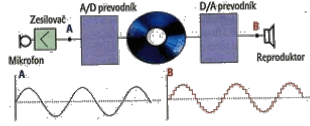
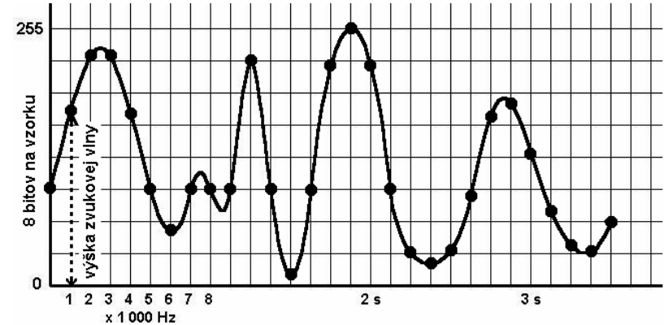

**Zvuk** – je pozdĺžne mechanické vlnenie s istou vlnovou dĺžkou, a teda zodpovedajúcou frekvenciou, s istou farbou a intenzitou (hlasitosťou).

**Zvuk je spojitá - analógová informácia.**

Harmonický zvuk (napr. komorné "a") môžeme znázorniť sínusoidou. Počítače však nevedia spracovávať spojité informácie, preto bolo potrebné vymyslieť spôsob, ako zvuk digitalizovať - previesť na čísla.

## Formáty zvuku

Tak, ako grafické údaje, tak aj zvukové údaje môžeme zakódovať pomocou rôznych formátov.

**Súborové formáty** môžeme rozdeliť do dvoch kategórií:

1. Formáty, ktoré zabezpečujú umelé vytvorenie zvuku
2. Formáty, v ktorých je uložený digitalizovaný zvuk (môžu byť stratové, teda vynechávať menej podstatné dáta, alebo sa môžu striktne snažiť o čo najvernejší záznam zvuku bez straty jeho kvality)

### MIDI formát
**MIDI** (Musical Instrument Digital Interface). Tento formát je prvým typom - zabezpečuje umelé vytvorenie zvuku. Súbor MIDI je súhrn inštrukcií pre zvukový syntetizátor počítača, hudobného nástroja alebo iného zariadenia, podľa ktorých sa zvuk vytvára (rovnaké syntetizátory majú mobilné telefóny, preto sa hudba MIDI označuje tiež polyfonické zvonenie).

Výhodou súborov MIDI je, že na minútu záznamu potrebujú oveľa menší úložný priestor ako ostatné formáty. 

### Wave formát
**Wave** alebo **Waveform** formát (súbor s príponou .wav) vyvinuli spoločnosti IBM a Microsoft na použitie na platforme PC. Stal sa štandardom na záznam zvuku v operačných systémoch Windows. Metódou záznamu dát je najčastejšie **Pulse Code Modulation (PCM)**, ukladajúca **nekomprimované dáta** (Existujú však i ďalšie spôsobí, ktoré Wave formát podporuje ako CCIT, GSM, g.723.1 ...). Princíp uloženia zvuku v tomto formáte popisuje obrázok:

Prevod zvuku z analógovej podoby do digitálnej zabezpečuje **A/D - analógovo - digitálny prevodník**.

Skôr ako sa z analógového signálu stane PCM zvuk, musí najprv prejsť:

- **vzorkovaním**,
- **kvantovaním**
- **kódovaním**.

## Vzorkovanie
Vzorkovač zaznamenáva aktuálne hodnoty analógového signálu v pravidelných intervaloch s istou **frekvenciou** napr. pri frekvencii 10 kHz sa zaznamená hodnota signálu 10 000 krát za sekundu. Vzniká signál **PAM - pulzná amplitúdová modulácia**.

Na obrázku je zakreslená analógová zvuková informácia, ktorá sa s hustotou vzorkovacej frekvencie digitalizuje odčítaním výšky zvukovej vlny, napr. posledný bod má kód 6310 = 001111112 (Na obrázku je zakreslené len každé tisíce odčítanie výšky zvukovej vlny z 8000 odčítaní za sekundu)

- **vzorkovacia frekvencia:** 8 000 Hz
- **počet bitov na vzorku:** 8
- **kvalita:** mono
- **dĺžka v sekundách:** 3,5
- **veľkosť súboru:** 27,4 KiB

**Výpočet veľkosti zvukového súboru**:

> **veľkosť nekomprimovaného zvukového súboru [v bitoch] =**

> **= vzorkovacia frekvencia [Hz] x počet bitov na vzorku [b] x kvalita x dĺžka v sekundách [s]**

**Kde:**

- **vzorkovacia frekvencia** je číslo udávajúce, koľkokrát za sekundu sa zosníma výška analógovej vlny (bežne od 8 000 Hz do 48 000 Hz),
- **počet bitov na vzorku** je číslo vyjadrujúce bohatosťzvuku; 8 bitov znamená 256 hodnotovú stupnicu v smere osi y, 16 bitov znamená 216 = 65 536 hodnotovú stupnicu
- **kvalita** znamená počet kanálov, pri mono jeden (1), pri stereo dva (2)
- **dĺžka v sekundách** je čas trvania skladby (zvuku).

## Príklady

### Príklad č.1
Ku zvukovej karte PC pripojte mikrofón a cez aplikáciu Nahrávanie zvuku (Programy – Príslušenstvo – Zábava – Nahrávanie zvuku) nahrajte a uložte zvuk v nekomprimovanom formáte PCM 8 000 Hz, 8 bitov, mono v dĺžke napríklad 30 sekúnd. Porovnajte veľkosť súboru získanú výpočtom (234,375 KiB) s veľkosťou súboru wav získaného nahrávkou. Ako sa zmení veľkosť súboru pri zmene kvality na stereo?

### Príklad č.2
Zvukový súbor wav má veľkosť55 MiB. Koľko trvá prehranie skladby, ak bola uložená v najvyššej kvalite? [5 minút]

### Príklad č.3
Koľko sekúnd trvá prehranie čiernobieleho videoklipu, ak sa vystrieda 30 obrázkov za sekundu vo
formáte 150 x 150 bodov? Súbor má veľkosť 1,2 MiB.

**Riešenie:**

150 x 150 bodov x 30 /s = 22 500 bodov x 30 /s = 675 000 /s = 675 000 b/s = 84 375 B/s =
= 82,4 KB/s

1,2 MiB = 1 229 KiB; 1 229 KiB : 82,4 KiB/s = 15 s

### Príklad č.4
Skladba bola nahraná v najvyššej kvalite (48 kHz, 2B, stereo) a trvá 2,5 minúty. Koľko MiB zaberá na disku vo formáte wav? Čo a ako sa zmení pri uložení skladby vo formáte mp3?

**Riešenie:**

1 s nahrávky zaberá: 48 000 x 2 B x 2 /s = 192 000 B/s

2,5 min = 150 s: 192 000 B/s x 150 s = 28 800 000 B = 27,5 MiB

## Ďalšie formáty zvuku

- **MPEG1 Layer 3** - veľmi populárny formát, ktorý všetci poznáme ako MP3. Je to stratový audioformát, schopný redukovať množstvo dát potrebných na záznam zvuku až desať násobne. To znamená, že na jedno CD sa zmestí desať bežných audio CD skomprimovaných do tohto formátu. Stratová kompresia spočíva vo využití vlastností ľudského sluchu na odstránenie nepočuteľných zvukov z nahrávky.
- **Windows Media Audio** - konkurenčný stratový zvukový formát spoločnosti Microsoft (súbor s príponou .wma). Vznikol ako odpoveď na formát MP3 a ako priama konkurencia spoločnosti RealNetworks. Microsoft deklaruje kvalitu záznamu porovnateľnú s CD kvalitou už pri dátovom toku 64 kb/s, čím má prekonať MP3, ale nezávislé testy to nepotvrdzujú. Formát umožňuje vložiť do záznamu aj digitálne riadenie autorských práv, Digital Rights Management (DRM), preto ho na publikovanie nahrávok preferujú skôr vydavateľstvá.
- **OGG Vorbis** - rovnako veľmi kvalitný stratový formát. Jeho výhodou je to, že je **Open Source** (tzn. je verejne k dispozícii zdrojový program a ktorýkoľvek programátor si ho môže upraviť podľa vlastných potrieb)
- **RealAudio** je audioformát spoločnosti RealNetworks (súbor s príponou .ra). Vyžaduje si vlastný prehrávač zvuku. Je uspôsobený najmä na prenos zvuku pri nízkom bitrate. Často sa teda používa pri publikovaní cez internet pomocou tzv. prúdového audia.

## Viackanálové formáty zvuku

- **AAC** - MPEG-4 Advanced Audio Coding je veľmi kvalitná kompresia zvuku, ktorá umožňuje použiť takmer neobmedzený počet kanálov. Nevýhodou je, že nie je zadarmo.
- **AC3** - Dolby Digital. Najviac sa používa na kódovanie zvukových stôp na DVD. Aj keď tento formát nedosahuje takú dobrú kvalitu, je často používaný.
- **DTS** - Digital Theater Systems je ďalší formát určený pre DVD. Poskytuje vyššiu kvalitu než AC3, ale za cenu extrémne vysokého bitového toku.

## Programy

### Na prehrávanie zvuku

Jedným z najdôležitejších parametrov prehrávacieho programu je to, koľko zvukových formátov dokáže prehrať. Keď vznikol nový zvukový formát, bolo potrebné stiahnuť si novšiu verziu prehrávača, do ktorého výrobcovia pridali jeho podporu. Niektorí výrobcovia však tento problém vyriešili inak. Navrhli svoj prehrávač tak, aby dokázal prehrať akýkoľvek formát pomocou tzv. kodekov.

**Kodek** je vlastne akýsi návod pre prehrávač, pomocou ktorého vie dekódovať daný zvukový formát. V operačnom systéme Windows sa nachádza práve takýto typ prehrávača s názvom Media Player. Okrem tohto prehrávača však existuje obrovské množstvo voľne dostupných prehrávačov, z ktorých najznámejšími sú WinAmp a Sonique. Súčasný výkon počítača však už umožňuje i prehrávanie viacerých skladieb súčasne, takže môžeme pomocou prehrávača ako napríklad OTS Turntables mixovať skladby ako DJ na diskotéke.

### Na nahrávanie a úpravu zvuku
Najjednoduchším programom pre nahrávanie zvuku je program **"Nahrávanie zvuku"**, ktorý je súčasťou operačného systému Windows. Program ponúka aj jednoduché efekty, ako je zrýchlenie, či spomalenie záznamu, vloženie ozveny a zaujímavé spätné prehrávanie. 

Medzi **vyspelejšie editory**, ktoré umožňujú nahrávať a upravovať viac kanálov a sú dostupné zadarmo, patrí program **Audacity**. Umožňuje nahrávať neobmedzený počet kanálov, strihať, kopírovať a mixovať ich dohromady. Dokáže tiež zmeniť rýchlosť prehrávania a hlasnosť jednotlivých kanálov, odstrániť šum a výsledok uložiť v rôznych formátoch. 

Medzi **profesionálne nástroje**, ktoré obsahujú viac ako 50 efektov na úpravu zvukových kanálov patria programy **SoundForge** od firmy Sony a **Audition** od firmy Adobe.