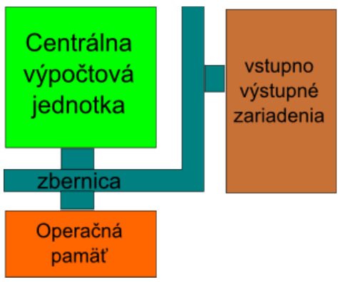
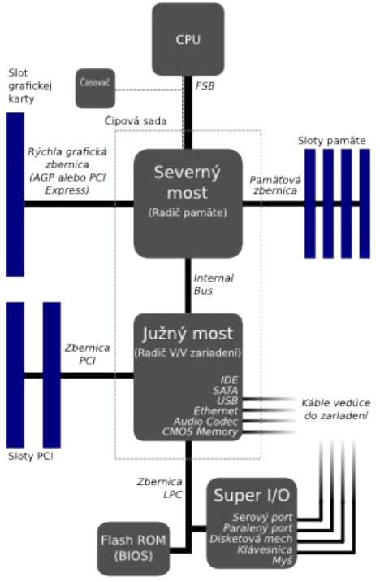

Dnešné počítače používajú vylepšené obmeny schémy, ktorú navrhol John von Neuman v roku 1946.

Von Neumanova schéma používa 4 základné stavebné prvky: centrálnu výpočtovú jednotku označovanú skratkou **CPU** (Central Proccesor Unit) alebo tiež slovom "procesor", **operačnú pamäť**, **zbernicu**, a **vstupno-výstupné zariadenia**.

## Popis činností jednotlivých súčastí počítača von Neumannovho typu.

1. Riadiaca jednotka nahrá program, ktorý sa má vykonávať prostredníctvom zbernice zo vstupného zariadenia do operačnej pamäte.
2. Počas vykonávania programu sa jednotlivé inštrukcie z operačnej pamäte postupne prenášajú do procesora, ktorý ich spracováva.
3. Spracované výsledky sa uložia späť do pamäte.
4. Počas vykonávania programu môže procesor komunikovať so vstupno-výstupnými zariadeniami a zobrazovať, tlačiť a prijímať nové údaje.

## Popis procesu spracovania inštrukcie procesorom

Spôsoby spracovania môžeme rozdeliť na:
- prúdové
- dynamické

Cieľom prúdového spracovania inštrukcií (pipelining) je urýchliť činnosť procesora tým, že sa inštrukcie vykonávajú paralelne. Vychádzame z toho, že **spracovanie inštrukcie** možno rozložiť na (spravidla) päť jednoduchších úkonov, ktoré na seba nadväzujú:

1. prenos inštrukcie z pamäte do procesora (Instruction Fetch - IF),
2. dekódovanie (Instruction Decode - ID) - inštrukcia sa konvertuje do jednoduchých povelov (mikrooperácií), ktoré výkonné jednotky procesora dokážu vykonať,
3. výber operandu z pamäte (Data Access - DA),
4. samotné vykonanie operácie (Execution - EX),
5. zápis výsledku do pamäte (Write Back - WB).

Dynamické spracovanie inštrukcií je súbor metód, ktorých cieľom je zvýšiť efektívnosť práce procesora tým, že sa predpovedá a mení poradie vykonávania inštrukcií.

## Význam vybraných parametrov procesora
Procesor načítava program a jeho údaje do pamäte, vykonáva inštrukcie programu a komunikuje s ostatnými zariadeniami prostredníctvom zbernice. Rýchlosť a výkon procesora ovplyvňuje niekoľko faktorov:

- **taktovacia frekvencia** - počet krokov vykonaných za jednu sekundu,
- **veľkosť registrov resp. dĺžka slova** - počet bitov spracovávaných pri jednej operácii,
- **typ inštrukčnej sady** - počet rôznych inštrukcií, ktoré je procesor schopný vykonať,
- **efektivita mikrokódu** - počet krokov potrebných na vykonanie jednej inštrukcie (napr. vynásobenie dvoch čísel),
- **počet jadier** - počet samostatných inštrukčných dekóderov,
- **počet inštrukčných kanálov** - maximálny počet inštrukcii, ktoré sa dajú vykonať v jednom kroku,
- **veľkosť vyrovnávacích pamätí** - počet inštrukcií, ktoré má procesor k dispozícii na spracovanie,
- **veľkosť adresovateľnej pamäte** - veľkosť pamäte, ktorú je schopný procesor používať.

### Taktovacia frekvencia
Taktovacia frekvencia určuje počet operácií, ktoré je procesor schopný vykonať za jednu sekundu. Udáva sa v násobkoch jednotky Hertz napríklad 3 GHz.

### Dĺžka slova
Pod šírkou spracovávaného slova myslíme maximálny počet bitov, ktorý je mikroprocesor schopný naraz spracovať. Procesor má v sebe zabudované tzv. registre, do ktorých sa ukladajú údaje s ktorými má procesor vykonať nejakú operáciu. Registre napríklad vstupujú ako operandy do matematických inštrukcíí (sčítanie, odčítanie...).

Veľkosť registrov je zhodna s veľkosťou slova. V súčasnosti sa najviac používajú 64 bitové procesory.

### Inštrukčná sada
Inštrukčnou sadou rozumieme súbor inštrukcií, ktoré môže procesor vykonávať. Na základe toho, z akého typu inštrukcií pozostáva inštrukčná sada, môžeme rozdeliť procesory na:

- **CISC** (Complex Instruction Set Computer - Počítač s úplnou inštrukčnou sadou) predstavuje zložité inštrukcie pozostávajúce z mikroinštrukcií, jedinou inštrukciou je možné vykonať zložitú operáciu, čo sa môže zdať výhodné, no takýto procesor vyžaduje zložitý dekóder inštrukcií a spracovanie inštrukcie trvá viacero cyklov
- **RISC** (Reduced Instruction Set Computer - Počítač s obmedzenou inštrukčnou sadou) inštrukčná sada pozostáva z malého počtu elementárnych inštrukcií, ktorými je možné vytvoriť zložitejšie operácie, jednoduché inštrukcie rovnakej dĺžky znamenajú, že procesor má jednoduchý dekóder inštrukcií, taktiež RISC procesory obsahujú veľký počet interných registrov s univerzálnym použitím, čo urýchli výkon programu, pretože väčšina operácií prebieha medzi registrami a ALU

## Hlavné súčasti procesora
Hlavnými súčasťami procesora (CPU) sú:

- Riadiaca jednotka (Control Unit)
- Aritmeticko logická jednotka (ALU)
- Pamäťové registre

### Riadiaca jednotka
Riadiaca jednotka riadi riadi tok údajov a vykonávanie operácií v inštrukčnom cykle. Riadiaca jednotka pozostáva z časti:

- **Register inštrukcií**, ktorý uchováva operačný znak inštrukcie počas jej vykonania.
- **Dekodér inštrukcií**, ktorý obsah dekóduje a generuje riadiace signály pre procesor.

### Aritmeticko-logická jednotka
Aritmeticko-logická jednotka vykonáva všetky aritmetické a logické operácie. Tieto operácie sú realizované pomocou obvodov ako sčítačka, odčítačka, násobička, delička, negátor a podobne. Výsledky ukladá do registrov počítača alebo do pamäte.

### Počet jadier a inštrukčných kanálov procesora
Moderné procesory obsahujú viacero jadier, z ktorých každé môže mať viacero inštrukčných kanálov. To umožňuje použiť paralelné výpočty.

### Registre
Register je úložisko pre jedno slovo (napr 64 bitov). Registre v procesore majú rôzne významy. Niektoré slúžia na presne stanovený účel, iné slúžia na voľné použitie.

### Veľkosť vyrovnávacej pamäte
Vyrovnávacia pamäť slúži na vyrovnávanie oneskorenia zbernice oproti rýchlosti procesora. Keby procesor nemal vyrovnávaciu pamäť, musel by čakať pokým sa k nemu údaje dostanú z pamäte cez niekoľko násobne pomalšiu zbernicu. V prípade vyrovnávacej pamäte jedna časť procesora načíta naraz celý blok údajov priamo do procesora a druhá časť môže zatiaľ vykonávať operácie.

S príchodom dynamického spracovania inštrukcií bola **cache rozdelená do dvoch úrovní**. Druhá úroveň má za úlohu vyrovnať spomalenie, v prípade zlej predikcie.

S príchodom viackanálových a viacjadrových procesorov bolo potrebné **zaviesť tretiu úroveň vyrovnávacej pamäte** kvôli zdieľaniu údajov medzi jadrami procesora.

Veľkosť vyrovnávacích pamätí sa udáva v násobkoch jednotiek Bajt (napr. 256 kB).

## Postup pri zápise a čítaní z operačnej pamäte
Operačná pamäť slúži na ukladanie programov a údajov, ktoré spracováva procesor. Je realizovaná pomocou pamäte typu **RAM - pamäte s náhodným prístupom**. Táto pamäť je dočasná a po vypnutí počítača sa jej obsah zmaže. 

**Výkon počítača ovplyvňuje:**

- **Množstvo pamäte**, ktoré sa udáva v násobkoch jednotky bajt (napr 4 GB)
- **Taktovacia frekvencia**. Počet slov, ktoré dokáže pamäť zapísať alebo prečítať za jednu sekundu udávaná v násobkoch jednotky Hertz (napr. 400 MHz).

### Adresovanie pamäte
Maximálna veľkosť pamäte je obmedzená adresným priestorom procesora. V súčasnosti je to 48 bitov, čo umožňuje adresovať $2^{48}$ bajtov (t.j. 256 TB).

## Zbernice
Zbernica slúži na prepojenie procesora s ostatnými súčasťami počítača. Je rozdelená do troch častí:

- **Adresná** - časť zbernice, na ktorú sa nastaví adresa zariadenia, s ktorým chce procesor komunikovať
- **Riadiaca** - časť zbernice, cez ktorú do zariadenia posielajú príkazy, ktoré zariadenie vykonáva
- **Dátová** - časť zbernice, cez ktorú sa prenášajú údaje

Rýchlosť komunikácie po zbernici je riadená Časovačom. Počet prenosov za jednu sekundu sa udáva v násobkoch jednotky Hertz (napr. 800MHz). V súčasnosti sa v počítačoch nachádza niekoľko zberníc, ktoré sú prepojené mostami.

- **FSB** (Front Side Bus) je systémová zbernica medzi procesorom a severným mostom (North Bridge). Jeho súčasťou je radič pamätí, radič zbernice grafickej karty (PCI Express alebo staršej AGP) a vnútorný radič.
- **HyperTransport**: vylepšená zbernica FSB – v tomto prípade je radič pamäte súčasťou procesora a zbernica Hyper Transport je prepojená so severným mostom, ktorého súčasťou je iba zbernica pre grafickú kartu a vnútorná zbernica.
- **Vnútorná zbernica** prepája severný most s južným mostom. Južný most obsahuje radič vstupno výstupných zariadení. Sú k nemu pripojené zbernice diskových zariadení (S-ATA, P-ATA, SCSI), zbernica prídavných kariet (PCI), univerzálna zbernica (USB).
- **Južný most** je ďalej pripojený k zbernici LPC a k pamäti, v ktorej sa nachádza základný vstupno výstupný systém počítača - BIOS. Tento systém slúži na to, aby po zapnutí počítača uviedol počítač do činnosti a spustil zavádzanie operačného systému počítača.
- **Zbernica LPC** je vlastne "zdedenou" zbernicou od starších počítačov. Ide o zbernicu, ktorá komunikuje s radičom, ktorý komunikuje s disketovou mechanikou,klávesnicou, myšou, sériovým rozhraním (Com), a paralelným rozhraním (LPT) (fialový konektor na klávesnicu a zelený na myšku...)