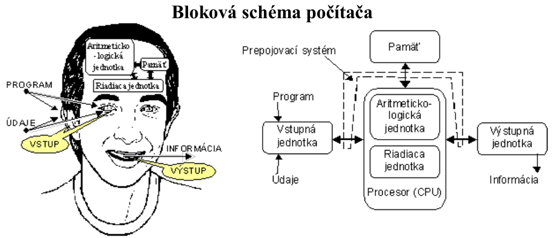

## Doba "kamenná"
Históriu a vývoj počítačov by sme mali datovať možno od roku 1614, kedy Napiér objavil logaritmy a zostrojil Napiérove kosti. Logaritmické pravítko bolo symbolom inžinierov, po nástupe mikropočítačov sa stalo relikviou.

**Míľniky:**

- **Abakus** – mechanické guľôčkové počítadlo z Arábie, rôzne typy (sčot, kalkulus)
- **"paskalína"** - súčtová mosadzná kalkulačka Blaisa Pascala - r. 1645 – ozubené kolieska
- **ENIAC** - veľký elektrónkový počítač z roku 1946

| **Osobnosť**                        | **Prínos**                                                                                                                                                                                                                                                                                                                              |
|-------------------------------------|-----------------------------------------------------------------------------------------------------------------------------------------------------------------------------------------------------------------------------------------------------------------------------------------------------------------------------------------|
| **Wilhelm Schickard** (1592 - 1635) | zostrojil 1. číslicovú kalkulačku na +, -, x, založený na princípe ozubených kolies.                                                                                                                                                                                                                                                    |
| **Blaise Pascal** (1623 - 1662)     | prvú kalkulačku zostrojil ako 19-násť ročný, od Ľudovíta XVI. neskôr dostal privilégium na výrobu 50 "paskalín                                                                                                                                                                                                                          |
| **G. W. Leibnitz** (1646 - 1716)    | zostrojil kalkulačku pre výpočet hodnôt polynómu, ale keďže niekedy do seba zapadalo až 25 kolesok, pochopil, že počítací stroj nemôže pracovať v 10. sústave.                                                                                                                                                                          |
| **Charles Babbage** (1792 - 1871)   | **Difference engine** - výpočet hodnôt diferencií polynómu až do 6. stupňa. Jeho 96 koliesok na 24 osiach sa začali otáčať v roku 1822. V roku 1837 zostrojil tzv. **Analytical engine**, ktorý mal podobu univerzálneho programovateľného stroja, kde vstup a výstup boli realizované pomocou diernych štítkov - Jacquardových kariet. |
| **Hermann Hollerith** (1860 - 1929) | podujal sa na sčítanie ľudu Spojených štátov v roku 1890, ktoré v roku 1880 500 úradníkov vyhodnocovalo 7 rokov. 43 "holeritov" - dierno-štítkových strojov a 50 zamestnancov vyhodnotilo za 1 mesiac. O tieto stroje prejavili záujem banky, poisťovne, firmy...                                                                       |

## Generácie počítačov

### Nultá generácia počítačov
Počítače 0. generácie pracovali na princípe **elektromagnetického relé**, ktoré využívalo 2 stavy a teda pracovali v dvojkovej sústave. Nemecký inžinier **Konrád Zuse** zostrojil elektromechanický počítací automat **Z-1**, neskôr až **Z-4**, ktorý sa skladal z 2600 relé a rýchlosť 1 výpočtu trvala niekoľko sekúnd. Vstup bol realizovaný klávesnicou, výstup pomocou žiarovkového zobrazovača. Počítač bol zničený pri bombardovaní Berlína (používal sa ako šifrovací stroj).

Na americkom kontinente profesor matematiky na Harwardskej univerzite a zakladateľ firmy IBM **Howard Aiken** uviedol v roku 1944 do prevádzky monštrum pod názvom **MARK I**. Vo vnútri 5,5t počítača pracovalo 3500 relé, mal dĺžku 15 m, sčítanie dvoch čísel trvalo 1/3 s, násobenie 6 s. Stroj pracoval v 10-kovej sústave a pracoval na vývoji atómovej bomby.

| **Obdobie** | **Veľkosť** | **Z čoho**             | **Na čo**      | **Koľko**  |
|-------------|-------------|------------------------|----------------|------------|
| 30-te roky  | haly        | elektromagnetické relé | vojenské účely | na zakázku |

### Prvá generácia počítačov 1944 - 1956
Vývoj prvého elektrónkového počítača si vynútila vojnová situácia, keď bolo potrebné urýchliť výpočty balistických dráh striel. V roku 1946 bol uvedený ENIAC, postavený z 18000 elektróniek, chladených 2 leteckými motormi. 30t monštrum spotreboval na žhavenie 140 kW, robil za 1 s 5000 čítaní, 300 násobení, pracoval v 10. sústave (10 elektróniek - každá predstavovala jednu cifru), pamäť sa nastavovala (programovala) 130 prepínačmi. Jeho výkon dnes dokáže nahradiť IO na čípe veľkom ako necht malíčka.

Slabiny naprogramovania ENIACu si uvedomoval "otec počítačov" **John von Neumann** (1903-1957). Sformuloval **zásady tvorby počítačov**:

1. Počítač sa nemá prispôsobovať programu, musí byť univerzálny
2. Program musí byť uložený v pamäti počítača.
3. Program sa vykonáva sekvenčne.

Neumann stál pri zrode myšlienky sériovej výroby počítačov, ktorú zahájil v roku 1951 **UNIVAC**, ktorý bol plne programovateľný, pracoval v binárnej sústave a programovalo sa v strojovom jazyku.

| **Obdobie** | **Veľkosť** | **Z čoho** | **Na čo**      | **Koľko**       |
|-------------|-------------|------------|----------------|-----------------|
| 40-te roky  | haly        | elektrónka | vojenské účely | jednotlivé kusy |

### Druhá generácia počítačov 1956 - 1964
V roku 1948 bol objavený **tranzistor**, ktorý nahradil veľkú elektrónku, pričom zmena stavu tranzitora sa udeje za 1 nanosekundu. Počítače tejto generácie pracovali s magnetickými pamäťami, vnútorná pamäť bola zložená z feritových jadier (1 jadro - 1 bit) a využívala tzv. deštruktívne čítanie.

Programy sa písali v nižších programovacích jazykoch, počítače úlohy spracovávali dávkovo, slúžili hlavne na hromadné spracovanie dát, ako aj vedecko-technické výpočty.

| **Obdobie** | **Veľkosť** | **Z čoho** | **Na čo**                                | **Koľko**          |
|-------------|-------------|------------|------------------------------------------|--------------------|
| 50-te roky  | miestnosti  | tranzistor | vojenské účely, hromadné spracovanie dát | malosériová výroba |

### Tretia generácia počítačov 1964 - 1980
V roku 1964 vznikol plát kremíka, na ktorom bolo prepojených rádovo 100 aktívnych prvkov, ktorý bol nazvaný ako **integrovaný obvod** (IO).

Podľa počtu prvkov na doštičke rozoznávame tzv. **hustotu integrácie**:

- **SSI** - single scale integration - 100 aktívnych prvkov
- **MSI** - midle scale integration - 1000 aktívnych prvkov
- **LSI** - large scale integration - 10000 aktívnych prvkov

Počítače využívali diskové magnetické pamäte, vyrovnávacie pamäte, operačnú pamäť na princípe IO, viacužívateľské OS, asynchrónne spracovanie žiadosti o prerušenie z periférií, programovalo sa už vo vyšších programovacích jazykoch. Za 1s bol schopný počítač 3. generácie vykonať 10000 - 100000 inštrukcií. Počítač obsluhoval tím operátorov, bežný programátor sa k takému počítaču ani nedostal. 

| **Obdobie** | **Veľkosť** | **Z čoho**         | **Na čo**                                                                     | **Koľko**      |
|-------------|-------------|--------------------|-------------------------------------------------------------------------------|----------------|
| 60-te roky  | skrine      | integrované obvody | hromadné spracovanie dát, vedecké výpočty, riadenie prevádzky strojov, armáda | sériová výroba |

### Štvrtá generácia počítačov 1980 - dnešok

#### 1. etapa
V roku 1980 **vysoká hustota integrácie** (**VLSI** - very large scale integration) natoľko zmenšila rozmery počítača, že mohol byť umiestnený na stôl, prvý počítač bol "ušitý" na jednoužívateľský jednoúlohový operačný systém DOS a mal označenie 8088. Na 1 $cm^2$ bolo umiestnených až 100000 prvkov. Začala éra 8-bitových počítačov.

Mikroprocesor s označením **80286** však pracoval už so 16-bitovým slovom, 80486 s 32-bitovým slovom.

| **Obdobie** | **Veľkosť** | **Z čoho**                                                      | **Na čo**                                 | **Koľko**           |
|-------------|-------------|-----------------------------------------------------------------|-------------------------------------------|---------------------|
| 80-te roky  | skrinky     | integrované obvody s vysokou hustotou integrácie, mikroprocesor | široké využitie v ekonomike, vede, armáde | veľkosériová výroba |

#### 2. etapa
**Mikroprocesor s ultra vysokou hustotou integrácie** (**ULSI** - ultra large scale integration - 5 miliónov akt. prvkov) napr. od firmy Intel je skôr známy pod názvom "pentium". Pracuje už s 64 - bitovým slovom, oproti zásadám von Neumanna vykonáva inštrukcie paralelne vďaka "pipeliningu" a je schopný vykonať za 1 sekundu v závislosti od taktovacej frekvencie až 10 miliónov inštrukcií.

| **Obdobie** | **Veľkosť**                 | **Z čoho**    | **Na čo**                                                 | **Koľko**            |
|-------------|-----------------------------|---------------|-----------------------------------------------------------|----------------------|
| 90-te roky  | na stole, prenosné počítače | mikroprocesor | všetky oblasti spracovanie a prenosu informácií, internet | hromadná veľkovýroba |

#### 3. etapa
Napriek neustálemu zmenšovaniu rozmerov, zvyšovaniu počtu akt. prvkov a zvyšovaniu taktovacej frekvencie, existuje isté obmedzenie - **rýchlosť svetla**! (Svetlo prejde vo vákuu za $10^{-10}$ sekundy len 3 centimetre.) Preto zvyšovať výkonnosť je možné len paralelnými systémami - viacerými mikroprocesormi, ktoré si vedia úlohy "podeliť medzi seba". Ale to už nie je história, ale súčasnosť!

| **Obdobie**              | **Veľkosť**           | **Z čoho**                                                         | **Na čo**                                                                                      | **Koľko**            |
|--------------------------|-----------------------|--------------------------------------------------------------------|------------------------------------------------------------------------------------------------|----------------------|
| od začiatku 21. storočia | zošit A4, NB, tablety | výkonnejší mikroprocesor, paralelné systémy, viacjadrové procesory | všetky oblasti ľudského života, hromadne sa objavuje v školstve, domácnostiach, sociálne siete | hromadná veľkovýroba |

Von Neumanova schéma bola navrhnutá v roku 1945 americkým matematikom Johnom Von Neumannom ako model samočinného počítača. Tento model s istými výnimkami zostal zachovaný dodnes.

- **Operačná pamäť:** Slúži k uchovaniu spracovávaného programu, dát a výsledkov výpočtov.
- **ALU:** Arithmetic-logic Unit /aritmeticko logická jednotka/: Jednotka prevádzajúca všetky aritmetické výpočty a logické operácie.
- **Radič:** Riadiaca jednotka, ktorá riadi činnosť všetkých častí počítača. Toto riadenie je prevádzané pomocou riadiacich signálov, ktoré sú zasielané jednotlivým modulom.
- **Vstupné zariadenia:** Určené pre vstup programu a dát.
- **Výstupné zariadenia:** Určené pre výstup výsledkov, ktoré program spracoval.

## Von Neumannova koncepcia počítača

Táto koncepcia digitálneho počítača vznikla okolo roku 1946. Základné moduly ním navrhnutého počítača sú: procesor, radič, operačná pamäť, vstupné a výstupné zariadenie a to všetko tvorí základ architektúry súčasných počítačov.

### Základné princípy
- dvojková sústava
- programy a dáta v operačnej pamäti (nenačítajú sa z vonkajšej pamäti v priebehu výpočtu, jednotné kódovanie - k programom môžeme pristupovať ako k dátam, to umožnilo univerzálnosť počítača, bezproblémové zavedenie cyklov a podmieneného vetvenia)
- rýchlosť vnútornej pamäti je porovnateľná s rýchlosťou aritmetickej jednotky
- priame adresovanie (prístup) - v ľubovoľnom okamžiku je prístupná ktorákoľvek bunka pamäti
- aritmeticko-logická jednotka - len obvody pre sčítanie čísiel (ostatné operácie sa dajú prevádzať na sčítanie)

### Von Neumannov počítač

1946 John von Neumann

1. 5 funkčných jednotiek – riadiaca jednotka, aritmeticko-logická jednotka, pamäť, vstupné zariadenie, výstupné zariadenie
2. Štruktúra je nezávislá na spracovávaných problémoch, na riešení problému sa musí zvonka zaviesť návod na spracovanie (program) a musí sa uložiť do pamäte. Bez tohto programu nie je stroj schopný pracovať
3. Programy, dáta, medzivýsledky a konečné výsledky sa ukladajú do tej istej pamäti
4. Pamäť je rozdelená na rovnako veľké bunky, ktoré sú priebežne očíslované, cez číslo bunky (adresu) sa dá prečítať alebo zmeniť obsah bunky
5. Po sebe idúce inštrukcie programu sa uložia do pamäťových buniek idúcich po sebe, prístup k nasledujúcej inštrukcii sa uskutoční z riadiacej jednotky zvýšením inštrukčnej adresy o 1
6. Inštrukciami skoku sa dá odkloniť od spracovania inštrukcií v uloženom poradí
7. Existujú aspoň - aritmetické inštrukcie (sčítania, násobenia, ukladania konštánt,...), logické inštrukcie (porovnávania, not, and, or,...), inštrukcie prenosu (z pamäti do riadiacej jednotky a na vstup/výstup), podmienené skoky a ostatné (posunutie, prerušenie, čakanie,...)
8. Všetky dáta (inštrukcie, adresy,...) sú binárne kódované, správne dekódovanie zabezpečuje vhodné logické obvody v riadiacej jednotke logická štruktúra

### Princíp činnosti počítača podľa von Neumanna
Do operačnej pamäti sa pomocou vstupných zariadení cez ALU umiestni program, ktorý bude vykonávať výpočet. Rovnakým spôsobom sa do operačnej pamäti umiestnia dáta, ktoré bude program spracovávať. Prebehne vlastný výpočet, pričom jednotlivé kroky vykonáva ALU.

Táto jednotka je v priebehu výpočtu spolu s ostatnými modulmi riadená radičom počítača. Medzivýsledky sú ukladané do operačnej pamäte. Po skončení výpočtov sú výsledky poslané cez ALU na výstupné zariadenie.

Názorne si môžeme popísať Von Noumannovu schému. Predstavme si bežný počítač, aký máme bežne doma.

Každý počítač má matičnú dosku. Na tejto doske je sústredené všetko to, čo v počítači pracuje. Srdcom každého počítača je procesor. Ten vo Von Neumannovej schéme predstavuje ALU.

Ďalšou dôležitou časťou každého počítača je operačná pamäť. V bežnom počítači je to pamäť typu RAM (Random Access Memory).

Radič riadi chod jednotlivých častí počítača.

**Vstupné zariadenia** – sú to periférne (prídavné) zariadenia pomocou ktorých vkladáme informácie do počítača. Patrí sem napríklad klávesnica, myš, CD-ROM, DVD-ROM a skener. Vstupné zariadenia spracovávajú vstupné informácie zadávané človekom, prevádzajú ich do binárneho kódu a takéto informácie poskytuje programu na spracovanie.

**Výstupné zariadenia** – sú to periférne zariadenia pomocou ktorých nám vystupujú z počítača spracované informácie. Patria sem monitor, reproduktory, tlačiarne. Výstupné zariadenia spracovávajú už spracované informácie v binárnom kóde a prekladajú ich do výstupného formátu nám zrozumiteľného.
