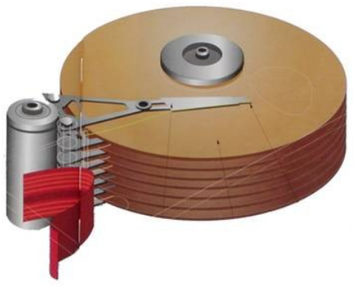
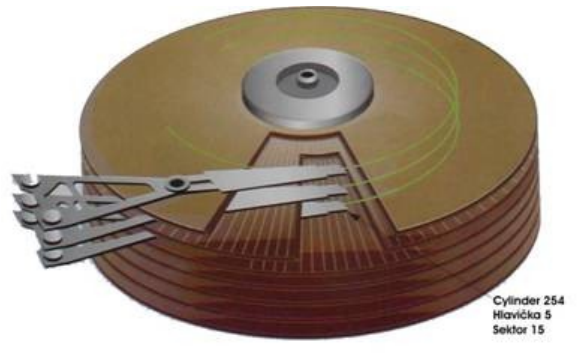
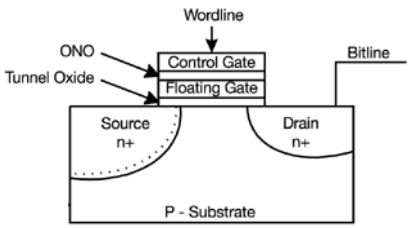

**Pamäť** je funkčná jednotka na uchovávanie údajov.

Digitálne pamäte pozostávajú z pamäťových prvkov, ktoré sú schopné v závislosti od vonkajšieho signálu nadobúdať jeden z dvoch dovolených stavov a zotrvávať v ňom dovtedy, pokým sa stav vplyvom ďalšieho signálu nezmení. Pamäťový prvok si pamätá jeden bit - t.j. jednotku informácie. Jednoduchou digitálnou pamäťou je žiarovka so stavmi "vypnutá" a "zapnutá".

Pamäťové prvky sú väčšinou zoskupené do pamäťových buniek alebo tzv. bajtov. Uložený údaj sa lokalizuje jednoznačnou identifikáciou pamäťovej bunky, v ktorom sa daný údaj nachádza. Túto identifikáciu voláme adresa. Súhrn viacerých pamäťových buniek sa nazýva slovo. Slovo zodpovedá množstvu údajov, ktoré môže vystupovať ako operand inštrukcie procesora, a ktoré zodpovedá šírke dátovej zbernice.

Medzi základné charakteristiky pamäti patrí jej veľkosť (kapacita) udávaná v násobkoch jednotky bajt (narp. 4GB) a prístupová doba v zlomkoch sekúnd (napríklad 5 ns) alebo pomocou pracovnej frekvencie v násobkoch jednotiek Hertz (napríklad 1333MHz) udávajúcej počet prístupov za sekundu. Pri dynamických pamätiach sa udáva aj časovanie pamäte, ktoré je udávané štvoricou čísel v tvare CL-Trp-Tras-Trcd (napr 9-9-9-24).

- **CL** (CAS latency) - určuje počet cyklov, ktoré sú potrebné na zvolenie správnej adresy.
- **Trp** (Precharge to Active, RAS# Precharge) určuje počet cyklov, ktoré sú potrebné na prednabitie pamäte.
- **Tras** (Active to Precharge) je dĺžka pamäťového cyklu banky, ktorá udáva počet cyklov, ktoré uplinú od aktivácie po jej prednabitie
- **Trcd** (Active to CMD, RAS# do CAS# delay) určuje čas potrebný na aktiváciu banky predtým, ako môže byť vydaný príkaz na čítanie.

**Pamäte rozlišujeme podľa nasledujúcich kritérií:**

- podľa **spôsobu prístupu**:
    - Pamäte s priamym prístupom skrátene označované RAM
    - Pamäte s cyklickým prístupom (napríklad rotujúce disky)
    - Pamäte so sekvenčným prístupom (napríklad magnetická páska)
- podľa **možnosti zápisu**:
    - Pamäte na čítanie aj zápis skrátene označované RWM
    - Pamäte len na čítanie skrátene označované ROM
- podľa **závislosti od zdroja energie**:
    - Trvalé - energeticky nezávislé
    - Statické - uchovávajú svoj obsah pokým sú napájané energiou
    - Dynamické - strácajú svoj obsah po určitom časovom intervale, je potrebné ich obnovovať

## Operačná pamäť
**Operačná pamäť** obsahuje časti programov (vrátane operačného systému), ktoré má vykonať procesor. Väčšinou je realizovaná dynamická RWM RAM pamäť - ide teda o krátkodobú pamäť počítača, ktorá je viacmenej určená ku krátkodobému zápisu aj čítaniu dát. Pri vypnutom stave (alebo reštarte) sú všetky dáta nenávratne stratené, preto je nutné uložiť ich na iný typ pamäte.

Operačná pamäť je niekoľko násobne rýchlejšia ako trvalé pamäte nezávislé od zdrojov energie. Čím väčšia je veľkosť operačnej pamäte tým viac programov môžeme mať spustených. Ak má operačný systém nedostatok operačnej pamäte, pomocou stránkovania odkladá práve nepoužívané časti operačnej pamäte na oveľa pomalšie trvalé pamäte, čo výrazne spomalí chod systému.

## Rýchle vyrovnávacie pamäte (cache)
**Rýchla vyrovnávacia pamäť (cache)** je malá, ale rýchla statická pamäť, ktorá slúži na vyrovnávanie oneskorenia dvoch zariadení pracujúcich s rozdielnou rýchlosťou - radiča operačnej pamäte a procesora.

V programe sa často opakuje prístup k tým istým, alebo blízkym (sekvenčne blízkym) pamäťovým referenciám, poprípade sa opakovane v slučke vykonáva určitá postupnosť inštrukcii. Pomocou špeciálnej rýchlej vyrovnávacej pamäti Cache (akéhosi príručného medzi skladu) možno odstrániť čakanie na prístup k dynamickej operačnej pamäti, nakoľko pamäť cache je podstatne rýchlejšia a nepotrebuje obnovovať svoj obsah. 

Vo vyrovnávacej pamäti je teda uložená iba tá časť operačnej pamäte, ktorá je práve procesorom používaná. Ak sa požadované údaje alebo inštrukcie nachádzajú v pamäti cache, sú rýchlo prečítané z tejto rýchlej pamäte a nie je vykonaný prístup do relatívne pomalej hlavnej pamäte.

Tzv. transparentná cache využíva inteligentné vstupno-výstupné jednotky na aktualizovanie kopie dát bez toho, aby sa na tomto prenose podieľal procesor. Opakom je tzv . netransparentná cache, ktorá vyžaduje softvérové úpravy na zaktualizovanie dát.

Rýchly procesor nie je nútený pri čítaní údajov z pomalej pamäti prechádzať do tzv. čakacích cyklov (Wait State), keď čaká na vydanie obsahu pamäte. Často používané dáta a inštrukcie sú preto zavedené do vyrovnávacej pamäte, z ktorej môžu byť veľmi rýchle sprístupnené. Do operačnej pamäte sa uskutočňuje prístup len pri požiadavke na nové hodnoty dát či inštrukcii, ktoré nie sú vo vyrovnávacej pamäti. Prístup do operačnej pamäti sa pritom vykonáva na procesore nezávislými technickými prostriedkami a procesor nie je nijako zaťažovaný.

## Vonkajšie pamäte - pamäte nezávislé na zdroji napájania
**Vonkajšie pamäte** sú také pamäte, ktoré dokážu trvalo uchovať informácie aj po odpojení od zdroja napájania. Z **technologického hľadiska ich delíme** na

- **Magnetické** - čítanie a zápis údajov prebieha na magnetickom princípe. Patria sem napríklad pevné disky, diskety a magnetické pásky
- **Optické** - čítanie a zápis údajov prebieha na optickom princípe. Patria sem napríklad CD, DVD a Blue Ray disky
- **Elektronické** - čítanie a zápis údajov prebieha na elektronickom princípe. Patria sem najme tzv flash pamäte (pamäťové karty, USB kľúče a SSD disky)

**Pri externých pamätiach si všimame najmä parametre** ako

- **kapacita** - udávaná v násobkoch jednotky bajt (napr. 1 TB)
- **prenosová rýchlosť** - udávaná v násobkoch jednotiek B/s alebo b/s
- **prístupová doba** - čas za ktorý je pamäť pripravená na čítanie a zápis

## Pevný disk
Najobľúbenejšou externou pamäťou je nepochybne pevný disk, pretože má vysokú kapacitu a spomedzi ostatných externých zariadení aj najvyššiu prenosovú rýchlosť a najnižšiu prístupovú dobu.

**Disk pozostáva z nasledujúcich častí:**

- médium, na ktorom sú uložené dáta
- magnetické hlavy pre zápis a čítanie dát
- mechaniku pohybujúcu hlavami
- motorček točiaci diskom
- radič – elektronický obvod, ktorý riadi prácu disku

Dátové médium pevného disku je zložené z tuhých kotúčov (používa sa aj výraz platňa) umiestnených v niekoľkých poschodiach nad sebou. Dáta sa zapisujú do magnetickej vrstvy nanesenej na každý kotúč.

S magnetickým povrchom diskov pracujú magnetické čítacie/zapisovacie hlavy. Hlavy sa pri pevných diskoch nepohybujú po povrchu disku, ale vznášajú sa nad ním. Vznášanie hláv zaisťuje aerodynamický vztlak vznikajúci nad roztočeným diskom. Pretože sa hlavy vznášajú nad diskom, nedochádza ku treniu medzi hlavou a diskom. To zabezpečuje vysokú trvanlivosť a spoľahlivosť pevných diskov.

Vzdialenosť vznášajúcich sa hláv nad diskom je niekoľko mikrometrov. Drobné zrnko prachu by tak mohlo spôsobiť ryhu na disku a znehodnotenie údajov. Z tohto dôvodu sú pevné disky uložené v prachotesnom puzdre.

### Geometria diskov
**Povrch disku** predstavuje pomerne rozsiahly priestor. Keď operačný systém požaduje od disku údaje, na povrchu disku ich musí vyhľadať radič pevného disku. Ten teda potrebuje poznať presnú geometrickú polohu zapísaných údajov. Preto si povrch disku rozdelí na **stopy** (sústredené kružnice), do ktorých si údaje zapisuje. Každá stopa je naviac priečne rozdelená na **sektory**. Toto usporiadanie nazývame **fyzickou organizáciou dát**.

### Hlavy a cylindre
Poslaním magnetických hláv je zápis a čítanie údajov. Nad každým povrchom "lieta" jedna hlava. Ak má pevný disk 5 platní, môže mať až 10 hláv (každá platňa má 2 povrchy). Hláv však môže byť aj menej, pretože krajné platne nemusia mať povrchy z oboch strán.

Všetky hlavy sú umiestnené na spoločnom ramene. Keď radič posunie hlavu číslo 3 (patriacu tretiemu povrchu) nad stopu 134, posunú sa aj hlavy nad ostatnými platňami nad stopu 134 "svojho" povrchu. Vďaka spoločnému ramenu sa tak hlavy vznášajú vždy nad rovnakou stopou všetkých povrchov. Rovnakým stopám na rôznych povrchoch sa hovorí cylinder (resp. valec).

Hlava je rozdelená na čítaciu a záznamovú. Záznamová hlava pracuje na induktívnom princípe – údaje sa zapisujú zmagnetizovaním časti povrchu pevného disku. ktorá sa práve nachádza pod zapisovacou hlavou. Čítacia hlava číta údaje ako sled zmien odporov vyvolaných rozdielnou orientáciou magnetického poľa.

Moderné disky kvôli kompatibilite navonok vykazujú inú geometriu ako v skutočnosti majú. Úlohou radiča disku je potom logické hodnoty prepočítať na fyzické hodnoty.

### Parametre pevných diskov

- **Prístupová doba (access time)** - vyjadruje ako rýchlo disk vyhľadáva dáta. Je to čas potrebný na presunutie hlavy disku od jeho stredu k jeho okraju. Jej hodnota sa pohybuje okolo 8-10 ms. Prístupová doba závisí od otáčok disku. Dnes sa disky točia vysokými rýchlosťami, najčastejšie hodnoty sú –7200 ot/min, 10000 ot/min, 15000 ot/min.
- **Kapacita disku** - pevné disky majú dnes kapacity najčastejšie v rozmedzí od stoviek GB po niekoľko TB. Veľkosť vyrovnávacej pamäte. Vzhľadom na to, že pevný disk nie je pamäť s priamym prístupom ale s cyklickým prístupom a pri čítaní a zápise sa niekedy musí čakať pokým sa platne otočia na svoje miesto, integruje sa do diskov vyrovnávacia pamäť typu buffer, ktorá sa tiež označuje ako disková cache. Táto pamäť je typu RAM (umožňuje priamy prístup). V prípade opätovného použitia dát už uložených vo vyrovnávacej pamäti, ku ktorému dochádza pomerne často, sa potom použijú dáta uložené v rýchlej pamäti namiesto pomalého prístupu na disk.
- **Typ radiča pevných diskov** - radič je „riadiacim centrom“ diskovej jednotky. V spolupráci so zbernicou zaisťujú prenos dát medzi
diskom a mikroprocesorom
- **Typ radiča** je jeden z dôležitých ukazovateľov kvality disku, niekedy sa celý pevný disk po type radiča pomenuje. V počítačovej histórii sa na scéne vystriedalo viac typov radičov. Momentálne sa stretneme iba s diskmi EIDE, SCSIa S-ATA.

## Kompaktné disky – CD

### Princíp
Laserová hlava zameriava laserový lúč prechádzajúci polopriepustným zrkadlom cez sústavu šošoviek na povrch disku. Polia (Land) odrážajú lúč späť, priehlbinky (Pit) ho rozptyľujú. Odrazené svetlo prechádza šošovkami a je zrkadlom presmerované na fotodiódu. LAND a PIT nepredstavujú 0 a 1, ale 1 je vyvolaná prechodom medzi poľom a priehlbinou. Žiadna zmena = 0.

CD ROM médium má jednu stopu v tvare špirály, ktorá začína v strede a odvíja sa smerom von. Je rozdelená na rovnako dlhé sektory. Informácie sú v blokoch stopy vo forme malých priehlbiniek rôznej dĺžky – PITY. Tie sú preložené rovnými oblasťami – LAND.

### Rozhrania
Prvé CD mechaniky boli vybavené rozhraním SCSI. Neskôr každý výrobca používal vlastné rozhranie a dodával s CD mechanikou aj radič. Riešením nekompatibility rozhraní rôznych výrobcov bolo definovanie štandardu ATAPI, ktorý podporujú radiče EIDE. V súčasnosti sa vyrábajú CD a DDV mechaniky s rozhraním SATA.

- **Výkonnosť jednotky**: Prístupová doba je okolo 200 ms.
- **Prenosová rýchlosť**: bola definovaná základná prenosová rýchlosť na 150 kB/s. Rýchlejšie CD sú označované násobkom tejto základnej rýchlosti – 4x,8x, .....52x, ..

### Médiá

- **CD-ROM** – vyrábajú sa lisovaním
- **CD-R** (Compact Disk Recordable) – umožňujú údaje na médium zapísať (vypáliť) raz. Údaje nie je možné prepísať.
- **CD-RW** (Compact Disc Rewritable) - umožňujú údaje na médium zapísať (vypáliť) viac krát. Údaje je možné zmazať a znovu napáliť.

### Kapacita média
Disk s priemerom 120 mm pri dodržaní špecifikácií kompaktného disku má kapacitu 74 minút pre disk pre zvukový záznam alebo približne 652 MB pre disk typu CD-ROM. Aby sa mohli používať rozličné postupy výroby kompaktných diskov, špecifikácia pripúšťa ukladanie údajov aj hustejším spôsobom. Takýto disk má potom kapacitu 79 minút a 40 sekúnd pre zvuk alebo 702 MB pre údaje.

## DVD – Digital Versatile Disk
Rovnaké rozmery disku ako CD (120 mm). Zápis je možný na každej strane média vo dvoch vrstvách. Laserový lúč je zaostrený vždy na jednu vrstvu. Väčšia kapacita je dosiahnutá väčšou hustotou zápisu a menšími rozmermi pitu. Preto je potrebný presnejší laser s kratšou vlnovou dĺžkou ako u CD. (CD – 780 nm, DVD – 635nm a 650 nm). 

Pre čítanie viacvrstvových DVD, je nutné mať dva druhy laserov. Vnútornú dátovú vrstvu je nutné čítať preostreným laserom cez polopriepustnú vnútornú vrstvu. Aby bola zaistená kompatibilita s CD, musí byť čítacie zariadenie schopné čítať signály z diskov s rôznou šírkou a vzdialenosťou pitov.

**Existujú tri základné formáty:**

- **DVD-AUDIO** – špeciálny formát pre zápis audia. Hudba má síce dĺžku 74 min (ako CD-A), ale je uložený plne priestorový zvuk vo vyššej kvalite.
- **DVD-VIDEO** – najlepší nosič pre film.
- **DVD-ROM** – médium pre uloženie dát (vrátane filmu)

Médium umožňuje zápis na jednu alebo obidve strany, v jednej alebo dvoch vrstvách na každú stranu. Od **počtu strán a vrstiev závisí kapacita média**:

- **DVD-5:** jedna strana, jedna vrstva, kapacita 4,7 GB
- **DVD-9:** jedna strana, dve vrstvy, 8,5 GB
- **DVD-10:** dve strany, jedna vrstva na každej strane, 9,4 GB
- **DVD-14:** dve strany, dve vrstvy na jednej strane, jedna vrstva na druhej, 13,2 GB
- **DVD-18:** dve strany, dve vrstvy na každej strane, 17,1 GB

## BLUE RAY
Disk Blue ray je jeden z najnovších formátov vysokokapacitných optických diskov určených primárne pre uloženie videa vo vysokom rozlíšení a/alebo veľkého množstva dát. Štandard Blu-ray je vyvíjaný konzorciom spoločností Blue ray Disc Association (BDA) . V porovnaní s konkurenčným formátom HD DVD má Blue ray vyššiu kapacitu v každej vrstve, 25 GB oproti 15 GB.

Názov Blue ray je odvodený od farby vlnovej dĺžky lasera (405 nanometrov) , ktorý číta dáta na nosiči. Vzhľadom na nižšiu vlnovú dĺžku umožňuje systém Blue-Ray uložiť na štandardný disk s priemerom 12 cm výrazne viac dát, ako DVD, ktoré používa červený laser s vlnovou dĺžkou 650 nm.

## Médiá s Flash pamäťou
Flash pamäť má malé rozmery a keďže neobsahuje žiadne pohyblivé časti je veľmi odolná voči poškodeniu. Vďaka tomu patria v súčasnosti médiá s Flash pamäťou medzi najpoužívanejšie na prenos súborov. Veľkokapacitné Flash pamäte sa používajú v pamäťových kartách, v zariadeniach pre zbernicu USB a SSD diskoch.

### Technická realizácia
Informácie sú uchovávané v podobe elektrického náboja v jednotlivých bunkách. Bunku tvorí tzv. MOSFET tranzistor, v ktorom je prietok prúdu ovplyvňovaný elektrickým poľom generovaným elektrickým nábojom tvoriacim uloženú informáciu uchovávaným v tzv. floating gate.

Informácia sa z bunky číta na základe toho, či tranzistorom prechádza prúd, čo ovplyvňuje uložený náboj. Flash pamäte poskytujú prakticky neobmedzene opakované čítanie dát.

**Bunka flash pamäti**

Do bunky flash pamäte ale nie je možné ľubovoľne opakovane zapisovať, pred zápisom je potrebné uskutočniť takzvanú operáciu mazania celého bloku, ktorý má typicky až 64, 128 alebo 256 kilobajtov. Mazanie a zápis sa uskutočňuje podľa typu flash pamäti rozličnými technikami, vo všetkých prípadoch je ale pri mazaní používané oproti bežným hodnotám oveľa vyššie napätie.

### Typy flash pamätí
Flash čipy sú dvoch typov, NOR a NAND, ktoré sa líšia technológiou, akou je realizované mazanie blokov a zápisu do buniek.

Z týchto rozdielov vyplývajú aj rozdielne vlastnosti pri čítaní, keď NOR umožňuje plne náhodné čítanie jednotlivých buniek, NAND umožňuje dáta čítať iba po blokoch o typickej veľkosti 512 až 2,048 bajtov. NOR a NAND typy sa v dôsledku rozličných technológií líšia aj v rýchlostiach jednotlivých operácií. NOR flash pamäť poskytuje vysoké rýchlosti čítania a nízke rýchlosti zápisu, NAND poskytuje vysoké rýchlosti zápisu a nízke rýchlosti čítania. 

**NAND** umožňuje vyrábať čipy oveľa vyššej kapacity. NAND čipy navyše zvyčajne priamo obsahujú logiku, ktorá dokáže premapovávať vadné bloky a opravovať chyby pomocou opravných kódov.

**NOR čipy** sa zvyčajne využívajú na ukladanie programov, keď môžu byť namapované priamo do pamäťového priestoru procesora a program vykonávaný priamo z nich. NAND sa zase používajú na ukladanie dát.

Ani jeden z typov NOR a NAND tak nie je ideálnym pre všetky nasadenia alebo pre všeobecnejšie nasadenia napríklad pri nahradzovaní pevných diskov. Líder segmentu flashových pamätí, Samsung, preto vyvinul nový typ, ktorý označuje OneNAND. OneNAND spája výhody NOR a NAND flash pamätí, keď samotné bunky sú NAND typu, kontroler je ale NOR typu.

Aktuálne OneNAND čipy tak poskytujú rýchlosť čítania 108 MB/s, rýchlosť zápisu 17 MB/s. Rýchlosť zápisu môže byť znásobená paralelným použitím viacerých čipov, pri typickom maximálnom použití 8 čipov je to až 136 MB/s. NAND flash pamäte umožňujú čítanie rýchlosťou 27 MB/s, zápis 13 MB/s, NOR flash pamäte čítanie 133 MB/s a zápis 0.14 MB/s.

### Obmedzenia
Flash pamäte poskytujú prakticky neobmedzené čítanie dát, počet zapisovacích cyklov na blok je vzhľadom na použité technológie obmedzený. V prvých generáciách to bolo zvyčajne iba niekoľko desiatok tisíc cyklov, v súčasnosti sú bežné hodnoty 100 tisíc zápisových cyklov, v niektorých prípadoch viac. Obmedzenému počtu zapisovacích cyklov sa musí prispôsobovať aj nasadenie flash pamäte. 

V prípade nových technológií využívajúcich flash ako cache pre pevný disk alebo ako náhradu pevného disku napríklad ovládací softvér alebo firmware inteligentne premapúva jednotlivé bloky, aby prichádzalo k čo možno najrovnomernejšiemu počtu zapisovacích cyklov u všetkých blokov. Tým sa predĺži životnosť flash média na maximálnu možnú mieru.

### Rozdiely oproti pamätiam a diskom
Trojica technológií flash pamäť, pevné disky a dynamické RAM pamäte má pri vzájomnom porovnaní viacero rozdielov, ktoré jednotlivé typy predurčujú na rozličné použitia.

Často sa ale navzájom kombinujú, keď rýchlejšie typy sa zvyčajne používajú ako cache pamäť pre pomalšie typy. RAM pamäť sa tak používa ako cache pre disky, v súčasnosti použitie RAM ako cache pre flash pamäte a najmä použitie flash pamäte ako cache pre pevné disky.

Najväčším rozdielom medzi jednotlivými typmi je samozrejme, že RAM pamäť vyžaduje pre uchovávanie informácie napájanie. To robí napríklad v prípadoch, že cachovanie disku dokáže poskytnúť výhody aj pri uchovaní cache po vypnutí PC, pomalšiu flash dokonca vhodnejšiu na cachovanie dát na disku ako RAM. Flash je lacnejšia ako RAM ale drahšia ako pevné disky, mechanicky pravdepodobne najodolnejšia z tejto trojice a má najnižšiu spotrebu.

Flash pamäte ponúkajú vyššiu hustotu zápisu dát ako RAM pamäte, ale nižšiu ako pevné disky.

Flash je samozrejme pomalšia ako RAM pamäť, prístupovú dobu pri čítaní má ale v rádoch RAM pamätí na úrovni desiatok nanosekúnd. Oproti pevným diskom je tak samozrejme mnohonásobne rýchlejšia pri náhodnom prístupe. Pri integrovaní s IDE radičom poskytuje prístupové doby pod 0.1 ms, čo je až rádovo 100 krát menej ako v prípade pevných diskov.

V súčasnosti dostupné flash pamäte a zariadenia na nich postavené spolu s ich rozhraním už nezaostávajú za pevnými diskami v sekvenčných rýchlostiach prenosu. Zmenilo sa to s príchodom najnovšej OneNAND flash pamäte, keď flash predbehla pevné disky aj v tomto ukazovateli.

Pri plne náhodnom prístupe flash pamäte oproti pevným diskom absolútne dominujú, keď disky dokážu za sekundu prečítať len cca 100 náhodných blokov, pri bežnej veľkosti blokov 4 KB u súborových systémov tak pri plne náhodnom prístupe je limitom pevných diskov prenosová rýchlosť na úrovni 0.5 MB/s.

## SSD disky
Solid state drive (mechanika s nepohyblivým médiom) alebo SSD alebo SSD disk je zariadenie pre ukladanie dát, ktoré pre záznam využíva zvyčajne statické pamäte typu SRAM ale existujú aj SSD s pamäťami DRAM. SSD emuluje rozhranie klasického pevného disku (HDD), čím ho môže nahradiť.

**Disk SSD neobsahuje pohyblivé časti**, je preto mechanicky odolnejší voči nárazom, nehlučný, s porovnateľnou prístupovou dobou, bez mechanických latencií, s menšími rozmermi a váhou avšak doteraz (2015) zvyčajne aj s nižšou úložnou kapacitou ako klasický pevný disk. 

SSD disky sa začali využívať hlavne v netbookoch a notebookoch, hoci boli (2009) podstatne drahšie na jednotku kapacity než pevné disky. S trvalým poklesom cien polovodičových pamätí, ale hlavne pre svoje mechanické a rozmerové vlastnosti je predpoklad, že v budúcnosti nahradia (hlavne 2.5" a menšie) pevné disky.

SSD sa zvyčajne vyrábajú v štandardných diskových formátoch (1.8", 2,5" a zriedkavejšie 3.5"). Väčšina výrobcov SSD používa (od 2014) statické NAND flash pamäte. Tieto pamäte (známe aj ako flash disky), nevyžadujú pre uchovanie informácie napájanie a teda dátový obsah zachovávajú aj pri odpojení napätia. Flash pamäte sú pomalšie ako pamäte DRAM tie však potrebujú na uchovanie informácie napájanie, ktoré môže byť realizované vo forme batérie v SSD disku. 

Od roku 2004 sú však pamäte Flash lacnejšie ako DRAM a preto sú SSD s pamäťami DRAM využívané tam, kde sú potrebné veľmi krátke doby prístupu a cena nerozhoduje. Súčasné SSD disky s flash pamäťami využívajú pamäte DRAM ako cache pamäť s podobnou funkciou ako je buffer pevných diskov.

Existujú aj hybridné disky (solid-state hybrid drives - SSHDs), ktoré kombinujú výhody SSDs a HDD v jednej súčiastke: veľký pevný disk a SSD cache, ktorá zvyšuje výkon pre často volané údaje.