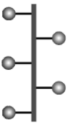
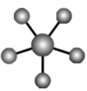
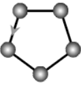
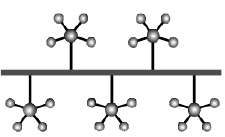
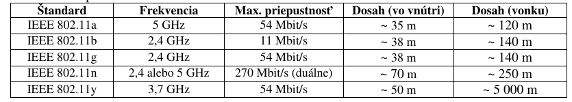

## Definícia počítačovej siete

Prepojením počítačov, prípadne s príslušenstvom, tak, že dokážu navzájom komunikovať, bezdrôtovým spôsobom alebo prostredníctvom fyzického prepojenia (kabeláže), vznikne počítačová sieť.

Vytvorenie počítačovej siete má svoje výhody, umožňuje predovšetkým:

- **zdieľanie prostriedkov** (hardvéru), napríklad tlačiarní, diskov
- **zdieľanie dát** (softvéru) využívajú napríklad databázové a informačné systémy
- **komunikáciu** medzi užívateľmi posielaním textových správ až po videokonferencie
- **monitorovanie a riadenie počítačov, zdieľanie výkonu**,...

## Podľa rozlohy
vzdialenosti prepojených počítačov

- **PAN** (Personal Area Network - osobná počítačová sieť) - spolupracujúce zariadenia slúžia len jednej osobe (typické prepojenie myši, tlačiarne alebo mobilu a počítača, notebooku, PDA,...) spája zariadenia rádovo v dosahu metrov. Na prepojenie sa obvykle používajú bezdrôtové technológie Bluetooth, IrDA, Wi-Fi.
- **LAN** (Local Area Network) - lokálna počítačová sieť, ktorej počítače sú navzájom vzdialené rádovo desiatky až stovky metrov, teda sú umiestnené v jednej prípadne v niekoľkých susedných budovách. Ide o siete firemné, školské, podnikové a pod. Slúžia hlavne pre zdieľanie dát a zariadení v rámci jednej firmy, budovy, lokality... LAN sú obvykle v súkromnej správe, sú tvorené jedným káblovým systémom (alebo iným prenosovým prostriedkom - rádiové vlny a pod.). Prenosové rýchlosti dosahujú rádovo 10 Mbps až 10 Gbps.
- **MAN** (Metropolitan Area Network) - mestská počítačová sieť s rozlohou rádovo desiatky $km^2$. Metropolitné siete umožňujú rozšírenie pôsobnosti LAN ich predĺžením, zvýšením počtu uzlov, zvýšením prenosovej rýchlosti. Rýchlosť v MAN býva vysoká, ale charakterom sa radí k sieťam LAN. Siete môžu
byť súkromné, ale i verejné a prenajímané.
- **WAN** (Wide Area Network) - globálna, veľkoplošná počítačová sieť v rámci celých kontinentov až sveta. Spája rôzne LAN a MAN siete v pôsobnosti krajín, kontinentov ale i sveta. Prenosové rýchlosti môžu dosahovať rádovo až Gbps. Najznámejšou sieťou typu WAN je internet.

## Podľa funkcie (úlohy) počítačov v sieti

### Peer-to-peer
(rovný s rovným, označuje sa tiež ako p2p sieť).

Všetky počítače v sieti sú rovnocenné. Každá stanica v sieti môže vyčleniť nejaký svoj prostriedok (diskový priestor, tlačiareň, mechaniku...) na zdieľanie. Iná stanica môže tieto prostriedky využívať. Tento typ siete obvykle nemá centrálnu správu, každý uzol sa spravuje sám. Zdieľanie prostriedkov je možné aj cez internet.

V niektorých textoch sa sieť typu peer-to-peer označuje aj ako ad hoc. Firma Microsoft ju na svojich www stránkach charakterizuje nasledovne: "Sieť ad hoc je dočasné pripojenie medzi počítačmi a zariadeniami používané na špeciálne účely, napríklad na zdieľanie dokumentov počas schôdze alebo hranie počítačových hier pre viac hráčov.

Pripojenie na Internet môžete tiež dočasne zdieľať aj s inými používateľmi v sieti ad hoc, takže títo používatelia nemusia nastaviť svoje vlastné pripojenia na Internet. Siete ad hoc môžu byť iba bezdrôtové, preto musí byť v počítači nainštalovaný bezdrôtový sieťový adaptér, ak chcete vytvoriť sieť ad hoc alebo sa pripojiť k takejto sieti."

### Klient / Server
V praxi sa častejšie vyskytuje zapojenie, pri ktorom je jeden z počítačov nadradený, riadiaci. Takýto počítač nazývame **server**. Ostatné počítače sa správajú ako **klienti** (workstation, pracovná stanica), ktorí požadujú určité služby od servera. Serverov môže byť viacero typov - podľa typu poskytovaných služieb - súborový server, tlačový server, poštový server, www server, ftp server,...

Nemusí platiť vzťah, že jeden server je jeden počítač, resp. na jednom fyzickom počítači môže existovať viacej serverov. Server máva špeciálny sieťový operačný systém (UNIX, Linux, Novell NetWare, Microsoft Windows NT, Microsoft Server 2008,...), často na ňom „bežia“ mnohoužívateľské programy.

Typickým príkladom servera je počítač, na ktorom sú umiestnené elektronické poštové schránky, do ktorých môže 24 hodín denne prichádzať elektronická pošta (e-mail). Klient si svoju poštu pozrie, keď napr. príde domov a pripojí sa svojim počítačom na server (požiada o službu – prezretie došlej pošty).

## Podľa fyzickej topológie
vzájomného usporiadania zariadení v počítačovej sieti

Medzi základné typy topológie siete LAN patrí: zbernica, hviezda a kruh. Zložitejšia topológia sietí môže obsahovať kombináciu základných typov, najčastejšie kombinácia hviezd do stromovej štruktúry, topológiu úplnú a chrbticovú.

### Zbernicová topológia

Základným prvkom zbernicovej topológie je zbernica - úsek prenosového média (kábel), ktorá tvorí kostru siete. K nej sú jednotlivé stanice siete pripojené pomocou odbočovacích prvkov jedna vedľa druhej. Prenosovým médiom je najčastejšie koaxiálny kábel (s prenosovou rýchlosťou 10 Mbit/s) alebo krútená dvojlinka. V zbernicovej topológii sa nevyskytuje centrálna alebo riadiaca stanica.

Dátové správy sa šíria vedením všetkými smermi a všetky stanice k nim majú prístup. Sieť zbernicovej topológie je najjednoduchšia a veľmi ľahko sa inštaluje. Zbernica má jeden začiatok a jeden koniec a musí byť ukončená terminátorom (odpor zamedzujúci „odrazu dátových správ“). Veľkou výhodou tejto topológie je funkčnosť siete v prípade výpadku jednej stanice, ale naopak, pri prerušení kábla (prenosového média) sa stáva sieť nefunkčná. V súčasnosti sa táto topológia využíva len zriedka.

### Hviezdicová topológia

V sieti hviezdicovej topológie pôsobí v centre siete centrálny uzol, ktorým môže byť prepínač (switch), v starších sieťach rozbočovač (hub) alebo, najmä pri bezdrôtových sieťach, opakovač (repeater). K centrálnemu uzlu sú pripojené stanice siete samostatnými linkami, najčastejšie pomocou symetrického kábla (krútená dvojlinka). Pri poruche centrálneho uzla je celá sieť vyradená z prevádzky.

### Kruhová (prstencová) topológia

Stanice siete sú prepojené vedením do tvaru súvislého kruhu. Dáta sa pohybujú v kruhu od odosielateľa (prechádzajú postupne k najbližšiemu susedovi) postupne cez všetky následné uzly až k príjemcovi (adresovanej stanici ) – smer pohybu je daný spôsobom prepojenia siete.

Na riadenie smeru prenosu dát sa používa riadiaca značka - Token. Pomocou nej sa dátové správy odovzdávajú postupne jedným smerom medzi stanicami. Stanica siete, ktorá má riadiacu značku, môže vysielať, ostatné stanice môžu iba prijímať. Týmto je odstránená možnosť vzniku kolízii pri súčasnom vysielaní niekoľkými stanicami. Výpadok ľubovoľnej stanice spôsobí nefunkčnosť celej siete.

### Stromová topológia

Stromová topológia je prirodzeným rozšírením topológie typu hviezda s kombináciou zbernice. Má aj podobné vlastnosti. Používa sa najčastejšie u širokopásmových sietí a optických vlákien.

### Úplná topológia

Každá stanica siete je prepojená zo všetkými ostatnými stanicami. Táto topológia vyžaduje veľký počet káblov. Je veľmi spoľahlivá, ale zle rozšíriteľná. Používa sa málo. V prípade, že nejaké spojenie zlyhá, dáta môžu putovať k cieľu ďalej po iných dostupných linkách (majú viac možností).

### Chrbticová topológia

Prepája jednotlivé LAN s ľubovoľnou topológiou.

### Zhrnutie

| **Topológia**    | **Výhody**                                                                                | **Nevýhody**                                                                                                        |
|------------------|-------------------------------------------------------------------------------------------|---------------------------------------------------------------------------------------------------------------------|
| Zbernica (Bus)   | Jednoduchá, spoľahlivá; ľahko sa rozširuje; jednoduché pripájanie ďalších staníc do siete | Pri prerušení prenosového média  kostry siete je sieť nefunkčná                                                     |
| Hviezdica (Star) | Ľahká modifikácia a pridávanie nových staníc siete                                        | Ak zlyhá centrálny uzol, zlyhá celá sieť                                                                            |
| Kruh (Ring)      | Rovnocenný prístup pre všetky stanice siete                                               | Sťažená inštalácie siete a obmedzený počet staníc v kruhu.  Zlyhanie jednej stanice spôsobí nefunkčnosť celej siete |
| Strom (Hub)      | Jednoduché rozširovanie siete                                                             | Pri výpadku centrálneho uzla je nefunkčný celý podstrom siete                                                       |
| Úplná            | Veľmi spoľahlivá                                                                          | Zle rozširovateľná                                                                                                  |

## Podľa logickej topológie
Spôsob, akým sa posielajú údaje v rámci siete.

- **unicast** ("jednosmerové vysielanie") - údaje sú posielané len na jeden počítač; je to najpoužívanejší spôsob na internete.
- **multicast** ("viacsmerové vysielanie") - údaje sa odošlú celej skupine len raz z počítača a tie sa podľa potreby v uzle kopírujú; existujú multicastové skupiny, do ktorých sa možno pripojiť a prijímať posielané údaje; výhoda je v tom, že sa údaje pošlú len raz a pre jednotlivé počítače sa vetvia v uzle, až vznikne potreba; nevýhoda je, že server nevie, kto prijíma a či boli údaje doručené.
- **broadcast** ("všesmerové vysielanie") údaje sa posielajú na všetky počítače v dosahu (obvykle sa jedná o lokálnu sieť); neexistuje tu žiadne poradie, ktoré musia jednotlivé stanice dodržiavať, aby mohli pristupovať k sieti ("kto prv príde, ten skôr vysiela"). Používajú ho napr. niektoré chatovacie programy, alebo hry pri hľadaní servera (na LAN).
- **token pasing** (odovzdávanie tokenu – "štafetového kolíka, pešiaka") posielať údaje môže iba tá stanica, ktorá vlastní Token. Ak už stanica nechce posielať žiadne údaje, odovzdáva Token ďalšej stanici.

## Podľa technológie

**Ethernet**
v súčasnosti (v rôznych modifikáciách) dominujúci typ, komunikácia na princípe zdieľania prenosového média (ether - „éter“ - vodič) - stanica začne vysielať keď nevysiela žiadna iná; všetky ostatné môžu dáta prijímať, ak sa stane, že dve stanice začnú vysielať naraz (kolízia), zastavia sa a po náhodnom čase pokus opakujú; fyzická topológia zbernicová (10Base5, 10Base2) alebo hviezdicová (10BaseT, 100BaseT,...).

Technológia Ethernet môže byť použitá aj pre bezdrôtovú sieť.

- **Rýchlosť** - Siete Ethernet dosahujú rýchlosť prenosu údajov 100 alebo 1 000 Mbps, čo závisí od typu použitého kábla.
    - **ThickNet** (hrubý ethernet) – používa ako médium hrubý koaxiálny kábel; zbernicová topológia; dĺžka zbernice môže byť až 500 m; prenosová rýchlosť je do 100 Mbps
    - **FastNet** (rýchly ethernet) – používa ako médium krútenú dvojlinku (prípadne optické vlákna); hviezdicová topológia; rýchlosť do 100 Mbps.
    - **Gigabitová** sieť Ethernet je najrýchlejšia a jej prenosová rýchlosť je 1 gigabit za sekundu (alebo 1 000 Mb/s); z krútenej dvojlinky využíva všetky štyri páry vodičov.
- **Náklady** - Káble a prepínače pre sieť Ethernet sú lacné a počítače sa dodávajú s už nainštalovanými adaptérmi (sieťovými kartami na zákl.doske). Pridanie prepínača (switch) alebo smerovača (router) do siete predstavuje najväčšie náklady (desiatky eur).
- **Výhody** - Ethernet je overená a spoľahlivá technológia. Siete Ethernet sú lacné a rýchle.
- **Nevýhody** - Inštalácia kabeláže.

## Podľa použitého prenosového média
rozlišujeme metalické (elektrický signál), optické (svetelný s.) a bezdrôtové siete (elektromagnetický s.).

### Metalická sieť
Prepája svoje komponenty nejakým druhom kábla (drôtu, vodiča)

- **Koaxiálny kábel** - opísaný v technológii Ethernet pre LAN sa dnes už používa zriedka; koaxiálny kábel sa však používa aj v káblovej televízii a umožňuje využiť ho aj na pripojenie do siete; je nutné použiť modem, ktorý "odfiltruje sieťový signál"
- **Krútená dvojlinka** - štandardne ide o štvorpárový kábel, pričom vodiče páru sú navzájom prepletené, skrútenie pomáha redukovať vzájomné presluchy a šumy z vonkajšieho prostredia, a zároveň bráni vyžarovaniu z páru do prostredia; rozdiel potenciálov v páre kóduje prenášaný signál; pri zapojeniach s prenosovými rýchlosťami do 100Mbps sa využívajú len dva páry, pri zapojeniach do 1Gbps sa využívajú všetky štyri páry;
    - **UTP** (Unshielded Twisted Pair) – netienená krútená dvojlinka;
    - **FTP** (Foilded Twisted Pair) – fóliovaná krútená dvojlinka – UTP obtočená hliníkovou fóliou na zníženie vyžarovania
    - **STP** (Shielded Twisted Pair) – tienená krútená dvojlinka – dokonalejšie tienenie ako FTP, pretože tienené sú už páry (tienenie môže byť realizované aj opletením neizolovaným zväzkom vodičov)
- **Telefónna sieť**
    - **Dial-up** je klasické vytáčané pripojenie do internetu. Uskutočňuje sa pomocou klasickej telefónnej linky a modemu. Tento prístup do internetu patril medzi najlacnejšie. Je to najstaršie, ale zároveň najpomalšie pripojenie. Dosahovaná rýchlosť sa pohybuje medzi 28kb/s-56kb/s. Ďalším problémom je, že v prípade používania internetu sa nedá používať telefónna linka (nedá sa volať a ani byť volaný).
    - **ISDN** (Integrated Services Digital Network - Digitálna sieť integrovaných služieb), je vo svojom princípe verejná digitálna telekomunikačná služba, primárne navrhnutá pre komfortnú telefóniu s pridanou možnosťou dátových prenosov. Funguje na princípe digitálneho prenosu údajov po existujúcich metalických vedeniach. Pre pripojenie na internet prostredníctvom linky ISDN je potrebné mať počítač vybavený ISDN kartou alebo ISDN modemom. ISDN modemy slúžia rovnakému účelu ako klasické analógové modemy, t.j. k prenosu dát. Preto im aj ostalo označenie modem, napriek tomu, že s pôvodným významom tohto slova (MOdulátor/DEModulátor) nemajú vôbec nič spoločné a komunikácia medzi ISDN modemami prebieha digitálne na úplne odlišnom princípe ako pri klasických analógových modemoch.
    - **ADSL** (Asymmetric Digital Subscriber Line - doslova „asymetrické digitálne účastnícke vedenie/linka/prípojka“) je jedna z foriem DSL (digitálneho účastníckeho vedenia). Vyznačuje sa tým, že je „asymetrická“, teda pri prenose dát sa využíva vyššia prenosová rýchlosť smerom k užívateľov (pri zavádzaní dát, tzv. "sťahovaní", po angl. download, alternatívne downstream) a nižšia od užívateľa (pri odsúvaní dát, po angl. upload, alternatívne upstream). Ide o vysokorýchlostnú ("širokopásmovú") technológiu, takže prenos dát prostredníctvom ADSL v porovnaní s prenosom analógovou prípojkou alebo základným prístupom ISDN je niekoľkonásobne vyšší. Umožňuje trvalý a časovo neobmedzený prenos dát nezávisle spolu s telefónnou hlasovou službou (analógovou alebo základným prístupom ISDN) na bežných medených telefónnych linkách, čiže užívateľ môže napr. telefonovať alebo faxovať a súčasne sťahovať dáta z internetu. ADSL umožňuje rýchlejšie dátové prenosy po medených telefónnych linkách ako je možné dosiahnuť pomocou konvenčných modemov. To sa dosahuje použitím frekvencií, ktoré sa bežne nepoužívajú pri hlasových telefonických hovoroch, obzvlášť frekvencie vyššie ako je schopné zachytiť ľudské ucho. Takýto signál nebude po bežných telefónnych linkách cestovať veľmi ďaleko, preto je ADSL možné využiť iba na krátke vzdialenosti, zvyčajne menšie ako 5 km. Keď signál dosiahne miestnu ústredňu telefonickej spoločnosti, ADSL signál sa odfiltruje a okamžite presmeruje do konvenčnej internetovej siete, kým akýkoľvek signál na hlasovej frekvencii sa prepne do konvenčnej telefonickej siete. To umožňuje, aby bolo jediné telefonické spojenie využívané pre ADSL aj hlasové hovory naraz.
    - **HPNA** (Home Phoneline Networking Alliance) je technológia určená pre vysokorýchlostný dátový prenos po vnútorných telefónnych rozvodoch budov a slúži k realizácii mnohobodovej lokálnej siete bez nutnosti inštalácie špeciálnych dátových káblov; sieťové adaptéry sa zapájajú do telefónnych rozvodov v budove (umožňujú používať aj telefóny); nevýhodou je nutnosť kúpy adaptérov. Home PNA a kompatibilný smerovač; u nás sa HPNA využíva málo.
- **Elektrická sieť**
    - **DPL** (Digital Power Line – digitálne silové vedenie) je sieťová technológia využívajúca elektrické rozvody. Veľmi zaujímavá je myšlienka pripojenia internetu priamo od elektrárne až do elektrickej zásuvky. Problémom je pretlačenie vysokofrekvenčného signálu cez transformátory na vysokonapäťovom vedení. Preto zatiaľ prichádza do úvahy hlavne také riešenie, keď je internet privedený za poslední transformátor smerom k užívateľom inou cestou, ako po elektrickom vedení.
    - **Home Plug** („elektrická zástrčka v domácnosti“) používa k prepojeniu počítačov v budove silové elektrické rozvody 230V; do elektrickej zásuvky sa zasunie adaptér HomePlug a k počítaču sa pripojí káblom USB alebo ethernetovým káblom; prenosové rýchlosti dnes sú stovky Mbps;

### Optická sieť
Predchádzajúce káble boli metalické (kovové). Optický kábel obsahuje zväzok optických vlákien. **Optické vlákna**, zložené z jadra a obalu, umožňujú prenos svetelného signálu úplným odrazom svetelného lúča na rozhraní jadro – obal, pričom sa lúč šíri z jedného konca vlákna na druhý koniec.

Ak má jadro dostatočne veľký priemer, umožňuje šírenie svetla vo viacerých módoch (vidoch), a takéto vlákno sa nazýva **multimódové** (mnohovidové). Tento režim je však nežiadúci pre diaľkové vysokorýchlostné spoje, keďže svetlo sa v jednotlivých módoch šíri rozličnou rýchlosťou a tak dochádza k „rozťahovaniu“ svetelných pulzov pri ich prechode vláknom.

Preto sa pre diaľkové spoje používa tzv. monomódové (jednovidové) vlákno s menším priemerom jadra. Mnohovidové vlákno sa používa v lokálnych sieťach, nie je tak „háklivé“ na ohyb; ako zdroj svetla využíva LED diódy (monovidové využíva laserový zdroj). Prenosové rýchlosti môžu dosahovať desiatky Gbps.

### Bezdrôtová sieť (wireless)
Poskytuje používateľovi voľnosť pohybu po celom území pokrytom signálom („žiadne káble“). Principiálne sem môžeme zahrnúť bezdrôtové siete LAN (WLAN) a PAN, mobilné siete a satelitné siete.

- **Wi-Fi / bezdrôtový Ethernet**
nie sú v zmysle certifikácie hardvéru celkom totožné, pre naše účely ich môžeme stotožniť. Hoci sa Wi-Fi (Wireless LAN) prenáša vzduchom, má rovnaké vlastnosti ako káblový neprepínaný ethernet. Dokonca sa môžu objaviť aj kolízie podobne ako v neprepínaných ethernetových sieťach. Bezdrôtové siete sú dnes postavené na štandarde IEEE. Wi-Fi umožňuje osobe so zariadením s bezdrôtovým adaptérom (PC, notebook, PDA) pripojenie k internetu v blízkosti prístupového bodu (access point). Typická Wi-Fi zostava obsahuje jeden alebo viac prístupových bodov (AP) a jedného alebo viacerých klientov. AP vysiela svoj SSID (Service Set Identifier) - sieťové meno. Na základe nastavení (napr. podľa **SSID**) sa klient môže rozhodnúť, či sa k AP pripojí (ak je sieť zabezpečená, musí poznať heslo/kľúč zabezpečenia/prístupovú frázu).

- **Bluetooth** („Modrozub“ - názov podľa vikingského kráľa) je bezdrôtová komunikačná technológia pracujúca v pásme rádiových vĺn 2,4 GHz (rovnakom ako Wi-Fi). Bluetooth využívajú napr. PC, PDA, klávesnice, myši, tlačiarne, mobilné telefóny, mobilné headsety, navigačné jednotky GPS, videokamery, slúchadlá, reproduktory, autorádia. Slúži na nadviazanie spojenia medzi dvoma, prípadne viacerými zariadeniami, ktoré nemusia na seba „vidieť“. Jednotlivé verzie majú dosah desiatky až stovky metrov.
- **IrDA** je komunikačný port vytvorený konzorciom IrDA (Infrared Data Association), ktoré opisuje bezdrôtovú komunikáciu pomocou infračerveného svetla (vysielačom sú LED diódy alebo laserové diódy, prijímačom sú fotodiódy). IrDA je súčasťou notebookov, tlačiarní, mobilných telefónov, PDA a pod. V súčasnosti je vytlačená rádiovým prenosom (Bluetooth), ktorý eliminuje nevýhodu infračerveného prenosu – potrebu priamej viditeľnosti. IrDA pracuje do vzdialenosti 1 m a zaraďujeme ju k PAN.
- **Mobilné telekomunikačné siete** a ich technológie sa pravdepodobne vyvíjajú najrýchlejšie (**2G, 3G, 4G, 5G**). Okrem hlasových služieb,
**SMS**, **MMS**, umožňujú **vysokorýchlostný prenos dát**, pripojenie na internet a ďalšie multimediálne služby, napríklad videohovory.
- **Satelitné siete** - umožňujú zabezpečiť hlasové a dátové služby po celej planéte (spojenie na veľké vzdialenosti) ale aj vysokorýchlostný prístup PC alebo LAN k internetu pomocou paraboly, konvertora a satelitného IP modemu. Výhodou je pokrytie a kvalita signálu, lacnejší je download ako upload, preto sa na upload používa mobilná telekomunikačná sieť.

