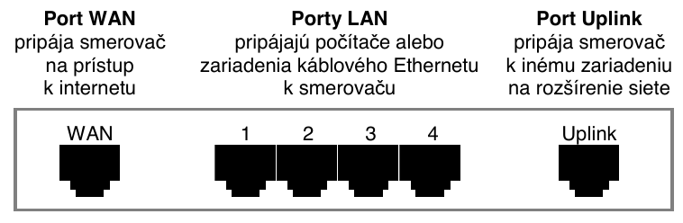
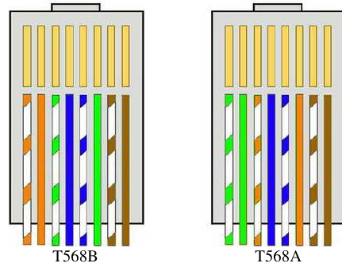

**Hardvér** zahŕňa všetky technické prostriedky siete.

**Patria sem najmä:**

- samotné počítače (servery a pracovné stanice...)
- sieťové karty a adaptéry (sieťová karta, Wi-Fi adaptér, adaptér Bluetooth,...)
- rozbočovače (hub)
- prepínače (switch)
- smerovače (router)
- modemy (modulátory a demodulátory)
- WAP (bezdrôtové prístupové body)
- opakovače (repeater)
- sieťové mosty (bridge)
- brány (gateway)
- bezpečnostné zábrany (firewall)
- káble (metalické, optické, ...)

## Sieťová karta
alebo LAN karta alebo sieťový adaptér alebo NIC (Network Interface Card) je rozširujúci modul počítača, ktorý zabezpečuje jeho komunikáciu s ďalšími zariadeniami siete. Do sieťového média vysiela údaje podľa príkazov procesora alebo zo sieťového média prijíma správy určené pre ňu a odovzdáva ichprocesoru na spracovanie. 

Každá karta má **jedinečnú MAC adresu (kód výrobcu + číslo)** na jednoznačnú identifikáciu karty v sieti. Najčastejšie je integrovaná na matičnej doske, prípadne ako PCI karta, s konektorom **RJ-45**, bezdrôtová sieťová karta s anténou umožňuje pripojenie do Wi-Fi. 

Adaptéry sa väčšinou pripájajú cez USB a sú ľahko prenosné medzi PC. V súčasnosti už každý notebook má zabudovaný Wi-Fi a často aj Bluetooth adaptér.

## Switch (prepínač) a hub (rozbočovač)
slúžia ako "centrum počítačovej siete". Pripájajú všetky zariadenia v počítačovej sieti a pracujú s dátami usporiadanými do **frames (dátových rámcov)**. Prijaté rámce zosilnia a pošlú prostredníctvom kabeláže na port cieľového počítača. 

Najväčší **rozdiel medzi hubom a switchom** je spôsob, akým posielajú rámce k cieľovému počítaču. Každý dátový rámec je určený pre konkrétny počítač v sieti. 

Keďže **hub** nevie, na ktorý port má daný dátový rámec poslať, rozpošle ho na všetky porty – tento typ komunikácie sa nazýva aj **"broadcasting"**. Takto síce hub zabezpečí, že rámec sa dostane na príslušné PC, ale zbytočne zaťažuje komunikáciu v sieti tým, že rámce sa rozpošlú na všetky počítače a len "ten pravý" ho spracuje, ostatné počítače ho ignorujú. 

Navyše, hub musí rozdeliť šírku komunikačného pásma (10 alebo 100 Mb/s) medzi všetky porty. To znamená, že čím viac počítačov je pripojených na hub, tým sa situácia zhoršuje – každý počítač posiela dátové rámce na hub a ten ich rozposiela znova na všetky porty. 

**Switch** je "inteligentnejšie zariadenie". Obsahuje vnútornú pamäť, v ktorej si uchováva všetky sieťové adresy (MAC = Media Access Control – hardvérová adresa, ktorá jednoznačne identifikuje každé zariadenie v sieti) pripojených počítačov. Ak teda switch prijme dátový rámec, vie presne, na ktorom porte je pripojený počítač, ktorému je rámec určený a vyšle ho len na tento port. To samozrejme veľmi zrýchľuje komunikáciu v sieti a navyše switch môže pre komunikáciu s pripojeným počítačom využiť celú šírku komunikačného pásma.

## Router (smerovač)
spája lokálne siete, aj rôznych topológii, alebo pripája lokálnu sieť k sieti WAN (Wide Area Network – rozľahlá sieť). Pracuje na základe sieťových adries a smerovacích protokolov a do druhej siete prepúšťa len tie správy, ktoré sú tam určené (smerované). 

Jeho hlavnou úlohou je **smerovať pakety do inej počítačovej siete**. Paket neobsahuje len dáta, ale aj cieľovú adresu, na ktorú má byť doručený. Pomocou hlavičky paketu a routovacej tabuľky dokáže router určiť najlepšiu cestu pre jeho doručenie tak, aby sa vyhol preťaženým alebo nepriechodným trasám. Ak router spája siete rôznej topológie a teda aj technológie, musí okrem smerovania ešte vykonávať transformáciu sprav z jednej siete do druhej.

Router musí byt po štarte nakonfigurovaný, musia sa mu zadať adresy jeho sieťových rozhraní. Adresy ďalších sieti získava zo siete snímaním routovacích tabuliek. Dnes je väčšina routerov určených pre pripojenie do internetu vybavených navyše switchom (4-8 portovým), serverom pre „prekladanie sieťových adries“ (NAT), DHCP serverom, DNS proxy serverom, či hardvérovým firewallom.

Zadná strana smerovača obsahujúceho štvorportový ethernetový prepínač (switch). Ak nemá port WAN, nie je to router:

## Modem
je zariadenie, ktoré slúži k prenosu nespojitých signálov z počítača pomocou spojitých signálov cez verejnú telefónnu sieť. Každý modem sa skladá z dvoch časti: 

- **MOdulátor** - ktorý prevádza digitálne signály z počítača na spojité (analógové) a vysiela ich do verejnej telefónnej siete a
- **DEModulátor** - ktorý vykonáva opačný prevod, t.j. prijíma spojité signály z verejnej telefónnej siete a prevádza ich na nespojité signály použiteľné v počítači.

Modem umožňuje napr. počítaču komunikovať po telefónnych linkách, cez rozvody káblovej televízie, vzduchom (rádiový prenos) atď.

## WAP (bezdrôtový prístupový bod)
(WAP - wireless access point alebo len access point – AP) je zariadenie, ktoré navzájom prepája bezdrôtové sieťové komunikačné zariadenia, čím vytvára bezdrôtovú sieť. Bezdrôtový prístupový bod funguje ako fyzický opakovač (repeater) alebo ako smerovač (router). 

Prístupový bod sa obvykle pripája k pevnej sieti typu Ethernet, čo umožňuje prenášať dáta medzi bezdrôtovými a drôtovými zariadeniami. Niekoľko prístupových bodov sa môže navzájom prepojiť a vytvoriť tak väčšiu sieť, ktorá umožňuje "roaming". Naproti tomu sieť, v ktorej sa klientske zariadenia komunikujú priamo navzájom, bez prístupových bodov, sa nazýva ad-hoc sieť.

V priemyselnej a obchodnej sfére mali bezdrôtové siete veľký vplyv na činnosť - zamestnanci v tejto oblasti často nosia prenosné dátové terminály, v ktorých sú zabudované skenery čiarového kódu a bezdrôtové adaptéry, čo im umožňuje aktualizovať údaje o stave prác a skladových zásobách v reálnom čase.

## Repeater (opakovač)
je jednoduché technické zaradenie, ktoré **spája dva segmenty siete rovnakej topológie a technológie**. Musí byť použitý, keď je vzdialenosť uzlov väčšia, ako povolená dĺžka kábla. Z obidvoch strán sníma všetky správy, ktoré zosilňuje a prepúšťa na druhú stranu. Nevykonáva žiadnu filtráciu prijatých správ a všetko, čo príjme zo strany jednej, prepustí, po zosilnení, na stranu druhú prijme.7

## Bridge (most)
**spája dva segmenty siete rovnakej topológie a technológie**; umožňuje deliť siete na menšie(efektívnejšie) podsiete. Bridge počúva prevádzku na obidvoch stranách a v prijatých správach vyhľadáva fyzické adresy zdrojového a cieľového počítača. Zo zdrojových adries (t.j. adries odosielateľov) vytvára tabuľku prítomnosti počítačov na svojich jednotlivých stranách. Potom podľa zdrojovej a cieľovej adresy sa rozhoduje, či má správu prehodiť do druhého segmentu alebo nie.

Bridge vykonáva teda určitú filtráciu správ a na druhú stranu prepúšťa len tie, ktoré sú tam určené. Pritom využíva podmienky jednoznačnosti fyzických adries na spájaných segmentoch. Obvykle bridge pracujú podľa samoučiaceho sa algoritmu. Mosty vedia adresy všetkých uzlov na každej strane siete, smerovače poznajú len adresy mostov a iných smerovačov (susedov). Pri štarte sú pracovné tabuľky mostov prázdne a fungujú ako opakovače. Tabuľky sa postupne, podľa prevádzky, zapĺňajú. Bridge nevyžadujú teda žiadnu konfiguráciu.

## Gateway (brána)
je špeciálne zariadenie, ktoré sa používa k **spájaniu sieti používajúcich rôzne komunikačné protokoly**. Gateway teda vykonáva transformáciu protokolov spájaných sieti ako po stránke programovej, tak aj technickej. Týmto sa najviac líši od routera, ktorý nedokáže transformovať protokoly. Router vyrovnáva len rôznu topológiu v spájaných sieťach a zabezpečuje smerovanie správ.

Pod sieťovým softvérom rozumieme aj všetky aplikácie zabezpečujúce služby na internete.

## Káble
Zameriame sa len na **UTP káble**, ktoré sa používajú v káblových sieťach LAN najčastejšie. K dispozícii sú **dva typy UTP kábla** líšiace sa spôsobom ukončenia konektorov – teda **poradia farebných vodičov v hlave konektora**. Farebnosť sa značí zľava doprava a v praxi sa stretávame s dvoma spôsobmi zapojenia vychádzajúcimi zo štandardov **T568A** a **T568B**.

Ak má kábel na oboch koncoch totožné ukončenie konektorov, jedná sa o takzvaný **priamy kábel**. Pokiaľ sú konektory na koncoch rozdielne, teda na jednom konci je to verzia A a na druhom verzia B, nazývame ho **krížený kábel (cross)**. 

Vo všeobecnosti platí, že zariadenia rovnakého typu prepájame vždy kríženým káblom, zatiaľ čo zariadenia rozličného typu prepájame káblom priamym. Čoraz viacej zariadení určených pre domácnosti a firmy integruje podporu **automatického režimu MDI/MDI-X**, teda schopnosti zariadenia rozoznať správne zapojenie. To umožňuje použiť oba typy kábla, keďže takéto zariadenie sa automaticky prestaví do potrebného režimu. 

Z praktického hľadiska môžete dva počítače prepojiť tzv. na priamo – postačí mám dostatočne dlhý krížený kábel a patričné sieťové karty. Kábel by pritom nemal presiahnuť 100 metrov stanovených normou, pravdou ale je, že komunikácia v rámci rezervy funguje aj pri kábli s dĺžkou ešte o 20 metrov väčšou. 

**Zapojenie vodičov podľa T568B/A v konektore RJ-45 (konektor otočený kontaktmi hore)**

## Softvér počítačových sietí
Sieťový softvér je programové vybavenie, ktoré spolu s hardvérom zabezpečuje funkcie počítačovej siete. U väčšiny operačných systémov sú základné sieťové funkcie súčasťou operačného systému, pričom rôzne verzie toho istého operačného systému môžu viac alebo menej podporovať sieťovú komunikáciu (napr. Microsoft Windows 7 Home Premium a Microsoft Windows 7 Profesional). 

Na **zobrazenie sieťovej konfigurácie pripojených adaptérov a testovanie pripojenia** môžeme v operačnom systéme Microsoft Windows použiť najmä **príkazy**:

- **cmd** -  slúži na sprístupnenie príkazového okna; príkaz cmd možno spustiť použitím kláves WIN+R alebo cez Štart - Všetky programy - Príslušenstvo - Príkazový riadok
- **ipconfig /all** - zobrazí úplnú konfiguráciu protokolu TCP/IP u všetkých sieťových adaptérov pripojených k PC
- **ping** adresa - overuje dostupnosť počítača so zadanou IP adresou alebo doménovým menom, zobrazí časy doručenia štyroch balíčkov dát alebo, v prípade neúspechu, chybové hlásenie
- **tracert** adresa - slúži na vypísanie uzlov na trase k cieľovému serveru 
- **route** print - slúži na získanie MAC adresy sieťovej karty

## Organizačné zabezpečenie siete
zahŕňa hlavne opatrenia na zaistenie správy siete a súbor pravidiel správania sa používateľov pri používaní siete. Patria sem zabezpečujúce prístupové heslá, prístupy, zdieľania údajov, vonkajšie pripojenia. Tieto funkcie obvykle vykonáva správca siete (administrátor), ktorý sa stará o chod a riadenie siete.