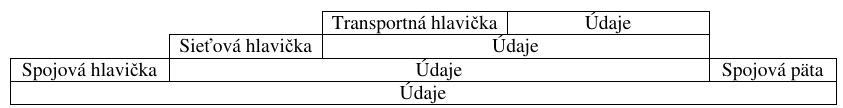
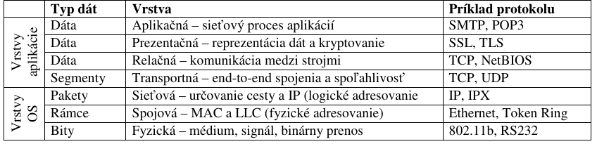
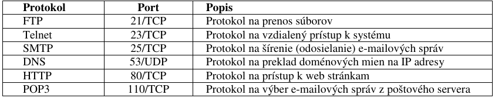

Medzinárodná organizácia pre normalizáciu (International Organization for Standardization – ISO) koncom roka 1979 prijala **Referenčný model ISO/OSI** (Reference Model of Open Systems Interconnection - Referenčný model prepojovania otvorených systémov), ktorý je odporúčacím modelom, ako riešiť vzájomné prepojovanie počítačových systémov rôznych typov a koncepcií, ktoré sú výsledkom práce rôznych výrobcov (heterogénne siete).

**Model ISO/OSI pozostáva zo siedmich vrstiev** (aplikačnej, prezentačnej, relačnej, transportnej, sieťovej, spojovej a fyzickej), ktoré definujú komunikačné schopnosti potrebné k uskutočneniu vzájomnej komunikácie medzi akýmikoľvek dvoma počítačmi. Každá vrstva využíva služby bezprostredne nižšej vrstvy a sama poskytuje svoje služby bezprostredne vyššej vrstve. Správa, súbor alebo akékoľvek údaje, ktoré budú odoslané do siete, musia prejsť týmito vrstvami, ktoré slúžia na to, aby údaje boli prenesené presne a neporušené.

## Aplikačná vrstva
**Aplikačná vrstva** (Application Layer), najvyššia, najbližšie k užívateľovi, je zodpovedná za poskytovanie prístupu aplikáciám (poštovému klientovi, prehliadaču www stránok, službe FTP,...) do siete. Požiadavku prevedie na bity a pripojí hlavičku, ktorá identifikuje (určuje) vysielací a prijímací počítač.

## Prezentačná vrstva
**Prezentačná vrstva** (Presentation Layer) preloží požiadavku do jazyka, ktorému rozumie prijímací počítač, t.j. vykoná transformácie potrebné pre správnu interpretáciu dát na cieľovom počítači. V tejto vrstve sú vykonané aj operácie ako dátová kompresia prípadne kódovanie dát. Vrstva pridá ďalšiu hlavičku, ktorá špecifikuje (určuje) jazyk a schému kompresie a kódovania.

## Relačná vrstva
**Relačná vrstva** (Session Layer) nadväzuje, udržiava a ruší logické spojenia - relácie medzi koncovými účastníkmi komunikácie. Určí hranice pre začiatok a koniec správy a rozhodne, či bude správa odoslaná poloduplexným prenosom, keď sa počítače striedajú pri vysielaní a prijímaní (aj riadi smer komunikácie), alebo plne duplexným prenosom, keď oba počítače vysielajú a prijímajú súčasne. Podrobnosti o tom sa uložia do relačnej hlavičky. Zabezpečuje vkladanie bodov návratu do prenášaných blokov dát, ktoré v prípade niektorých komunikačných chýb slúžia na označenie miesta v postupnosti prenášaných dát, odkiaľ sa bude prenos opakovať.

## Transportná vrstva
**Transportná vrstva** (Transport Layer) je zodpovedná za prenos dát na dohodnutej úrovni kvality. Rozdelí údaje na segmenty a vykoná kontrolné súčty vychádzajúce z obsahu dát, ktoré možno neskôr použiť na kontrolu správnosti ich usporiadania. Tiež vytvorí záložnú kópiu dát. Transportná hlavička obsahuje kontrolný súčet každého segmentu a jeho miesto v správe. Zaoberá sa komunikáciou len medzi koncovými používateľmi, t.j. medzi vysielajúcim uzlom a koncovým uzlom. K prenosovej vrstve neodmysliteľne patria porty, teda čísla komunikačných kanálov na ktorých jednotlivé aplikácie komunikujú.

Až tie potom spolu s IP adresou utvárajú kompletnú adresu aplikácie – napríklad webový server očakáva komunikáciu z internetového prehliadača na porte číslo 80 cez protokol TCP. Server elektronickej pošty komunikuje na portoch 25 (SMTP) a 110 (POP3), taktiež protokolu TCP. Hoci to teda v stavovom riadku prehliadača nevidíte, v skutočnosti sa pripája nielen na IP adresu webového servera, ale aj na konkrétny port, teda port 80 (adresa je v skutočnosti napr. http://ghubeneho.edu.sk:80/).

## Sieťová vrstva
**Sieťová vrstva** (Network Layer) vyberá pre správu cestu. Zo segmentov vytvorí pakety, spočíta ich a pridá hlavičku, ktorá obsahuje poradie paketov a IP adresu počítača, ktorý správu prijme. Zaisťuje potrebné smerovanie (routing) prenášaných paketov, ak neexistuje priame spojenie medzi príjemcom a odosielateľom. Sieťová vrstva je jediná, ktorá „vidí” skutočnú topológiu siete.

## Spojová vrstva
**Spojová vrstva** (Data Link Layer - vrstva dátových spojov, linková vrstva) dohliada na prenos, rozpoznáva chyby v prenose, potvrdzuje bezchybný prenos, prípadne si vyžiada opakovanie prenosu. Potvrdí kontrolný súčet a potom adresuje (MAC adresy - jedinečné adresy od výrobcu zariadení v ethernetovej sieti) a duplikuje pakety. Táto vrstva uchováva kópiu každého paketu, až kým nedostane potvrdenie z nasledujúceho bodu siete, že paket prišiel neporušený. Riadi tiež tok dát medzi dvoma uzlami, aby nedošlo k lokálnemu stavu uviaznutia komunikácie.

## Fyzická vrstva
**Fyzická vrstva** (Physical Layer) je najspodnejšou vrstvou referenčného modelu OSI. Zabezpečuje sériový prenos bitov medzi dvoma sieťovými uzlami pomocou fyzickej prenosovej cesty. Kóduje obsah dátových paketov na sériu elektrických signálov reprezentovaných hodnotami 0 a 1 pri digitálnomprenose (napríklad pri prenose klasickou telefónnou linkou vytvára analógový signál).

Tieto signály sú posielané cez prenosové médium k fyzickej vrstve príjemcu. Sprostredkujúci uzol siete spočíta a overí kontrolný súčet každého paketu. Smerovač môže tiež správu presmerovať, aby sa zamedzilo zahlteniu siete.

**U príjemcu** sa proces spracovania cez jednotlivé vrstvy deje v opačnom poradí, t.j. prijatý elektrický signál je konvertovaný fyzickou vrstvou na sériu bitov. Tieto hodnoty sú zoskupené do paketov a odovzdané linkovej vrstve. Spojová vrstva prepočíta kontrolné súčty, potvrdí príjem a pakety zapíše. Sieťová vrstva prepočíta došlé pakety po stránke zabezpečenia. Transportná vrstva prepočíta kontrolné súčty a zloží segmenty správy. Relačná vrstva podrží časti správy, kým nie je kompletná a potom ju pošle vyššej vrstve. Prezentačná vrstva ju dekóduje, dekomprimuje a preloží. Aplikačná vrstva identifikuje príjemcu, prevedie bity na číselné znaky a údaje zašle príslušnej aplikácii. 

**Každá vrstva (okrem fyzickej) pridá k prenášaným údajom svoju hlavičku**; posledné štyri vrstvy:

**Vrstvy a typy dát**

**Najčastejšie používané porty a prenosové protokoly**

