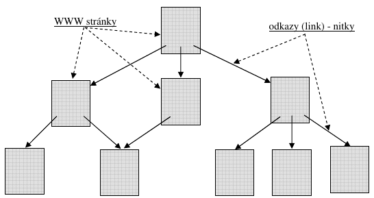

tvorí celosvetové prepojenie počítačových sietí, slúžiace na výmenu a vyhľadávanie informácií. Je to akási "sieť sietí". Aj naša malá lokálna počítačová sieť po pripojení do internetu sa stáva súčasťou Internetu, alebo ak chcete, spoluvytvára Internet.

História Internetu začína v 60. rokoch. Za finančnej podpory armády (agentúry ARPA) americkí vedci vyvíjali počítačovú sieť, ktorá by mala prepojiť dôležité vojenské a administratívne centrá USA.

**Podarilo sa navrhnúť a vytvoriť sieť, ktorá je:**

- **decentralizovaná**, t.j. nemá centrum alebo centrá, poškodenie ktorých by znamenalo znefunkčnenie celej siete;
- **komunikácia** medzi počítačmi sa uskutočňuje **vo forme tzv. paketov** (datagramov, „balíkov“ dát); všetky prenášané údaje sa „naporcujú“ do paketov; každý paket môže ísť, podľa potreby, inou cestou od zdroja k cieľu.

Prvý uzol budúceho Internetu bol zriadený **v septembri 1969 v UCLA** (tento dátum sa považuje za dátum vzniku Internetu). Do konca roka boli vybudované ešte ďalšie tri uzly, všetky na univerzitách v USA. Vznikla sieť, ktorú nazvali **ARPANet**. Postupne vznikali ďalšie a ďalšie uzly, pripájali sa ďalšie
a ďalšie lokálne siete. 

V roku 1973 sa pripojili prvé dve neamerické inštitúcie (britská a nórska). Kým v roku 1983 prekročil počet prepojených počítačov číslo 1 000, v roku 1987 to už bolo viac ako 10 000, v roku 1989 100 000 a v roku 1992 viac ako 1 000 000. Pre úplnosť uvedieme, že na Slovensku bol prvý pripojený v roku 1990 Ústav aplikovanej kybernetiky v Bratislave na európsku sieť EUNET.

Slovo Internet sa prvýkrát objavuje po rozdelení siete ARPANet na armádnu a akademickú sieť. Prepojovaciu sieť nazvali DARPA Internet (agentúru ARPA medzitým premenovali na DARPA – Defence Advanced Research Project Agency). Nevyhnutná štandardizácia Internetu (aby dokázali navzájom komunikovať rôzne počítačové siete po celom svete) znamenala zavedenie sady protokolov označovaných TCP/IP, používaných od roku 1984.

**Rozmach Internetu**, tak ako ho poznáme dnes, začína rokom 1993, keď začínajú komerčné aktivity na Internete (vo ľne prístupný prvý prehliadač WWW). Do tohto roku dominovala na Internete elektronická pošta (e-mail). Dnes sa predpokladajú stovky miliónov prepojených počítačov.

**Niekoľko skratiek a pojmov súvisiacich s internetom:**

- **TCP/IP** (Transmision Control Protocol/Internet Protocol) označenie sady protokolov, na základe ktorých funguje internet (musia ich dodržiavať komunikujúce strany, aby si "rozumeli").
- **IP adresa** – číselná adresa každý počítač v sieti internet má pridelenú jednoznačnú číselnú adresu podľa ktorej ho možno nájsť (IPv4 sa skladá zo štyroch celých čísel od 0 do 255 oddelených bodkami, napr. 183.127.250.16). 
- **Doménová adresa, doménové meno** - číselné adresy počítačov sa zle pamätajú, preto používame doménové (menné) adresy (mennú adresu, zadanú užívateľom, si počítač najprv preloží na číselnú, vhodnejšiu pre počítač). Doménové meno sa skladá z domén oddelených bodkami, ktoré predstavujú určitú hierarchickú štruktúru. Najvyššie v štruktúre je vrcholová doména, čo je dvojznaková doména štátu (sk, cz, hu, de, jp, uk,...) alebo trojznaková doména „zamerania“ (com – komercia, edu – vzdelávanie, mil – armáda, gov – vláda, net – sieť,...). Napr. stonline.sk, ukf.sk, zoznam.sk, fmph.uniba.sk, spu.sanet.sk, vlak-bus.cz, vltava.cpress.cz, yahoo.com,... sú všetko doménové adresy počítačov na internete.
- **DNS** (Domain Name System) - systém, ktorý zabezpečuje po zadaní doménového mena zistiť IP adresu počítača.
- **URL** (Uniform Resource Locator) - je jednoznačná adresa dokumentu alebo služby na internete, prakticky to je adresa WWW stránky; jej podstatnú časť tvorí doménové meno servera, na ktorom sa dokument alebo služba nachádzajú.
- **ISP** (Internet Service Provider) - poskytovateľ pripojenia na internet - firma, prostredníctvom ktorej sa dá pripojiť na internet.
- **E-mail** - elektronická pošta umožňujúca posielanie textových správ s prílohami medzi počítačmi pripojenými na internet.
- **WWW** (World Wide Web)
    - WWW alebo Web je celosvetová „pavučina“ prepájajúca jednotlivé webové dokumenty
    - webový dokument sa skladá z WWW stránok; je vystavený na internete a možno ho prezerať pomocou **prehliadača** z ľubovoľného počítača pripojeného na internet
    - WWW stránka obsahuje okrem informácií publikovaných v rôznych formách (zvuk, obraz, video...) aj prepojenia (odkazy) na ďalšie WWW stránky
    - služba www umožňuje vyhľadanie a zobrazenie požadovaných WWW stránok.
- **Intranet** - lokálna počítačová sieť pracujúca na základe protokolov TCP/IP, t.j. ako „lokálny internet“.
- **Extranet** - je koncept rozšírenej podnikovej komunikácie (Extended Enterprise Communications), ktorá presahuje rámec hraníc podniku. Na vzájomnú komunikáciu medzi spolupracujúcimi podnikmi, ich partnermi, zákazníkmi, dodávateľmi slúži internet a jeho komunikačné služby. V protiklade od intranetu, extranet nie je zasa obmedzený na interné (vnútropodnikové) použitie.

## Služby na internete

### E-mail
Najstaršou službou na internete je posielanie správ, tzv. elektronická pošta, e-pošta, e-mail, mail (Electronical Mail). Jej najväčšími výhodami sú:

- prakticky okamžité doručenie správy po odoslaní (elektrický signál sa šíri rýchlosťou skoro 300 000 km/s!);
- pohodlné posielanie správ napr. z domu, pričom správy možno posielať 24 hodín denne;
- veľmi nízky poplatok (na odoslanie správy sa stačí pripojiť na server poskytovateľa len na niekoľko sekúnd, prípadne pri pevnej platbe počet odoslaných mailov nemá vplyv na cenu);
- možnosť „pribaliť“ k textovej správe ďalšie prílohy (súbory obsahujúce obrázky, tabuľky, atď.).

Na spracovanie mailu sa používajú programy nazývané **poštoví klienti**. Tí komunikujú s poštovým serverom, čo je program zabezpečujúci e-mailové služby na serveri poskytovateľa pripojenia.

Teda, ak sme pripojení na server poskytovateľ a, môžeme spustiť poštového klienta. Táto činnosť môže byť zautomatizovaná tak, že k nadviazaniu spojenia dochádza buď automaticky po spustení poštového klienta alebo po kliknutí na príslušné tlačidlo (Odoslať/Prijať všetko) v poštovom klientovi.

Najznámejšie „lokálne“ programy na obsluhu e-mailov sú Microsoft Outlook Express, ktorý je súčasťou opera čného systému Microsoft Windows, Microsoft Outlook, ktorý je sú časťou kancelárskeho balíka Microsoft Office. V súčasnosti sa používajú mailové služby integrované na www stránkach (napr. Gmail na www.google.sk), ktorých výhodou je prístup k pošte z ktoréhokoľvek po čítača vo svete pripojeného na internet.

**E-mailová adresa**
Pred prvým použitím sa musí každý poštový klient nakonfigurovať. Niektoré údaje nám musí poskytnúť provider, resp. sú uvedené v zmluve o poskytnutí pripojenia na internet (napr. telefónne číslo "servera"). My si volíme názov poštovej schránky (prvá č asť našej adresy). Najčastejšie to je naše priezvisko, prezývka a pod. (bez dĺžňov a mäkčeňov), aj keď teoreticky to môže by ť akýkoľvek text bez dĺžňov a mäkčeňov. Môže sa použiť aj bodka, podčiarnik alebo pomlčka, nie medzery. Veľké a malé písmená sa nerozlišujú, resp. veľké písmená sa nepoužívajú.

**Príklady názvov poštových schránok**: kovac, p.kovac, peter_kovac, mail, dobrerano,... Druhú časť adresy tvorí doménové meno servera poskytovateľa
pripojenia končiace označením krajiny, teda u nás sk. Napr. p.kovac@stonline.sk, dobrerano@slovakradio.sk, kiko@nextra.sk, hela_j@fmph.uniba.sk, mail@tmc.sk,... Vidíme, že názov schránky sa oddeľuje od názvu servera znakom @ ("zavinač", znak "at"). 

V slovenskej klávesnici sa vkladá kombináciou kláves pravé Alt+V alebo Ctrl+ľavé Alt+V. Podľa znaku @ jednoznačne rozpoznáme mailovú adresu, každá mailová adresa ho musí obsahovať. Všeobecne teda mailová adresa má štruktúru:

> názov_poštovej_schránky_užívateľa@umiestnenie_servera_poskytovateľa_pripojenia

Pre úplnosť musíme uviesť, že existujú bezplatné poštové servery, ktoré sa tešia značnej obľube. Ak máme pripojenie na internet, konkrétne službu WWW, môžeme si bezplatne zriadiť poštové konto na takomto serveri. Napr. adresa kovac@gmail.com môže by ť adresa užívateľa zo Slovenska napriek tomu, že nekončí doménou sk!

### Niekoľko poznámok k e-mailu
Predovšetkým by sme chceli zdôrazniť, že sme popísali len štandardné vlastnosti poštových klientov. Mnohí poštoví klienti umožňujú aj dokonalejšiu organizáciu e-mailov, napr. vytvorenie podpriečinkov *Súkromné*, *Firemné*, *Od Petra* a pod. v priečinkoch *Doručená pošta*,.... 

Kontakty v adresári môžeme organizovať do skupín – zadaním mena skupiny do poľa Komu: bude správa zaslaná všetkým členom skupiny. Ak na počítači pracuje viacej osôb, cez položku *Súbor* – *Totožnosti* môžeme vytvoriť viacero používateľov alebo totožností. Každá totožnosť dostane vlastné poštové priečinky a adresár (tým však nie je znemožnené prezeranie pošty inou totožnosťou). Ak má daný užívateľ viacej mailových adries na rôznych serveroch, vie ich spravovať pomocou tzv. kont. 

Kontá tiež umožňujú roztriedenie správ jednotlivým užívateľom tej istej poštovej schránky a uvedenie skutočného mena odosielateľa do poľa *Od:*. Mailová adresa má v takomto prípade tvar napr. "Peter Kováč" <mail@tmc.sk>, teda pred adresou uzavretou v znakoch < > je v úvodzovkách uvedený názov konta. 

Záver: e-mailová adresa môže obsahovať aj upresňujúcu časť, musí však obsahovať popísané jadro so znakom @.

Ďalej by sme chceli upozorniť, že elektronická pošta je v súčasnosti najobľúbenejším médiom pre autorov počítačových vírusov. Kto by nebol zvedavý na prílohu správy, v ktorej predmete je uvedené: I love you! Po otvorení prílohy sa spustí program – vírus, ktorý „navštívi“ náš adresár a bez nášho vedomia sa automaticky rozpošle na všetky mailové adresy. Preto nás snáď ani neprekvapí, že za dva dni je zavírený celý svet. 

Preto buďte opatrní a neotvárajte "bezhlavo" prílohy mailov, najmä ak chýba sprievodný text, nedáva zmysel a pod. V poslednom čase sa mail stal obľúbeným aj pre šírenie poplašných správ. Príde vám napr. správa, že ak v priečinku Windows máte súbor s takým a takým názvom, urýchlene ho vymažte, pretože to je „maskovaný“ vírus. Neznalí horlivci si takto môžu znefunkčniť počítač.

**Na záver by sme opísali odoslanie a doručenie e-mailu s prílohou:**

1. Po pridaní prílohy k správe ju poštový klient prekóduje (napr. algoritmami MIME, UUEncode, BinHex) prípadne aj skomprimuje. Prekódovaním sa napríklad obrázok zmení na text. Po kliknutí na tlačidlo Odoslať poštový klient kontaktuje server poskytovateľa internetového pripojenia, konkrétne **server SMTP** (Simple Mail Transfer Protocol). 
2. Server potvrdí, že bol kontaktovaný a poštový klient mu oznámi, že má pre neho správu na odoslanie na určitú adresu. SMTP odpovie správou: "Pošli" alebo "Obsadené, skús neskôr". Po príkaze „Pošli“ klient pošle správu na server (jeho adresu má uvedenú v nastavení) a požiada o potvrdenie. 
3. **Server SMTP** potvrdí príjem správy a opýta sa servera **DNS** (Domain Name Server) na IP adresu servera, ktorému má doručiť poštu (pýta sa podľa mena za znakom @, ktoré sme napísali do poľa Komu:) a lokalizuje e-mailový server príjemcu. Server DNS oznámi SMTP najlepšiu cestu pre správu.
4. Správa prechádza rôznymi internetovými smerovačmi, tie rozhodujú podľa vyťaženosti smerov o elektronickej ceste e-mailu. Správa tiež môže prechádzať rôznymi medzisieťovými bránami, ktoré konvertujú údaje z jedného typu počítačového systému, ako napríklad Windows, UNIX a Macintosh, na typ počítačového systému, ktorý je nasledujúcim priechodovým bodom na trase. 
5. Keď **e-mail dorazí na server SMTP príjemcu**, server SMTP prenesie správu na server POP (Post Office Protocol). Server POP pozná umiestnenie poštovej schránky príjemcu (jej názov sme uviedli v adrese pred znakom @) a umiestní do nej došlú správu. 
6. Na pokyn príjemcu poštový klient kontaktovaním POP servera zistí, že je v schránke na **serveri POP** nová správa. Server ju pošle poštovému klientovi, ktorý ju zobrazí a dekóduje a dekomprimuje prílohy.

## Služba www
Služba www je dnes najpoužívanejšou službou na internete. Skôr než si ju opíšeme, povedzme si nie čo o záhadných troch písmenách www. WWW (World Wide Web) sa prekladá ako "celosvetová pavučina". Tí, čo s WWW pracujú, charakterizujú dnes WWW ako celosvetovú sieť hypermediálnych dokumentov. Čo je to ten "hypermediálny dokument"? 

**Hypermediálny dokument** sa skladá z tzv. WWW stránok. Ešte pred pár rokmi WWW stránka obsahovala len hypertext. Charakteristickým pre hypertext je, že sa v ňom nachádzajú odkazy („skoky“) na ďalšie WWW stránky. Čiže hypertextový dokument (webový dokument) si možno predstavi ť ako sieť zloženú z WWW stránok a odkazy – nitky v úvode spomenutej pavučiny – spájajú jednotlivé stránky. Napríklad ako v nasledujúcom obrázku.

Odkazy na WWW stránke nájdeme jednoducho. Všade tam, kde sa kurzor myši zmení na je umiestnený odkaz na ďalšiu stránku. Väčšinou býva textový odkaz podčiarknutý, má zmenenú farbu písma, tlačidlo s odkazom zmení podfarbenie pri výbere kurzorom a pod. Odkaz môže byť "schovaný" aj v obrázku. Po kliknutí na odkaz sa začne zobrazovať stránka, na ktorú odkaz odkazuje. Keďže sa musí "stiahnuť" zo vzdialeného servera do nášho počítača, rýchlosť, s akou sa zobrazí nová stránka, je limitovaná najpomalším úsekom medzi serverom a počítačom.

Dnes na stránkach WWW nájdeme nie len text a obrázky, ale aj zvuky, animácie, video, živé vysielanie rozhlasu a televízie, preto hovoríme o hypermediálnych dokumentoch. Všetky organizácie, inštitúcie, firmy, mestá, politické strany, médiá,..., aj jednotlivci sa snažia prezentovať na internete, t.j. mať vlastné WWW stránky „viditeľné“ odkiaľkoľvek na svete. No a v úvode spomenutá služba www nám umožňuje takéto stránky vyhľadávať a zobrazovať – pohybovať sa po Webe. WWW stránky sú umiestnené na serveroch. 

Zobraziť požadovanú WWW stránku znamená predovšetkým poznať jej adresu (URL). Keďže webové dokumenty väčšinou obsahujú viacej prepojených stránok, existuje „úvodná strana“, ktorej hovoríme domovská stránka (home page). Keď zadáme len adresu servera, zobrazí sa spravidla táto domovská stránka. Napr. www.nitra.sk zobrazí domovskú stránku mesta Nitra; www.spu.sk zobrazí domovskú stránku Slovenskej poľnohospodárskej univerzity; www.markiza.sk zobrazí domovskú stránku televízie Markíza atď. Adresy ďalších stránok (okrem domovskej) sa spresňujú zápisom za „/“, kde sa uvedie cesta k danému dokumentu aj s jeho názvom. Napr. www.bratislava.sk/INFORMACIE.HTM zobrazí priamo informácie o meste. Treba si pamätať, že kým v zápise adresy servera, t.j. pred „/“ nerozlišujeme veľké a malé písmená, za lomítkom sa veľké a malé písmená rozlišujú!

Ak rozumieme štruktúre WWW dokumentu, je nám zrejmé, že stačí poznať adresu domovskej stránky a na tú hľadanú sa už "nejako doklikáme". Na zobrazovanie WWW stránok slúžia **programy nazvané prehliadače WWW stránok (browsery)**. Najznámejšie prehliadače sú Microsoft Internet Explorer, Mozilla Firefox a Opera. Po spustení prehliadača sa zobrazí v prehliadači predvolená stránka. Ak nám nevyhovuje, musíme zadať novú adresu, z ktorej chceme získať informácie. Vkladá sa do poľa Adresa a pred zápis adresy servera, ktorá spravidla začína písmenami www, prehliadač vloží text http://, čím „hovorí“ WWW serveru s uvedenou adresou, že budú spolu komunikovať podľa protokolu http (HyperText Transfer Protocol) určeného na presun WWW stránok. 

Po stlačení klávesu Enter začne proces, ktorého výsledkom by malo by ť zobrazenie požadovanej stránky. Dĺžka tohto procesu – sťahovania údajov tvoriacich stránku zo servera do nášho počítača závisí najmä od rýchlosti prenosu a samozrejme od množstva údajov, ktoré treba preniesť. Približne aká časť stránky je už prenesená, nás informuje postupne sa vypĺňajúci pruh v dolnej časti okna. Po ukončení procesu sa v stavovom riadku zobrazí slovo Hotovo.

### Vyhľadávanie informácií na internete
Zatiaľ sme predpokladali, že poznáme adresu stránky, na ktorej máme požadovanú informáciu. To ale často nie je pravda. Adresu sa môžeme pokúsiť uhádnuť. Veď prečo by napr. Univerzita Konštantína Filozofa nemala mať adresu www.ukf.sk alebo mesto Prešov adresu www.presov.sk. Pri Banskej Bystrici už musíme trochu experimentovať. Je to adresa www.bbystrica.sk alebo www.banska_bystrica.sk alebo...(asi sotva by sme uhádli adresu www.bbb.sk). Pri adresách v zahraničí treba myslieť na to, že slovenčina nie je svetový jazyk.

Ako sa teda dostať k tej správnej adrese a požadovanej informácii? Niektorí prevádzkovatelia serverov na to mysleli a zriadili vyhľadávacie servery. Vyhľadávací server www.zoznam.sk umožňuje, ako väčšina, dva základné spôsoby vyhľadávania. Ak chceme napríklad napísať mail na naše zastupiteľstvo v Španielskom kráľovstve, ale nepoznáme adresu, použijeme vyhľadávanie v katalógoch (kategóriách), ako Cestovanie, Ekonomika a služby, Inštitúcie a organizácie, Šport, Zábava, Vzdelávanie,...

Druhý spôsob vyhľadávania sa nazýva fultextové vyhľadávanie a jeho podstatou je zadanie charakteristického textu – kľúčových slov, pre h ľadanú informáciu. Keby som chcel napríklad vidieť slávny obraz Mona Lizy vystavený v Louvre v Paríži, kľúčové slová sú zrejme Mona Lisa Louvre a Paris (keďže budem hľadať v zahraničí, nemal by som text napísať po slovensky). Musím sa rozhodnúť pre vyhľadávač umožňujúci zadanie k ľúčových slov, napr. yahoo (www.yahoo.com), superzoznam (www.szm.sk), www.seznam.cz, www.katalog.atlas.cz, www.best.sk, www.surf.sk, www.altavista.com,... My sme sa rozhodli pre Google (www.google.com), ktorý ponúkne aj slovenskú lokalizáciu (na doméne com!).

Po vložení kľúčových slov a kliknutí na tla čidlo Hľadaj! (Search) sa vyhľadajú a zobrazia odkazy na všetky WWW stránky, v ktorých sa zadané slová vyskytujú (a vyhľadávací server ich má vo svojom archíve). Je na nás, aby sme si, často z veľkého množstva odkazov, vybrali tie, ktoré nás dovedú k požadovanej informácii. Vyhľadávací server sa snaží najprv ponúknuť odkazy na stránky, ktoré obsahujú všetky zadané kľúčové slová. Nám ponúkol tieto odkazy – pozri obrázok na predchádzajúcej strane. 

Prvý odkaz ponúka oficiálne stránky múzea v Louvre, cez tie by sme sa určite dostali k hľadanému obrazu, ale druhý odkaz je presnejší, keďže ponúka priamo odkaz na portrét Mona Lisa (1479...). Po kliknutí na tento odkaz sa zobrazí stránka, kde po kliknutí do portrétu si môžeme podrobne prezrieť a prípadne aj vytlačiť hľadaný obraz. 

Po neúspešnom hľadí nám nič nebráni zadať nové kľúčové slová o ktorých si myslíme, že nás úspešnejšie dovedú k hľadanej informácii.

Na vyhľadávanie informácií na Webe môžeme použiť aj systém firmy Microsoft prístupný cez položky Štart – Hľadať – V sieti Internet... 

Ak si prezriete viacej vyhľadávacích serverov, zistíte, že prakticky vždy umožňujú obidva druhy vyhľadávania. Samozrejme je dobré pamätať si aj konkrétne adresy, ako napr. www.vlak-bus.cz, na ktorej zistíme spoľahlivo vlakové aj autobusové spojenie medzi dvoma miestami na Slovensku (alebo v Čechách). Na adrese www.zoznamst.sk môžeme nájsť telefónne číslo a adresu každého neutajeného vlastníka pevnej telefónnej linky ST. Na adrese www.mapy.zoznam.sk nájdeme mapy mnohých miest na Slovensku, ktoré nám môžu pomôcť pri hľadaní konkrétnej ulice vo zvolenom meste.

### Niekoľko poznámok k službe www
Základy WWW stránok neboli položené v USA ale vo švajčiarskom výskumnom centre CERN v Ženeve. Tu v roku 1989 definoval Tim Berners-Lee vnútorný hypertextový systém pracujúci s protokolmi TCP/IP, tzv. intranet. Napísal aj prvý program na tvorbu jednoduchých hypertextových stránok a nakoniec svoj systém nazval World Wide Web. Dnes je www najdôležitejšou službou na internet.

Ďalej by sme chceli v krátkosti odpovedať na otázku: Je ťažké vytvoriť WWW stránku? Odpoveď znie: Nie. Pri práci s textovým editorom Microsoft Word, ale aj pri prípadnej práci s aplikáciami Microsoft Excel alebo Microsoft PowerPoint, môžete vytvorený dokument uložiť ako stránku WWW (Súbor – Uložiť ako webovú stránku...). Na tvorbu profesionálnych WWW stránok však treba vedieť trocha viac, napríklad značky programovacieho jazyka HTML (HyperText Markup Language), v ktorom môžu byť WWW stránky vytvorené.

### Princíp fungovania služby www
Po odoslaní doménového mena (napr. www.priklad.sk) www stránky, ktorú nám má prehliadač (www klient) zobraziť, server poskytovateľa pripojenia odošle adresu serveru DNS (jeho IP adresu má v nastavení), aby mu oznámil IP adresu servera, na ktorom sa nachádza požadovaná WWW stránka (meno servera sme zadali v adrese). Nameserver buď prehliadaču vráti požadovanú IP adresu alebo sa opýta najbližšieho vhodného DNS servera, ktorý by požadovanú adresu mohol poznať. Ak tento nemá uloženú žiadnu informáciu ani o hľadanej doméne (priklad.sk), ani o vrcholovej doméne (.sk), opýta sa jedného z koreňových serverov internetu (root DNS, je ich trinásť pre celý internet). Ich adresy poznajú všetky DNS servery. Tieto koreňové servery obsahujú informácie o všetkých doménach najvyššej úrovne, ako sú .com, .org, alebo aj .sk. 

Servery pre doménu .sk vedia, kde sa nachádza doménový server pre doménu priklad.sk. Ten vie odpovedať na otázku, aká je IP adresa počítača, na ktorom sa nachádza www.priklad.sk. Celý popísaný rad činností sa vykoná nesmierne rýchlo, pričom základom je systém, v ktorom jeden server môže (pre)poslať požiadavku inému a ten mu odpovie. Po získaní IP adresy hľadaného servera náš prehliadač www stránok adresuje požiadavku o zaslanie www stránky na smerovač, ktorý zistí aktuálnu prevádzku na internete a pakety, na ktoré sa požiadavka "rozpadne", putujú od jedného smerovača k druhému a tie ich smerujú najpriechodnejšími smermi do cieľa. Keď server obdrží požiadavku, prečíta si z hlavičky adresu odosielateľa a odošle signál, ktorým potvrdí, že požiadavku prijal. 

V tomto okamihu sa zmení hlásenie v stavovom riadku zo Zisťuje sa adresa... na Čaká sa na... Požiadavka je zaradená do radu, a čaká, kým server nevybaví predchádzajúce požiadavky. Keď má server voľné prostriedky, odošle stránku (HTML dokument) a súčasne odošle inštrukcie na miesta, kde sa nachádza grafika, zvuk a video uvedené v kóde stránky a vydá príkazy, aby sa z týchto miest odoslali príslušné súbory do nášho počítača (hlásenie Prenášajú sa údaje z...). 

V našom počítači sa komponenty stránky ukladajú do pamäte cache (môže sa využiť pri neskoršej požiadavke zobraziť stránku). Prehliadač začne z častí uložených v cache zostavovať na obrazovke webovú stránku, najrýchlejší je text (zvuk, hudba alebo video sú odovzdané prehrávaču, až keď je súbor kompletný). Po zobrazení celej stránky nám prehliadač v stavovom riadku vľavo dole vypíše oznam Hotovo.

## Ďalšie služby na internete

### Služba IRC (Internet Relay Chat)
umožňuje tzv. „ četovanie“, čo je posielanie krátkych textových správ medzi užívateľmi sediacimi za počítačmi a prihlásenými na ten istý IRC server. Najznámejším IRC serverom na Slovensku je snáď www.pokec.sk. Po zaregistrovaní a prihlásení si užívate ľ vyberie diskusný kanál, ktorého pomenovanie sa snaží vystihnúť, o čom sa v skupine diskutuje a môže komunikovať s ostatnými prihlásenými.

Na internete, najmä pri interaktívnej komunikácii, sa používajú emotikony, čo sú symboly snažiace sa vyjadriť pocity komunikujúceho. Napr. zápis :-) alebo :) znamená "som veselý, usmievam sa" (☺), zápis :-( alebo :( "som smutný" (), zápis :-O "šokovaný, udivený", zápis ;-) "šibalský úsmev", :-p "vyplazujem jazyk", a čo symbol % ) ?

### Služba ICQ (I seek you)
je dokonalejšou verziou služby IRC. Poskytuje viacej súkromia, keďže užívateľ rozhoduje napríklad o tom, komu sa automaticky zobrazí jeho ICQ číslo po prihlásení na ICQ server. Umož ňuje tiež posielať partnerovi súbory a ďalšie služby.

### Služba Skype
umožňuje hlasovú komunikáciu medzi užívateľmi podobne ako cez klasický telefón (mikrofón, reproduktor; hlas je „balený“ do paketov), ako aj iné služby, napríklad komunikáciu prostredníctvom posielania krátkych správ, t.j. chat.

### Blog
je čosi ako internetový zápisník, miesto, kde jeho autor zdieľa svoj subjektívny názor, skúsenosti alebo poznatky s ostatnými. Blogy môžu byť tematicky zamerané (politika, sociálna situácia, či webdizajn, blog o blogovaní, a pod.), ale aj nemusia. Blog je skratka od weblog, web znamená pavučina (v sú časností veľmi bežný pojem označujúci internet) a log znamená zápisník.

### Facebook
je rozsiahly webový systém, ktorý slúži hlavne na tvorbu sociálnych sietí, komunikáciu medzi používateľmi, zdieľanie multimediálnych dát, udržiavanie vzťahov a na zábavu. Každý užívateľ má v ňom uvedený svoj profil, priateľov a možnosť komunikácie pomocou správ.

### Elektronické konferencie
Na akékoľvek témy na internete možno diskutovať. Stačí len na serveri vytvoriť diskusnú skupinu. Do verejnej diskusnej skupiny sa môže ktokoľvek prihlásiť zaslaním, často len prázdneho, mailu, prípadne príspevku. Špeciálny program, spravujúci danú diskusnú skupinu, všetkým prihláseným automaticky posiela všetky príspevky od ostatných diskutujúcich. Hovoríme o neinteraktívnej komunikácii, ako pri e-pošte (komunikujúce strany nie sú v kontakte v reálnom čase).

### Videokonferencie
Už názov napovedá, že ide o výmenu zvukovej a obrazovej informácie medzi dvoma alebo viacerými účastníkmi využívajúcimi sieť internetu. Potrebné sú jednoduché mikrofóny a digitálne kamery. Zvuk aj obraz je „balený“ do súborov a putuje ako pakety, ako každý iný „počítačový“ súbor.

### Internetový obchod
Nakupovať možno aj na internete, kde si môžeme objednať, najčastejšie na dobierku, už pomaly akýkoľvek tovar alebo službu (kameru, pizzu, letenku, dovolenku,...). Výhodou je, že nemusíme kvôli nákupu vyjsť z domu. Tovar si však nemôžeme vyskúšať, výber tovaru má podobný charakter ako z katalógu. Tovar nám môže doručiť klasická pošta, kuriérna alebo donášková služba.

### Internetové bankovníctvo (Internet banking, Home banking,...)
Umožňuje nadviazanie spojenia s vybranou bankou prostredníctvom siete internet, čo umožňuje získavať rôzne informácie o našich účtoch (zistiť zostatok na účte, históriu transakcií, uhradené a neuhradené príkazy, nerealizované prevody atď.), vykonávať transakcie (zadanie platobného príkazu, jednoduchého aj hromadného, zadanie rýchlej platby, trvalého príkazu, otvorenie a zrušenie terminovaného vkladu, zmenu jeho parametrov atď.) a zadávať rôzne služby (žiadosť o vydanie PK, žiadosť o zmenu adresy, žiadosť o zmenu limitu atď.).