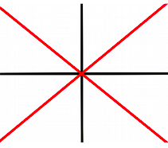
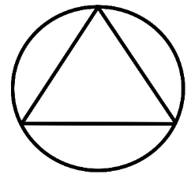
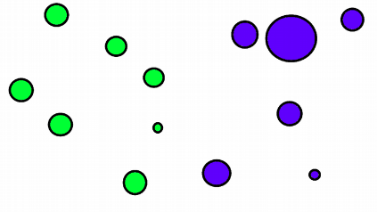
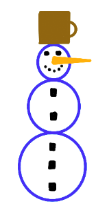

1. Nakreslite na veľkosť celého grafického okna spolu štyri čiary. Dve na seba kolmé prechádzajúce stredom a dve diagonály spájajúce protiľahlé rohy.
   
   

2. Vytvorte následujúci tvar – kružnicu opísanú trojuholníku.
   
   
   
3. V priestore grafickej plochy vytvorte n vyfarbených kružníc na náhodnej pozícii x, y (v rozmedzí okna) s náhodným polomerom r (10 – 40 pixelov).
Farba každého kruhu bude závisieť od toho, či sa nachádza na pravej alebo ľavej polovici okna. Napríklad všetky na pravo budú modré, na ľavo zelené. Skúste sa pohrať so šírkou prázdneho predelu v strede.

   
   
4. Nakreslite snehuliaka s použitým základných geometrických útvarov.
   
   

5. Vytvorte funkciu, ktorá nakreslí dopravný prostriedok (lokomotívu / automobil / bicykel) na súradnice x, y s dĺžkou l. Tieto informácie bude 
   možné zadávať ako parametre funkcie. Potom zavolajte túto funkciu a na konkrétnom mieste predmet vykreslite.
