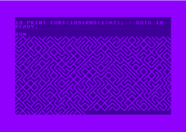
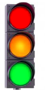
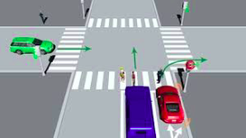
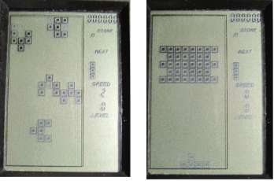

1. **10 PRINT** - Vytvorte mriežku čiar, v ktorej každé políčko bude náhodne tvorené čiarou z ľavého horného do prvého
dolného rohu alebo z ľavého dolného rohu do pravého horného štvorca. (/, \). Kresbu môžete doplniť rôznymi grafickými efektmi 
(tieňovanie, farebný gradient, a pod.)

2. **Semafór** - Programátorsky opíšte obrázok semafora a zabezpečte, aby sa svetlo rozsvietilo pri kliknutí myšou na plochu svetla. 
Pri stlačení šípok (hore, dole) na klávesnici sa bude posúvať, ktoré svetlo svieti. Len jedna farba môže byť aktívna naraz! Svietiť 
znamená, že z tmavšieho odtieňa sa farba zmení na svetlejší.
- Rozšírenie: Pri aktívnom svetle bude možné meniť jeho intenzitu (jas farby) klávesami +, -. Pomôcka: použite farebný model HSV namiesto RGB.

3. **Spájanie čiar** - Pri kliknutí do grafickej plochy sa vytvorí bod (farebný kruh) a ak existuje predchádzajúci, tak sa s ním spojí čiarou.
- Uložte body v poradí vytvárania do súboru. Formát zvoľte najvhodnejší pre ľahké ďalšie spracovanie.
- Z konzoly bude možné zadať súbor, z ktorého sa majú body načítať do grafickej plochy. Keď sa tak stane existujúca kresba sa premaže.
- Po kliknutí na bod (zvýrazní sa) ho bude možné posúvať po grafickej ploche bez toho, aby sa porušili čiary spájajúce ho s jeho susedmi.

4. **Križovatka** - Vytvorte simuláciu križovatky, kde sa z každej strany môže náhodne zjaviť auto idúce smerom ku križovatke.
Ovládaním semaforov (červená, zelená) zabezpečte, aby sa autá nikdy nezrazili, tj. reagovali na svetelný signál zastavením/pokračovaním v jazde. 
Tiež by mali čakať z každého smeru zhruba rovnaký krátky čas. Doprava musí byť plynulá.

5. **Retro Hry**
- Tanky
- Odrážanie loptičky ničí stenu
- Žabka prechádza rieku po drevách

