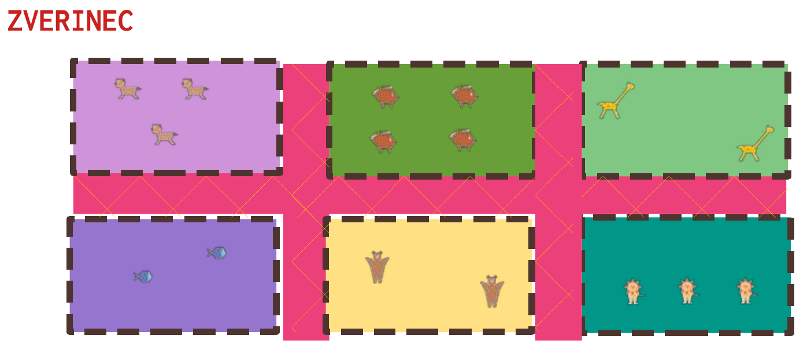
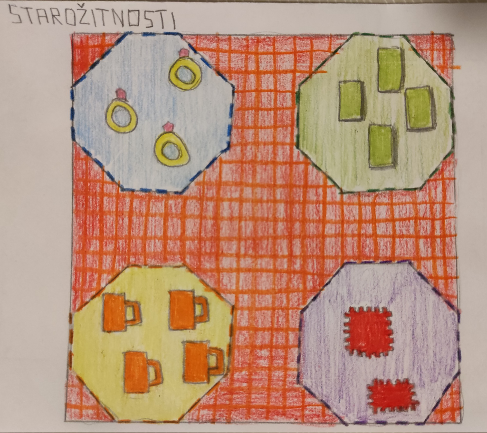
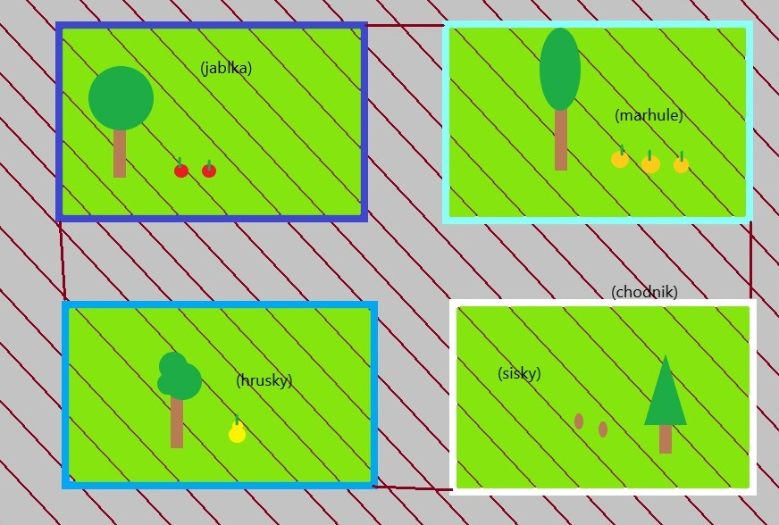
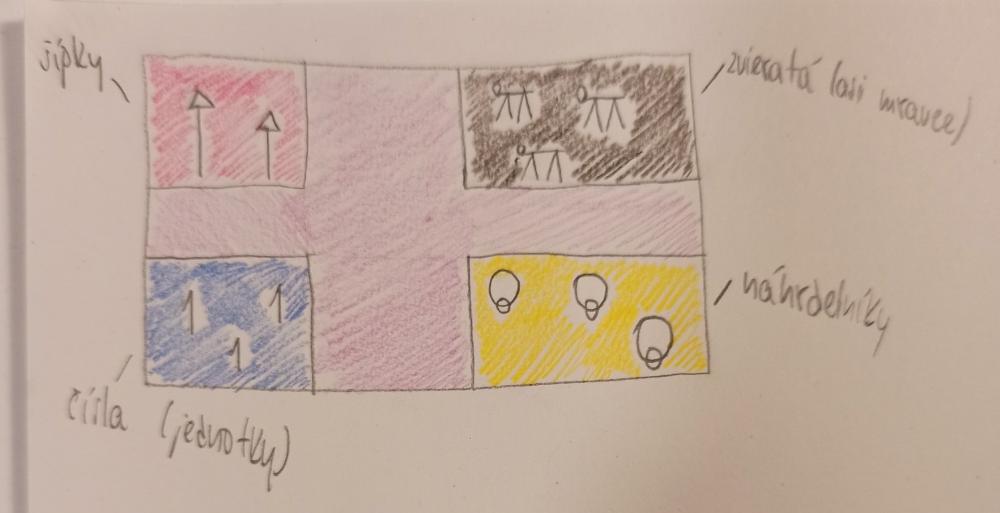
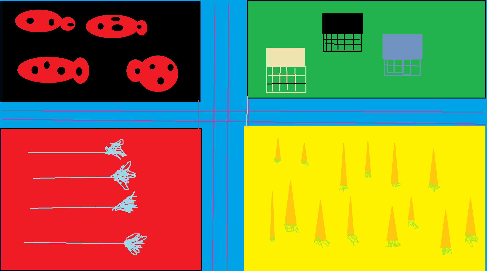

- **Téma:** Korytnačia grafika

Keď sa chce Pán Zberateľ Všeličoho podeliť s ostatnými o svoju veľmi cennú zbierku v plnej kráse, musí nájsť priestor, kde by ju rozložil. Na slnku vyzerá všetko krajšie, preto sa Pán Zberateľ rozhodol, že bude mať výstavu v záhrade. Aby mu neprajníci nepoškodili cennosti musí ich oplotiť a zároveň ich tým rozdelí do zvlášť ohrád. Záhrada môže byť, podľa počtu rôznych zberateľových cenností, rozložená napríklad takto:

1. Úloha (5 b):
	- Vymyslite si čo bude Pán Zberateľ zbierať. Musí to byť aspoň 4 rôzne veci / zvieratá / rastliny, ktoré dokážete nakresliť z geometrických útvarov korytnačkou 
    - Výstava musí byť ladená veselo, preto si vyberte akými farbami natriete plot každej ohrady, vyfarbíte zem a aký vzor bude na hlavnej ceste. Náčrtok záhrady predstavíte na hodine.
2. Úloha (15 b): V Imagine Logo nakreslite mapu výstavy, podľa toho čo Pán Zberateľ zbiera.
    - (3 b) Musí pozostávať z ohrád (uholník – trojuholník / štvorec / …), pričom každá strana “uholníka” sa ponášať na plot zhora (striedavo hrubšie a tenšie čiary).
    - (5 b) V každej ohrade musia byť najmenej 2 rovnaké predmety. V iných ohradách sú odlišné predmety.
    - (2 b) Ku každej ohrade sa bude dať dostať vzorovanou farebnou cestou.
    - (3 b) V ľavom hornom rohu napíšte názov výstavy (vymyslite si, najmenej 4 písmená) nakreslením písmen slova.
    - (2 b) BONUS: Tlačidlá na pohyb korytnačky po výstave.

Určite použite vlastné príkazy pre nakreslenie ohrady a každého z 4 rôznych predmetov. Pre nakreslenie viacerých príkazov použite príkaz opakuj. Ostatné použitie príkazov je na Vás.

Pošlite súbor, ktorý uložíte v Imagine Logo (s príponou .IMP) a všetky použité príkazy vo Worde (.docx), ktoré ste použili na nakreslenie (vrátane obsahu vlastných príkazov)! (Za správne poslané súbory sú 2b)

---
**Galéria minulých projektov**

{ width="300" }
{ width="300" }
{ width="300" }
{ width="300" }
