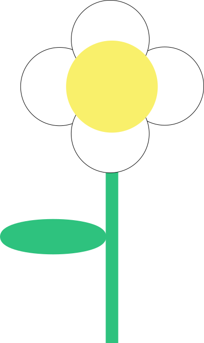
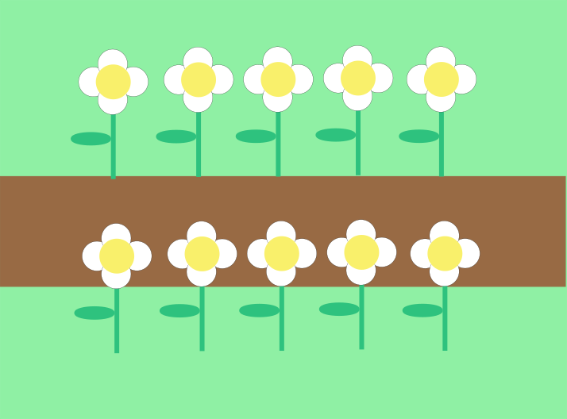

V blízkom parku rozkvitol utešený záhon sedmokrások. Láka ťa vziať si jednu z nich a pri trhaní lupienkov si položiť odvekú otázku: "Ľúbi ma, neľúbi ma...?" Toľká škoda by bola znivočiť takú pastvu pre oči len z rozmaru. Preto napíšeš program, ktorý sedmokráskam ubližovať nebude a prinesie ti kvetinový záhon domov.

1. Program nakreslí na obrazovku sedmokrásku z geometrických útvarov. Bude sa podobať obrázku. Sedmokráska sa skladá zo stonky (obdĺžnik), listu (elipsa), a kvetu (kruh) s okvetnými lístkami (4 kruhy).

2. Prepíš úlohu č.1, tak, aby sme sedmokrásku mohli nakresliť na ľubovoľných súradniciach x, y na obrazovke. Príkazy doplň do vlastného podprogramu s predpisom (namiesto troch bodiek):
```python
def sedmokraska(x, y):
    ...
```
3. Rozmiestni 5 sedmokrások vedľa seba na obrazovku. Nebudú sa medzi sebou prekrývať. Použi cyklus a podprogram z predošlej úlohy.
4. Aby sme ocinúť v obklopení kvetiniek, nakresli druhý rad 5 sedmokrások. Medzi dvoma radami sedmokrások bude hnedý chodník a pod sedmokráskami svetlozelená tráva.




---
**Návrh na hodnotenie (max. 10 b)**

1. 4b
2. 3b
3. 1.5b
4. 1.5b
