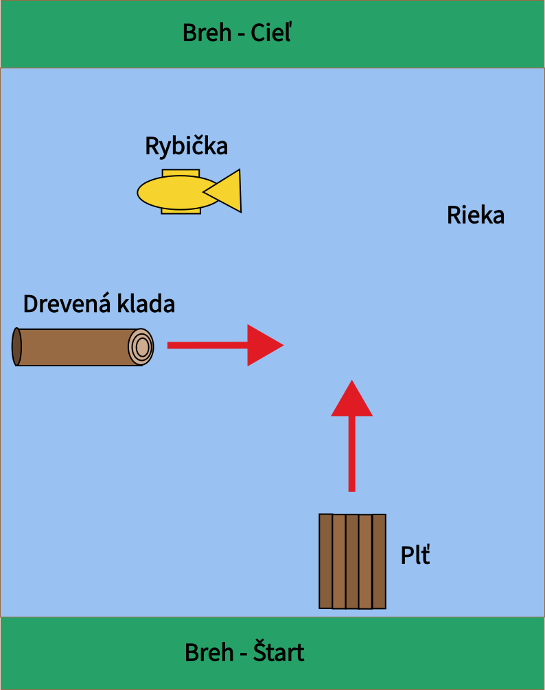

## Príbeh

> Lodivod sa chcel dostať do lepšieho prúdu, aby sa vyhol zradným brehom a zamieril k pravému brehu, ku ktorému sa dosiaľ nepriblížil. Manéver sa nezaobišiel bez ťažkostí, no lodivod ich šťastne zdolal ... Dva dni plávala plť podľa toho, ako to umožňoval prúd, raz pri pravom, raz pri ľavom brehu, ale po celý čas neutrpela ani najmenší podozrivý náraz.
> - Jules Verne, 800 míľ po Amazone

Sú to časy už dávno minulé, kedy Dunaj v blízkosti veľkých miest obkolesoval spleť malých ostrovčekov. V tomto vodnom kráľovstve žil aj náš bájny pltník Augustín, ktorý prevážal vzácnych, aj menej známych hostí z brehu na breh. A veruže tých brehov mal po ceste neúrekom. Vrásky na čele mu každodenne robili kusy dreva, ktoré sa valili dole prúdom sťa katamarány. Keby narazili v takej rýchlosti do krehkej plte zaraz by sa všetci z paluby ocitli v nemilosti dravej rieky. Na obživu Augustín lovil dunajské ryby, ale nie vždy mu prišli na mušku. Také boli strasti skromného pltníka Augustína v objatí riečiska.

## Popis hry
Pltník Augustín si ťa vzal za učňa a učí ťa tajomným dunajským zákonitostiam a zákutiam. V počítačovej hre, ktorú vytvoríš, budeš v plti prevážať pocestných z jedného brehu na druhý. Po ceste na teba číhajú drevené klády unášané prúdom rieky. Musíš si po ceste uloviť rybičku na chutný obed.

## Úlohy

1. Na paper naskicuj a naprogramuj kreslenie predmetov v hre. Každý predmet kresli na obrazovku v samostatnom podprograme:
    - plť
    - drevená klada (drevo)
    - rybička
2. Nakresli scénu, kde sa bude hra odohrávať. Dva trávnaté brehy oddelené riekou.
3. Vytvor animáciu na pohyb plťky z jedného brehu na druhý
4. Pridaj do animácie pohyb drevenej klády po strede rieke. Drevo sa objaví na jednom okraji obrazovky a zmizne na druhej strane obrazovky. Po zmiznutí za okrajom obrazovky sa drevo vráti na začiatok, a to sa dookola opakuje.
5. Ovládaj plť do dvoch strán pomocou šípok na klávesnici.
6. Reštartuj hru po narazení plte do drevenej klády. Plť sa vráti na východzí breh rieky.
7. Po zmiznutí dreva za okraj obrazovky a vrátení na začiatok, nastav drevu náhodný posun voči stredu rieky.
8. Nakresli rybičku na náhodných súradniciach v rieke za drevom.
9. Pri ulovení rybičky a priplávaní na druhý breh oznám, že hráč vyhral.
10. (*) Gratulujem! Keď si úspešne dokončil predošlé úlohy, tak si naozaj macher. Logické myslenie máš v malíčku. Teraz mám pre teba nápady, ako hru spraviť zaujímavejšou:
    - Pridanie levelov: po doplávaní na druhý breh sa môže začať nová hra, kde budú rieka rýchlejšia, plť pomalšia, ryba menšia, ...
    - Plť bude unášaná prúdom rieky. Plť začne hore po prúde a bude sa musieť dostať na druhý breh predtým než odpláva priďaleko.
    - Ďalšie nástrahy: okrem drevených klád bude na plť číhať nebezpečný vodný vír.

## Inšpirácia
Hra "Pltníci na Dunaji" je voľne inšpirovaná legendárnou arkádovou hrou [Frogger](https://en.wikipedia.org/wiki/Frogger)
