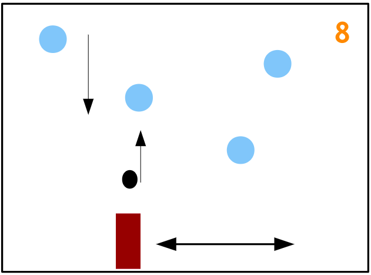

Hra pozostáva z týchto typov predmetov: delo, projektil, snehuliaci, skóre

**Delo** sa nachádza naspodku obrazovky. Znázornené je jednofarebným obdĺžnikom. Hráč ho
pohybuje šípkami doprava alebo doľava alebo pohybom myši v okne, kde sa berie do úvahy len jej
x - ová súradnica.

Po stlačení klávesy na výstrel (napr. X), alebo stlačením tlačidla myši, delo vystrelí **projektil**
(kruh / vianočná hviezda) smerom k hornému okraju obrazovky. Potom môžu nastať dve situácie:
- **Zásah**: projektil trafí snehuliaka a snehuliak je zničený. Hráčovi sa **pripočíta bod do skóre**
- **Mimo**: projektil preletí hornú hranicu obrazovky a nič sa nestane

**Snehuliaci** sú vytváraní v pravidelných intervaloch, vždy s inou x súradnicou. Pohybujú sa rovno
smerom k dolnému okraju obrazovky. Figurujú ako NPC. Znázornení sú svetlomodrým kruhom.
Akonáhle sa snehuliak dostane do úrovne dela, hra sa končí a hráč prehráva. Pokiaľ hráč dosiahne
istý počet bodov, vyhráva.

**Vylepšenia:**
- Nahradiť jednoduché geometrické útvary textúrami generovanými buď procedurálne alebo načítanými ako obrázky.
- Vytvoriť snehuliakov s rôznymi vlastnosťami - rýchlosť, životy (musia byť zasiahnutí viacerými
projektilmi, aby boli úplné zničení) , veľkosť, sebaobranné schopnosti (tiež vedia strieľať)
- Medzi snehuliakmi sa budú pohybovať neškodné ovečky, za ktorých zastrelenie sa odpočítajú
body
- Predstavivosti sa medze nekladú. Navrhnite vlastné modifikácie ...

