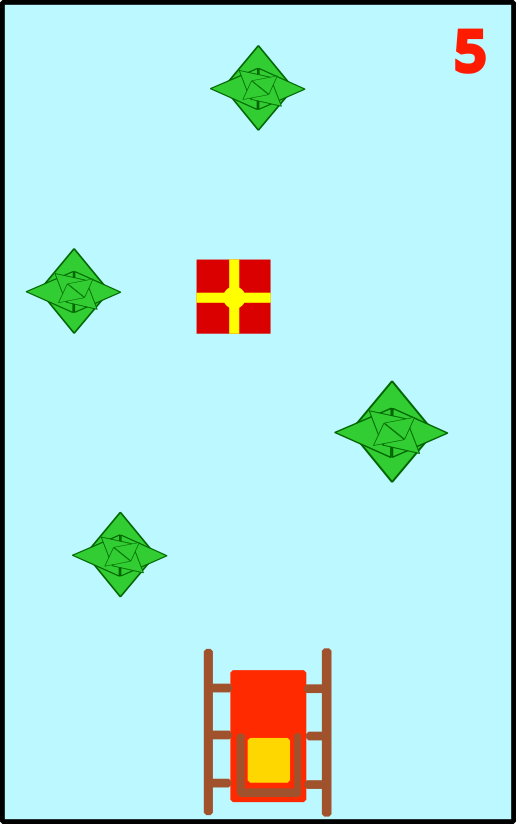

## Príbeh

Na ceste zo severného pólu na saniach plných darčekov pre poslušné deti z celého sveta sa Mikulášovi prihodila nepríjemná situácia. V lesoch severskej tajgy zbadal sa stratene potulovať jedného zo svojich menej šikovných škriatkov. Rozhodol sa ho zachrániť, ale pre hustý porast stromov musel zastaviť na vzdialenejšej čistinke.

Keď prišiel so škriatkom naspäť na miesto, kde odparkoval svoje sane, s prekvapením zistil, že sa záprah sobov splašil. Rozutekali sa kade ľahšie pred svorkou vlkov, ktorá krúžila opodiaľ. Zostali mu len sane a darčeky rozkotúľané po lese odnesené prefíkanými líškami. Pomôžte Mikulášovi sa dostať na saniach z hustého lesa, pozbierajte darčeky a zachráňte Vianoce!

## Herné predmety

V hre vystupujú Mikulášove **Sane**, **Stromy** hustého lesa, a rozkotúľané **Darčeky**, a **sneh** na zemi. Pohľad je zvrchu (akoby z lietadla).

## Priebeh hry

**Sane** sa neustále pohybujú vpred po lese. Hráč ich vie **pohybovať doprava a doľava šípkami** na klávesnici, aby sa vyhol stromom. Stromy sú vytvorené na náhodných x-ových súradniciach. V skutočnosti budú v grafickej ploche sane umiestnené na pevno uprostred dole a **stromy budú zväčšovať svoju y-ovú súradnicu**. Čím sa navodí ilúzia pohybu saní. Medzi stromami sa na náhodných x-ových súradniciach **budú objavovať darčeky**.

Keď sane narazia do stromu hra sa končí. Keď sane prejdú cez darček priráta sa do skóre 1 bod.

## Vylepšenia

- Zrýchľovať sane úmerne s rastúcim počtom bodov v skóre
- Vytvoriť špeciálne typy darčekov, ktoré hráčovi dočasne pridajú novú schopnosť. Napríklad namiesto jedného má hráč tri životy, čie keď narazí do stromu ním dvakrát prejde bez ujmy.
- V lese sa budú pohybovať neškodné veveričky, za ktorých zrazenie sa odpočítajú body zo skóre
- Predstavivosti sa medze nekladú. Navrhnite vlastné modifikácie ...

## Bodovanie projektu pre Seminár z informatiky

- **Maximálny počet bodov za projekt je 20**, z ktorých je vypočítaná známka podľa klasifikačného poriadku.
- Za každé funkčné vylepšenie **navyše sa pridávajú 3 body**.
- Hra musí byť naprogramovaná v jazyku Python v Tkinter. Môžete používať aj príkazy, ktoré sme si neukazovali, keď viete vysvetliť ako fungujú.
- Za neúplné úlohy sa prideľujú čiastkové body.

**Návrh na hodnotenie**

1. **(7 b)** Nepohyblivé herné predmety (sane, strom, darček, sneh) nakreslené z geometrických útvarov.
2. **(4 b)** Sane sa dajú pohybovať doprava a doľava šípkami na klávesnici
3. **(4 b)** Stromy alebo darčeky (vytvorené na konštantných súradniciach) sa pohybujú smerom nahol po obrazovke.
4. **(1 b)** Stromy alebo darčeky sú vytvárané na náhodných počiatočných súradniciach.
5. **(1 b)** Darčeky sa neprekrývajú so stromami.
6. **(1 b)** Po náraze saní do stromu sa ukončí hra.
7. **(2 b)** Po kolízií saní s darčekom sa do skóre pripočíta bod
