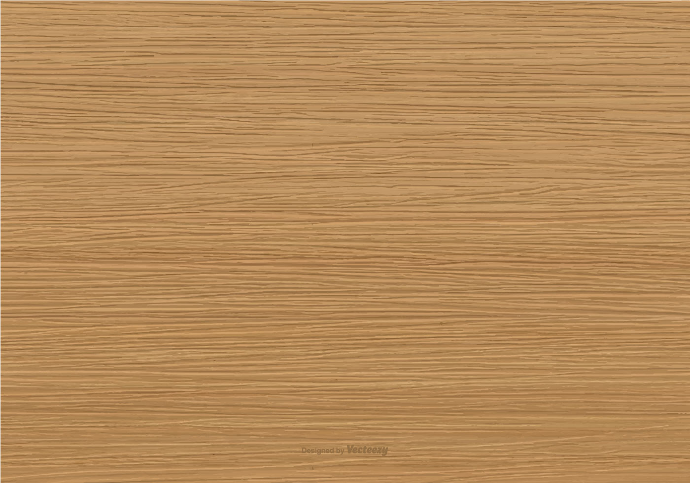

## Postavičky

{ width="50" }
{ width="50" }
{ width="50" }
{ width="50" }
{ width="50" }
{ width="50" }
{ width="50" }

## Hra

```python
from pygame import *

BLACK = Color(0, 0, 0)
WHITE = Color(255, 255, 255)

WIDTH = 600
HEIGHT = 600
screen = display.set_mode((WIDTH, HEIGHT))

policka = 8
riadok = HEIGHT // policka
stlpec = WIDTH // policka

texture = image.load("wood.jpg")
texture = transform.scale(texture, [WIDTH, HEIGHT])
screen.blit(texture, [0, 0])

chessboard = Surface([WIDTH, HEIGHT])
chessboard.set_alpha(128)

for r in range(policka):
    for s in range(policka):
        color = BLACK if (r + s) % 2 == 1 else WHITE
        y = r * riadok
        x = s * stlpec
        draw.rect(chessboard, color, (x, y, riadok, stlpec))

screen.blit(chessboard, [0, 0])

figures = {
    "P": image.load("pesiak.png"),
    "J": image.load("jazdec.png"),
    "V": image.load("veza.png"),
    "S": image.load("strelec.png"),
    "K": image.load("kral.png"),
    "D": image.load("dama.png")
}

start = {
    "P": ["A2", "B2", "C2", "D2", "E2", "F2", "G2", "H2"],
    "V": ["A1", "H1"],
    "S": ["C1", "F1"],
    "J": ["B1", "G1"],
    "K": ["E1"],
    "D": ["D1"]
}

for fig, pos in start.items():
    texture =  transform.scale(figures[fig], [riadok, stlpec])
    for place in pos:
        x = stlpec * (ord(place[0]) - ord('A'))
        y = HEIGHT - riadok * int(place[1])
        screen.blit(texture, [x, y])

"""
strelec = image.load("strelec.png")
strelec = transform.scale(strelec, [riadok, stlpec])

position = "B1"
x = stlpec * (ord(position[0]) - ord('A'))
y = HEIGHT - riadok * int(position[1])
print(x, y)
screen.blit(strelec, [x, y])
"""

while True:
    display.update()
    time.delay(30)
```