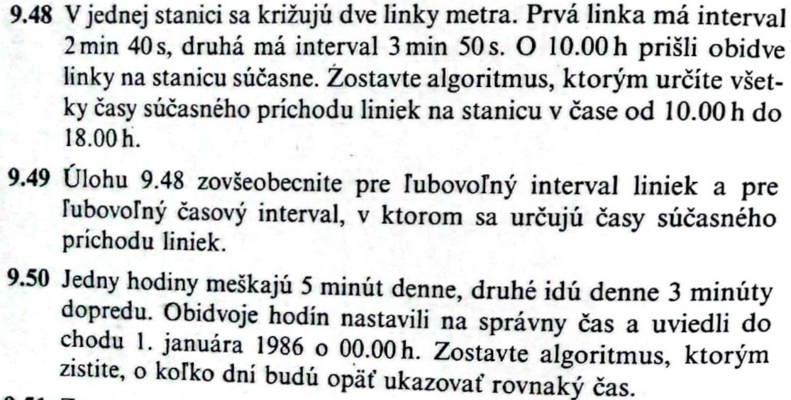
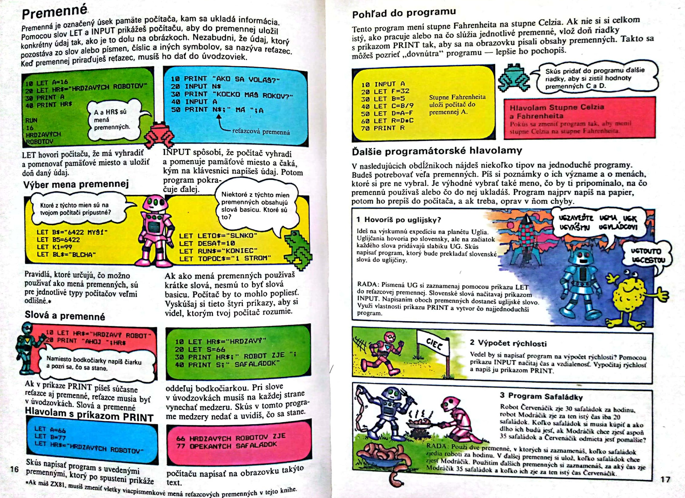
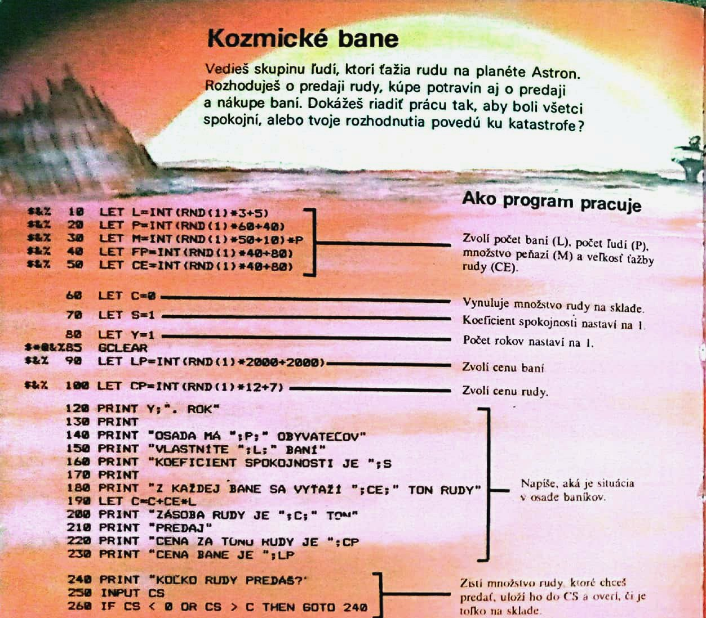
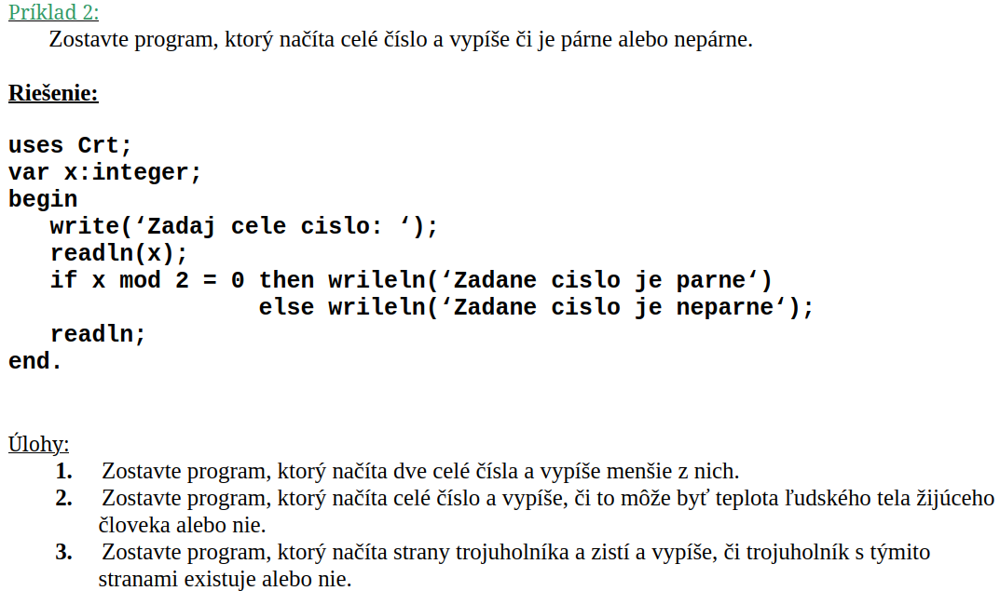
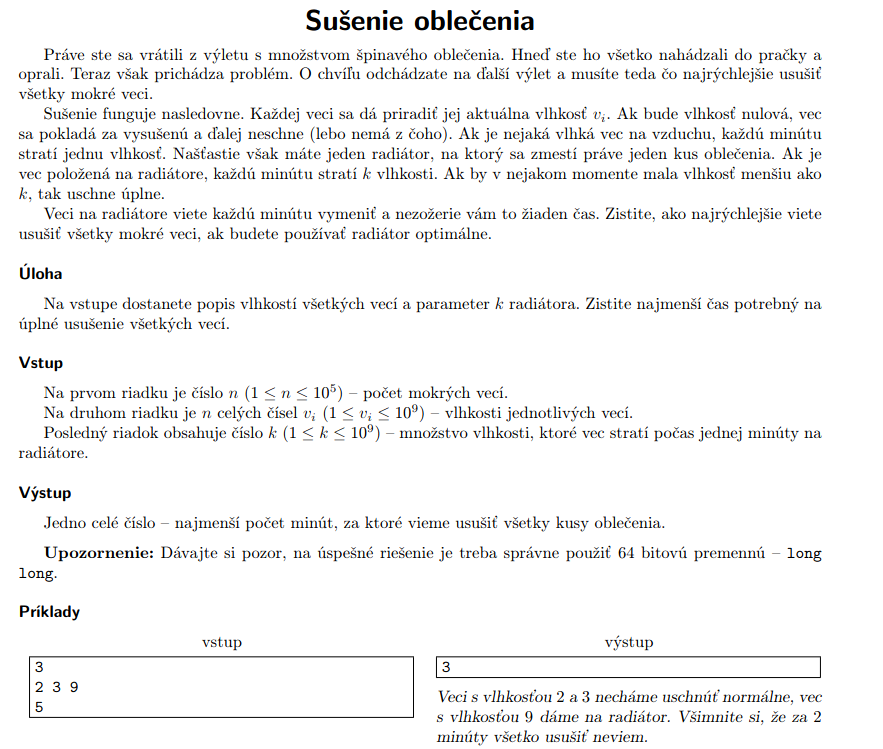
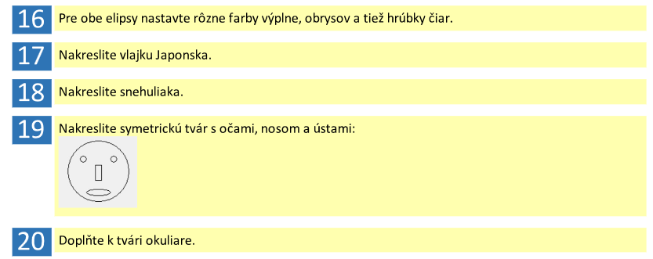
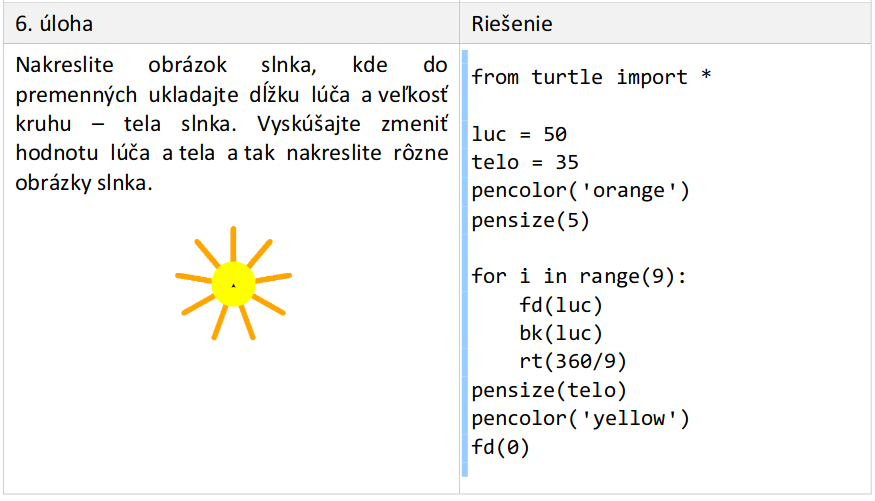

Súčasný stav problematiky tvorby edukačných materiálov obsahuje zákonitosti stavby a funkcií učebnice, odporúčania pri písaní zrozumiteľných učebných textov a rozvrhovaní didakticky správneho systému úloh v zbierke. Tiež porovnáme doterajšie učebnice programovania pre stredné školy navzájom a vzhľadom na štátny vzdelávací štandard. 

## Učebnica
Základným prameňom poznatkov a nositeľom obsahu vzdelávania je učebnica, ktorá patrí medzi čelných predstaviteľov pedagogických textov. Predstavuje jadro zoskupujúce okolo seba ostatné učebné prostriedky. V medziach učebných osnov vymedzuje obsah základného učiva s doplnením o rozširujúce učivo, pričom rozsah osnovy učebnice nemusí byť totožný s učebnými osnovami.

Učebnica pomáha žiakom s osvojením si obsahu učiva, čím podporuje všetky súvisiace čiastkové činnosti: precvičovanie, opakovanie, systematizáciu a integráciu. V edukačnom procese pôsobí učebnica aj výchovne, čím vplýva na formovanie postojov, motívov a záujmov. Odlišuje sa v tom od iných kníh a textov, pretože má priamu spätosť so získavaním a spracovaním faktov, pojmov a vzťahov žiakmi. Efektívne tak smeruje k dosiahnutiu výchovno-vzdelávacích cieľov vyučovacieho predmetu. Učebný program žiaka a vyučovací program učiteľa je ideálne v učebnici podchytený a odráža sa do scenára učebného a vyučovacieho procesu. Hlavná časť učebnice predstavuje súbor úloh určených na aktívne riešenie.

Podľa školského zákona sa učebnica spolu s učebným textom a pracovným zošitom zaraďuje medzi edukačné publikácie. Na vzdelávanie sa používajú publikácie schválené ministerstvom školstva alebo zodpovedajúce princípom a cieľom výchovy a vzdelávania. Princípy súvisiace s vlastnými vzdelávacími materiálmi sú v duchu rovnoprávnosti, rovnocennosti, zodpovednosti, tolerancie a vyváženého rozvoja osobnosti a zdokonaľovania vzdelávania podľa výsledkov výskumu a vývoja.

## Didaktické funkcie učebnice
V učebnici pôsobí viacero naviazaných a prelínajúcich sa vlastností vystupujúcich vo výchovno-vzdelávacom procese, ktoré sú tu opísané bez stanoveného poradia dôležitosti:

- **Informačná funkcia:** sa sústreďuje na vymedzenie povinného rozsahu informácií pri štúdiu nevyhnutných na zapamätanie.
- **Transformačná funkcia:** spočíva v didaktickom transfere poznatkov vedného odboru na obsah učiva v zrozumiteľnej a pútavej podobe. Zároveň berie ohľad na vekové a kultúrne osobitosti žiakov. Nabáda na výber vzdelávacích metód a uľahčuje aktivizáciu žiaka pri cvičeniach a úlohách prieskumného charakteru. Pri transformácii znalostí sa hľadí sa aj na potreby profesijného života a spoločenského očakávania od absolventov.
- **Systematizačná funkcia:** pri objasňovaní učiva zabezpečuje následnosť poznatkov, postupný nárast náročnosti a vedie k metódam vedeckej systematizácie.
- **Usmerňujúca funkcia:** slúži k upevňovaniu vedomostí, napomáha v orientácii sa v nich a zapojením ich do praktických druhov činností. Vyžaduje sprevádzanie navrhnutými aktivitami pod vedením učiteľa.
- **Motivačná funkcia:** pobáda túžbu a schopnosti žiakov na samostatné získavanie vedomostí.
- **Integračná funkcia:** ucelene spája poznatky žiakov nadobudnuté z ich rozličných činností.
- **Koordinačná funkcia:** zapája ku vzťahu k študovanému predmetu informácie z masovokomunikačných prostriedkov.
- **Výchovná funkcia:** súčasne tiež rozvíjajúca funkcia. Spočíva v zladenom formovaní čŕt osobnosti žiaka.

Uvedené didaktické funkcie zabezpečujú komplexné pôsobenie učebnice na rozvoj kognitívnych a afektívnych schopností žiaka. Pri ich prepojení v učebnom texte dochádza nielen k nadobudnutiu nevyhnutných vedomostí a zručností na zvládnutie vyučovacieho predmetu, ale aj na rozvoj kľúčových kompetencií a medzi nimi pripravenosť k ďalšiemu vzdelávaniu sa.

## Prvky učebnice
Aby učebnica plnohodnotne napĺňala svoje mnohé poslania, je poskladaná z \textbf{prvkov textového i mimotextového charakteru}, ktoré podnecujú aktívne kognitívne procesy a umožňujú zapojenie zvoleného učebného štýlu čitateľa. Zaradenie súčastí učebnice do členenia jej podsystémov nie je striktné, ale riadi sa dominantnou funkciou danej časti.

Text v učebnici je súhrn viacerých viet, ktoré sú prostriedkom na odovzdávanie informácií žiakom podľa komunikačného zámeru autora. Z povahy súvislého písaného jazykového prejavu sa vyznačuje kohéziou a koherenciou. Kohézia je súdržnosť textu na úrovni vzájomnej nadväznosti medzi vetami za použitia gramatických, lexikálnych a grafických jazykových prostriedkov. Najčastejšie sa uplatňuje gramatická zhoda medzi nadradeným a podradeným slovným druhom alebo vetným členom, opakovanie výrazu ďalej v texte, synonymá, a interpunkčné znamienka. Koherencia je zase tematická spojitosť textu, keď sa z hlavnej rozvíjajú vedľajšie myšlienky.

Podľa úlohy, ktorú zohráva text v predstavovaní učebnej látky sa rozlišuje \textbf{základný, doplňujúci a vysvetľujúci text}. Základný text je určený ako povinný na osvojenie pre zvládnutie problematiky. Podľa typu činností motivovanej základným textom sú povšimnuté teoretické poznávacie texty, považované tiež za výkladovú zložku zastávajúcu informačnú funkciu vysvetľovania a komentovania nového učiva. Naproti tomu u inštrumentálno-praktických textov a nevýkladovej zložky prevláda transformačná funkcia premietajúca sa do otázok, úloh a cvičení. Doplňujúci text prehlbuje rozsah učebných osnov dodatočnou argumentáciou vplývajúcej na rozumovú a emočnú stránku. Regulovanie poznávacej činnosti má na starosti vysvetľujúci text, ktorý dáva základný text do súvislostí.

Mimotextové zložky nachádzajúce sa v učebnici sa rozlišujú na **aparát organizácie osvojovania, ilustračný materiál, a orientačný aparát**. Na organizáciu osvojovania slúžia prehľadové tabuľky, otázky a úlohy spolu s odpoveďami, ktoré v závislosti od kontextu môžu spadať aj do základného textu. Ilustrácie prevažne graficky dotvárajú textovú zložku, s ktorou sú vo vzťahovej rovine, buď nadradenosti ako vedúce ilustrácie, rovnocennosti, alebo podriadenosti ako doplnkové ilustrácie. Súvislosť medzi textom a ilustráciou sa pozná podľa toho, či text opisuje ilustráciu, vtedy je text podriadený, alebo ilustrácia slúži na dokreslenie situácie. Typickými príkladmi ilustrácií sú obrázky, schémy, plány, diagramy, grafiky, mapy. Orientačný aparát slúži na zdôraznenie slovných spojení alebo myšlienok cez tlačové zvýraznenia a symbolické značenie. Opakuje tiež prvky z hlavnej časti v zhutnenej podobe na navigovanie v knihe, v čom spočíva úloha predhovoru, obsahu, a registrov.

Tradičná redakčná výroba učebnice dbá na ustálené metódy a organizovanú spoluprácu pre kontrolu správnosti obsahu po odbornej stránke. Redakcia dohliada na gramatickú, pravopisnú a štylistickú úpravu. Zasadzuje sa o koordináciu činnosti autorských kolektívov, tak aby umožnila zosúladiť všetky dôležité prvky učebnice najmä súhru textovej a grafickej časti. Osvedčené pracovné postupy redakcie zabezpečujú zahrnutie podstatných zložiek učebnice. Postup sa začína s vypracovaním osnovy učebnice, prípravou materiálov a podkladov. Nasleduje príprava rukopisu a obrazových predlôh, v čase vymedzenom stanoveným harmonogramom, ktoré následne prechádzajú korektúrou. Celkové snaženie je zavŕšené vydaním učebnice a získaním doložky od ministerstva školstva podľa osobitého predpisu. Tvorba vzdelávacích materiálov priamo učiteľmi nie je až tak rigidná, ale redakčné techniky navádzajú aspoň na zmysluplnú organizáciu práce.

## Multimediálne prostredie
Postavenie výuky informatiky okolo počítačov a súvisiaceho prídavného vybavenia vedie k prirodzenej snahe uspôsobovať edukačné materiály naskytajúcim sa podmienkam. Učebné texty tým môžu zužitkovať príležitosti na obohatenie ich obsahu multimédiami a hypertextovými prepojeniami. Princípy uplatňujúce sa pri tvorbe klasických učebníc sa nevyhnutne prenášajú aj na tvorbu multimediálnych učebníc, pretože rovnako zostávajú publikáciami uspôsobenými ku didaktickej komunikácii.

Množstvo existujúcich učebníc prechádza do online prostredia zo svojej pôvodne knižnej úpravy na zvýšenie ich atraktívnosti a pohodlia pri prístupe k nim. Ani vznik učebnice určenej primárne pre elektronické médium však ešte nezaručuje využitie plného potenciálu na skĺbenie inovatívnych vyučovacích metód a ponúknutých technických vymožeností. Učebnice sa preto odlišujú podľa miery ich splynutia s digitálnym prostredím na **jednoduché, komplexné a pokročilé učebnice**.

Jednoduché učebnice sú elektronickým obrazom svojich papierových vzorov bez uplatnenia akýkoľvek nových rozširujúcich možností. Komplexné učebnice získame zakomponovaním multimediálnych prvkov, zastúpených prevažne zvukmi, obrázkami, animáciami, videom, a vložením  hypertextových odkazov smerujúcich dovnútra vlastného obsahu, na externé webové portály a ďalší multimediálny obsah. Pokročilé učebnice navyše pozostávajú z interaktívnych prvkov aktívne prispôsobujúcich tok informácií. Interakcia sa odohráva cez tlačidlá, posuvníky, kontextový pomocník, a príbuzné ovládanie. Nadstavbou pokročilej učebnice je edukačný softvér.

**Interaktívne personalizované úlohy** slúžia na obohatenie osvojenia vedomostí z multimediálnej učebnice. Snaha vedie k znížovaniu kognitívnej záťaže pri návrhu používateľských rozhraní, tak aby sa žiak mohol sústrediť výhradne na osvojované učivo, než na ťažkosti s komplikovanými krokmi na dosiahnutie vytýčených zámerov vo virtuálnom priestore. Teórie venujúce sa tomuto problému súvisia s obmedzeniami kapacity krátkodobej pamäte.

**Teória kognitívnej záťaže** odporúča eliminovanie vonkajšej (*extraneous*) kognitívnej záťaže cez zjednodušenie kompozície zobrazovaných prvkov. Vonkajšia kognitívna záťaž zaberá miesto vnútornej (*intrisic*) a konceptuálnej (*germane*) záťaži, ktoré sú potrebné na riešenie samotnej úlohy. **Teória duálneho kódovania** hovorí, že verbálne a neverbálne podnety sú v pamäti kódované zvlášť. Tým sa zvyšuje počet položiek v krátkodobej pamäti, pokiaľ pochádzajú z odlišného zdroja.

## Skvalitňovanie učebného textu
Vylepšenia v učebných textoch sa uskutočňujú na základe teoretických východísk z porozumeniu textu pri **čítaní ako psycholingvistickej činnosti**. Na úspešné odhalenie komunikačného zámeru pozná recipient vzťahy medzi objektívnou realitou a na ňu odkazujúcimi prvkami textu, medzi jednotlivými prvkami textu a medzi textom a doterajšími znalosťami prijímateľa. 

Operáciou elaborácie čitateľ nachádza asociácie v prečítanom texte s už nadobudnutými sémantickými epizodickými znalosťami a vizuálnymi predstavami, pokiaľ jestvuje také spojenie. Inferencia umožňuje doplnenie zamlčaných informácii v texte, ktoré vyplývajú z opísaných pričinno-dôsledkových súvislostí. Počas zvnútorňovania edukačného textu dochádza k postupu od jeho porozumenia bez vzťahu k iným textom, cez prevod na parafrázy a symbolický zápis, cez interpretáciu vnášajúcej odlišný pohľad na prečítané, až ku extrapolácii inovatívnych záverov a schopnosti predpovedať dôsledky. 

Na objasnenie nových konceptov je teda prospešné, ak sú uvádzané východiskové situácie povedomé a autorova predstava sa zhoduje s čitateľovou. Čítaním môže nastať neporozumenie v tzv. **mikroštruktúre textu**. Do mikroštruktúry patria slová, vety, vzťahy medzi vetami, či štruktúra textu. Neznámym slovám dokážeme predchádzať ich vhodným výberom usúdenej z náročnosti pojmu. Na to slúžia taxonomické normy zachytávajúce typickosť pojmu, tým že ho zaradia pod názov nadradenej kategórie. Zložité vety odkazujúce sa vedľajšou vetou na vzdialené slová a včlenené prívlastkové vety by mali byť radšej rozdelené na dve vety. Pozornosť pri rozdeľovaní treba venovať neopomenutiu podstatných spájajúcich slov. 

**Zložitosť textu** sa opisuje kvantitatívnymi charakteristikami, ktoré sa prejavujú v čitateľnosti a náročnosti textu. **Čitateľnosť** sa zvykne merať dĺžkou viet alebo výskytom neobvyklých slov. Jednou z mnohých mier čitateľnosti je Gunning **Fog index**, v prijateľnom skóre pre stredné školy do 14. **Náročnosť** textu vychádza z lexikálnych a syntaktických faktorov, ktoré pokladajú na škálu zložitosť toho čo je povedané a akým spôsobom je to zapísané. *Průchová modifikácia Nestlerovej metódy* zisťuje obtiažnosť na vzorkách výkladového textu učebnice zohľadnením syntaktickej a sémantickej náročnosti. Pod 20 bodov sa jedná o text nízkej obtiažnosti a nad 60 bodov ide o texty vysokej obtiažnosti. Textu vyjadrujeme tiež inferenčnú záťaž, čiže nutnosť vyvodzovania vzťahov čitateľom. Znižuje sa umiestnením podobných myšlienok za sebou.

$$ 0.4 \cdot \left(\left(\frac{\sum slova}{\sum vety}\right) + \left(\frac{\sum \text{slova nad 2 slabiky}}{\sum slova}\cdot 100\right)\right)$$

$$ 0.1 \cdot \left(\frac{\sum slova}{\sum vety}\right) \cdot  \left(\frac{\sum slova}{\sum slovesa}\right) +  \left(\frac{\sum pojmy}{\sum slova}\right) \cdot \left(\frac{\sum P_1 + 3\sum P_2 + 2\sum P_3 + 2\sum P_4 + \sum P_4}{\sum slova}\right) $$

Ku kvalite textov učebnice prispieva aj **makroštruktúra textu**, ktorá rozčleňuje tematické okruhy na kapitoly a tie na texty. Na poskytnutie nadhľadu slúžia typografické zvýraznenia hrubým písmom alebo oddeľovacím prázdnym priestorom, nadpisy rôznych veľkostí na rozlíšenie tém a podtém, kľúčové vety vyjadrujúce hlavnú myšlienku, a uvádzajúce či rekapitulujúce otázky pobádajúce čitateľa na aktívne prijímanie materiálu. Nemenej znateľná pri čítaní je primerane jednoduchá grafická úprava, ktorá neodpúta pozornosť od obsahu. Prehľadnosť sa vylepšuje nastavením ľahko čitateľného písma s veľkosťou odrážajúcou hierarchiu celkov, riadkovaním do bloku, a zalamovaním príkladov v celku na jednu stranu.

Na hodnotenie kvality učebníc sa uplatňujú experimentálne, expertné a štatistické metódy. V autentickom školskom prostredí môžeme experimentálne overovať a porovnávať navrhovanú učebnicu so staršou zaužívanou. Pozorovatelia učebnice ako sú experti, učitelia a žiaci hodnotia rozličné vlastnosti, s ktorými prichádzajú do kontaktu, napríklad primeranosť, metodické spracovanie, zaujímavosť, zložitosť. Štatisticky sa kvantifikuje rozsah textu určený na vyučovaciu jednotku, čitateľnosť a náročnosť textu.

Výskum Drahošovej sumarizuje techniky pre pedagogickú prax na zlepšovanie zrozumiteľnosti učebného textu. Ohľadom výberu slov odporúča uprednostniť bežné slová, opísateľné pojmy a aktívne slovesá, zároveň sa vyhýbať nepotrebným slovám. V rovine štylistiky by sa malo písať s priblížením sa bežne hovorenej reči, v jednoduchých celkoch a krátkych vetách. Myšlienky textu vyjadrovať adresne a presvedčivo s opieraním sa o skúsenosti čitateľa.

## Systém úloh v zbierke
Skupina úloh sa označuje za systém úloh, keď plní konkrétnu didaktickú funkciu v súlade s učebnými cieľmi, štruktúrou poznávacieho procesu a podmienkami učebného procesu. Otázky na precvičovania učiva sa vyznačujú špecifikami oproti výkladovému textu, prevažne tým že ich riešenie bezpochyby vyžaduje aktívnu činnosť žiaka na rôznych úrovniach myslenia. Učiteľ v tomto štádiu pozoruje postup žiakov pri vypracovaní úloh a na základe ich vonkajších prejavov posudzuje a usmerňuje ich činnosť k želanému cieľu. Kritické je stanoviť následnosť a hierarchiu úloh, tak aby umožňovali kontinuálny rozvoj žiaka.  

### Psychologické východiská
Návrh systému úloh sa zapodieva s otázkami žiackej motivácie riešenia úloh, diferenciácie úloh vzhľadom na individuálne osobitosti žiakov, vhodného zoradenia úloh od jednoduchších k zložitejším a spôsobu merania stupňa zvládnutia učiva. Nedá sa predpokladať, že všetky témy budú samy osebe atraktívne. Dieťa sa však aspoň odhodlá k takým úlohám, ktoré sa domnieva že prekoná bez pociťovaných ťažkostí.

Úspech prirodzene motivuje na skúšanie väčších výziev. Nepríjemné skúsenosti a zlyhanie žiakov postupne odrádzajú. Výber a zoradenie úloh má zaručiť zážitky úspechu. Primeraný cvičebný materiál zodpovedá poznávaciemu potenciálu dieťaťa vo **vekových osobitostiach, individuálnych odlišnostiach a predchádzajúcich skúsenostiach**. Pokrok v psychickom vývine vyšších schopností dosiahneme zaradením nielen veku primeraným problémov, ale aj rozvíjajúcich na rozšírenie zóny najbližšieho vývinu podľa Vygotského. Z hľadiska individuálnych predpokladov na riešenie úlohy sa treba zamýšľať nad optimálnymi poznávacím štýlom, celkovou úrovňou schopností a profilom schopností na splnenie konkrétneho zadania. V zbierkach sa preto ponúkajú úlohy troch úrovní náročnosti: **menej náročné, stredné, vysoko náročné**.
 
Skupinu menej náročných úloh vedia riešiť priemerní žiaci v nižšom ročníku, teda sú určené na opakovanie a pre žiakov s pomalším tempom vývinu či nižšou poznávacou kapacitou. Stredne náročné úlohy s najväčšou početnosťou sú pochopiteľné pre priemerných žiakov v danom ročníku. Žiaci s vyššou poznávacou kapacitou dokážu prejsť vysoko náročnými úlohami, ktoré sú určené pre priemerných vo vyššom ročníku.
 
Úlohy by mali byť prispôsobené okrem schopností žiaka aj vedomostiam a spôsobilostiam. Získavanie nových schopností prechádza od nadobudnutia vedomostí v podobe pojmov a schém, cez osvojovanie spôsobilostí v priebehu čoraz vyladenejšieho motorického, senzomotorického a psychického cvičenia, až k rozvíjaniu myslenia spojeného so stratégiami formulácie problému a plánovania riešenia.

Efektívneho učenia celkove dosiahneme podľa Skinnera, keď sú známe konkrétne ciele výchovy a vzdelávania, žiakom je umožnené postupovať vlastným tempom nezávisle na ostatných, a okamžitou spätnou väzbou s odhalením správnej odpovede.

### Klasifikácia vlastností úlohy
Naplnenie tematického celku náročnosťou odstupňovanými úlohami s rozmanitými didaktickými funkciami a zapojením kognitívnych funkcií naprieč úrovňami myšlienkových operácií sa dá skontrolovať cez špecifikáciu vlastností konkrétnej úlohy. Od charakteristík úlohy sa odvíja  jej zaradenie do zbierky a sú to (s príkladmi z matematiky):

- **Téma**: názov tematického celku vo vyučovacom predmete *(napr. Funkcia)*.
- **Podtéma**: téma sa rozdeľuje na viaceré časti *(napr. Lineárna funkcia, ...)*
- **Element**: pojmy, vzťahy a procesy podľa obsahového štandardu. Rozsiahlejšie elementy môžu vystupovať ako podtémy *(napr. Pytagorova veta)*
- **Funkcia**: didaktické požiadavky na poznávací proces. Prípustné je ak úloha napĺňa niekoľko didaktických funkcií, napr. slovná úloha na upevnenie učiva s aplikáciou poznatkov mimo matematiky. Úlohy na základe didaktickej funkcie podľa D.Švedu sú :
    - úlohy na motiváciu učebnopoznávacej činnosti žiakov
    - úlohy na aktualizáciu skôr osvojeného učiva
    - prípravné úlohy predchádzajúce vysloveniu definície pojmu a riešeniu základných úloh 
    - úlohy na osvojenie definície pojmu, formulácie vety a postupu riešenia
    - úlohy na upevňovanie učiva
    - úlohy na aplikáciu učiva mimo informatiky
    - úlohy na aplikáciu učiva vo vnútri informatiky
    - úlohy propedeutického charakteru k nasledujúcim elementom učiva v tematickom celku
    - úlohy na opakovanie a systemizáciu
- **Úroveň**: úloha rozvíja zároveň všetky nižšie úrovne poznávacích procesov, preto sa označuje iba najvyššou. Poznávacie procesy podľa M.Zelinu sú:
    - vnímanie
    - pamäť
    - nižšie konvergentné procesy
    - vyššie konvergentné procesy
    - hodnotiace myslenie
    - tvorivé, divergentné myslenie

Klasifikácia úlohy podľa uvedených kritérií je náročná a subjektívna, lebo pri zaradení záleží od mnohých okolností ako sú formulácia úlohy, vedomosti a skúsenosti žiakov, podmienky vyučovania a organizačný prístup učiteľa.

### Preformulovanie úloh
Často sa vyskytujúci nedostatok systému úloh je neúplnosť pestrosti didaktického zamerania cvičení. Ukázalo sa, že nedostatok úloh vo fáze aktualizácie učiva, v prípravnej fáze alebo vo fáze osvojovania učiva sa dá prekonať vytvorením nových úloh vo forme jednoduchých otázok alebo iným zaradením podľa témy, podtémy a elementu učiva. Preformulovaním navyše dosiahneme úpravy kategórií úlohy, či zvýšenie alebo zníženie jej obtiažnosti. Doplnenie chýbajúcich typových úloh sa môže realizovať rozličnými prístupmi, z ktorých vyzdvihujeme tri systematické metódy:

- **Zmena podmienky v zadaní**: najčastejšie mení tému, podtému, element učiva, čím môže mať vplyv na etapu vyučovacieho procesu, kedy sa úloha osvedčí použiť. Konkrétnosti dopadu na úlohu závisia od presného textu zadania. Napríklad, zmeniť podtému úlohy z "Príkazy" na "Cykly" vieme pridaním požiadavky na viacnásobne duplikovanie obrazca vedľa seba. Zmenou formátu vstupu programu, rozdelením viacerých údajov v jednom riadku do viac riadkov, sa úloha dostane z podtémy "Reťazce" do "Vstupy programu".
- **Tvorba otočenej úlohy**: poskytuje predlohu na prípravu divergentných úloh, ktoré sú spravidla ťažšie na vymyslenie než tie na nižšie myšlienkové operácie. V otočenej úlohe nebudú vyjadrené priamo číselné údaje na dosadenie do vzorca, ale situácia sa ilustruje graficky a žiak musí zvážiť stratégiu riešenia.
- **Zmena fabuly úlohy**: sa spolieha pri sprístupnení podstaty úlohy pre iného adresáta na zmenu príbehu slovnej úlohy a zasadenie javov do iného kontextu. Nemení umiestnenie úlohy v zbierke. Výpočty o rozmeroch valcových predmetov môžu takto nadobudnúť dejovú líniu o bareloch nafty, kmeňoch stromov, stenách rotúnd, alebo elektrickom odpore drôtov.

Vyváženie počtu úloh medzi témami a časťami zbierky sa najlepšie dosiahne zmenou podmienky v zadaní. Otvorené úlohy nemajú hojné zastúpenie, pretože zvyknú byť časovo náročné a pre priemerných žiakov za dogmatického spôsobu výučby náročné. Najmä vtedy sa uplatní úprava na obrátenú úlohu. Sady didaktických testov alebo personalizované interaktívne elektronické učebnice, do ktorých je potrebné generovať podobne náročné úlohy z rovnakej oblasti, hojne zužitkujú zmenu fabuly úlohy.

## Vzdelávacie štandardy v informatike
Výchovno-vzdelávací štandard sú kritéria vzdelávacej inštitúcie na požadovanú úroveň žiakovho výkonu po kognititívnej, formatívnej a konatívnej stránke. Ciele vzdelávania sú predpísané v štátnom vzdelávacom programe *(ŠVP)*, z ktorého školy vychádzajú v školskom vzdelávacom programe *(ŠkVP)*. Tvorí ho obsahový štandard vymedzujúci čo sa má žiak naučiť a výkonový štandard s minimálnou normou činnosti žiaka.

V informatike je ŠVP rozdelený na 5 okruhov: algoritmické riešenie problémov, reprezentácie a nástroje, softvér a hardvér, komunikácia a spolupráca, informačná spoločnosť. Konanie internej formy maturitnej skúšky z informatiky nasleduje metodický pokyn cieľových požiadaviek. Dosiaľ sme analyzovali *akým spôsobom* majú učebnice a zbierky úloh predkladať učebnú látku. V súlade so vzdelávacími štandardmi určíme *čo majú obsahovať*.

### Algoritmické riešenie problémov
Algoritmizácia a programovanie reprezentuje až 70% váhy výslednej známky maturitnej skúšky a najväčší tematický okruh v ŠVP informatiky pre stredné školy, ktorý dostáva v rámcových učebných osnovách ŠkVP najväčší podiel, až približne tretinu z celkovej časovej dotácie. Nemusíme sa pozerať len na formálne dokumenty, aby sme si uvedomili, že programovanie sa stáva v dnešnom technologickom svete a informačnej revolúcii nepostrádateľnou digitálnou kompetenciou pre život.

ŠVP vyčleňuje 8 tematických celkov algoritmizácie:

- **Analýza problému**: naplánovanie algoritmického riešenia problému rozdelením na menšie časti a opísanie idey v prirodzenom jazyku. Identifikovanie vstupných informácií, očakávaných výstupov a akcií.
- **Jazyk na zápis riešenia**: používanie konštrukcií programovacieho jazyka, vytváranie a interpretovanie zápisov podľa pravidiel syntaxe.
- **Postupnosť príkazov**: skladanie príkazov do poradia na riešenie problému.
- **Nástroje na interakciu**: načítanie neznámej hodnoty na vstupe a zobrazenie výstupu. Ošetrenie prípustného rozsahu alebo formátu hodnôt.
- **Premenné**: priradenie do pomenovanej premennej a jej použitie v aritmetike.
- **Cykly**: odhalenie repetitívnych vzorov so známym a neznámym počtom opakovaní. Akumulovanie čiastkových výsledkov v tele cyklu a kombinovanie cyklov s vetvením.
- **Vetvenie**: stanovenie logickej platnosti vlastnej podmienky obsahujúcej boolovské operácie.
- **Interpretácia zápisu riešenia**: odladenie programu krokovaním a opravenie chýb v existujúcich programoch.

Výstižne sa základné pojmy z povinných tematických celkov programovania dajú zhrnúť podľa štruktúr vývojového diagramu na **sekvenciu príkazov, vstupy, výstupy, podmienky a cykly**. V cieľových požiadavkách na maturitnú skúšku sú témy ešte rozšírené o vnorené príkazy cyklu a vetvenia, **podprogramy** s parametrami, lokálnymi premennými, návratovou hodnotou a nerekurzívnym volaním. Navyše sa pridávajú **jednorozmerné polia, textové súbory, zložené údajové štruktúry** a použitie **generátora náhodných čísel**.

### Existujúce učebnice a zbierky úloh
V prehľade edukačných publikácií, vrátane elektronických, sa upriamime na porovnanie usporiadania uvedenia jednotlivých pojmov, typické formulácie úloh a grafickú úpravu textu. Už učebnica z matematiky pre 3. ročník stredných škôl a nadväzujúca zbierka úloh z roku 1987 rozoberajú tému algoritmov približne v šírke danej dnešným ŠVP informatiky s okrajovým doplnením o programovanie v jazyku Basic.

Kapitole algoritmy sa venuje 36 strán (z 344 celkovo), kde sú koncepty predstavené v poradí: premenné, podmienené príkazy, príkazy cyklu. Overovanie správnosti algoritmov aplikujú na vývojových diagramoch. Slovné úlohy si zachovávajú ráz príznačne matematických svojim znením  aj výpočtovým zameraním. Pokyny sú v rozkazovacom spôsobe 2. osoby množného čísla, ale namiesto ustáleného výrazu "vypočítajte príklad" sa vyskytuje "zostavte algoritmus". Objavujú sa tu "evergreeny" na poli programovacích cvičení, napríklad určenie najväčšieho čísla na vstupe spomedzi troch, premena jednotiek časových úsekov, nájdenie najväčšieho spoločného deliteľa alebo vypísanie členov rekurentnej postupnosti vyjadrenej vzorcom. Útržky zo zbierky úloh ukazujú bežný spôsob číslovania úloh.

**Ukážky z kapitoly algoritmy v zbierke úloh z matematiky pre 3. ročník SŠ**

[Zbierka-Vetvenie](img/zbierka-mat-vetvenie.jpg)

**Úlohy na podmienený výraz**

**Úlohy na príkaz cyklu**

Odlišný prístup ku grafickej úprave majú knihy zo série "Skúsiš to s ...", v rámci ktorej boli uvedené knihy programovania pre mikropočítače v Basicu a strojovom kóde. Cieľové miesta pôsobenia knihy neboli zrejme školy, ale skôr voľnočasové aktivity ako sú počítačové krúžky. Tieto dve knihy sa nápadite odlišujú pestrofarebnými ilustráciami až takmer komiksovým podtónom, kde sú hlavnými hrdinami roboti v ľudskom a hmyzom stvárnení a mimozemšťania. Krátke odseky výkladového textu sú obohatené o motivovanie každého príkazu jednoduchým príkladom priamo pobádajúcim na odskúšanie. Funkčné bloky kódu rozsiahlejších programov sú priebežne vysvetľované textom so svorkami, čo môže slúžiť ako dobrý model na prezentovanie riešení v zbierke.

**Bohato ilustrovaná kniha o programovaní v jazyku Basic**

**Výkladový text o premenných s hlavolamami**

**Opis kódu programu počítačovej hry**

Učebné texty na webe pod názvom: "Algoritmy a programovanie v Pascale: nielen pre maturantov z predmetu informatika", tvoria obsiahly prierez prvkov programovacieho jazyka, konkrétne: výraz s premennou, údajové typy, vetvenie, cyklus, cyklus v cykle, procedúry, funkcie, rekurzia, jednorozmerné polia, textový súbor, vyhľadávanie a triedenie polí, reťazce znakov. Učebnica je prehľadne štruktúrovaná. Z obsahu sa hypertextom smeruje na kapitoly, kde je každý nový pojem typograficky zvýraznený podčiarknutím, príkazy jazyka sú odlíšené neproporcionálnym rezom a farbou písma. Po jadre kapitoly nasledujú obvykle 2 vzorové príklady s riešeniami a spravidla 3 priebežné programátorské úlohy, otázky na opakovanie teórie, a úlohy na precvičovanie celej témy. Na konci učebnice je umiestnených 51 jednoduchších úloh na opakovanie a 30 úloh pre náročnejších, ktorým však chýba zmysluplná organizácia náročnosti.

**Riešený príklad z vetvenia nasledovaný úlohami na samostatnú prácu**

Slovné úlohy objasňujúce príbehom problémové situácie sú prítomné v súťažiach ako sú Olympiáda v Informatike, organizovaná Národným inštitútom vzdelávania a mládeže (*NIVAM*), alebo Zenit, Korešpondenčný seminár (*KSP*) a Letné školy, organizované občianskym združením Trojsten. Vzorové riešenia zadaní vychádzajú v príručkách po skončení kôl. Keďže úlohy bývajú nad rámec základného učiva, tak na vysvetlenie často sa vyskytujúcich algoritmov vznikla *Kuchárka KSP*. Ukážka ilustruje predlohu pre zadanie z KSP, ktoré sa vyznačuje okrem popisu situácie cez krátky dej aj jasným predpísaním vstupov a výstupov. 

**Úloha letnej školy KSP na binárne vyhľadávanie s úvodným príbehom**

Uvedenie programovacieho jazyka *Python* do výučby informatiky na stredných školách znamenal dopyt po nových učebných materiáloch, ktoré preložia zápisy hlavne z dosiaľ používaného jazyku Pascal. Medzi učebnicami Pythonu prevláda trend predstavovať programovanie cez procedurálne kreslenie a moduly *tkinter*, *turtle*, niekedy *pygame*. V grafickom programovaní sa pojem cyklu predstavuje oveľa skôr ako podmienky, presne naopak než pri textovom móde.

Kučera a Výbošťok dali dohromady trojdielnu sériu učebníc "Programujeme v Pythone", v slovenskom a anglickom jazyku so zodpovedajúcimi príručkami pre učiteľov a testami k učebnici. Vypracovali aj zbierku 64 riešených úloh k maturite z informatiky "Maturujeme v Pythone". Vychádzali z potrieb aktívnych učiteľov z Klubu učiteľov informatiky. Osnova prvého diela učebnice začína grafickými príkazmi a ďalej sa skladá z premenných, opakovaní častí programu, podprogramov, klikania myšou a ovládania klávesnicou, podmienených príkazov, časovača. Na záver učebnice je polročné snaženie žiakov zavŕšené tvorbou jednoduchých hier. 

**Úlohy na programovanie grafiky v jazyku Python**

**Kreslenie obdĺžnikov**

**Cyklus a korytnačia grafika**

Blaho a Salanci pripravili pracovné listy *abcPython* na 20 vyučovacích hodín. Pri ich preberaní nepočítajú s výkladom učiteľa. Dostupné sú aj metodické materiály ku listom. Postupne sa objavujú témy, kde sa prelína textový a grafický režim: interaktívne zadávanie príkazov, výrazy, premenné, výpisy, kreslenie, náhoda, výrazy v cykle, elipsy, vetvenie, podprogramy, kreslenie myšou. 

Mészárosová vytvorila metodickú príručku pre vyučovanie základov programovania, kde cez Python rozvíja na rozpätí 16 vyučovacích hodín korytnačiu grafiku. Využíva tým oboznámenosť žiakov s korytnačkami v jazyku Logo z druhého stupňa základnej školy. Rovnako začína predstavením grafickými pokynov na pohyb a kreslenie korytnačkou. Nasledujú premenné, for cyklus, funkcie, funkcie s parametrami, poloha korytnačky, náhodná poloha a vetvenie. Na opakovanie osvojených zručností slúži projekt kreslenia pohľadnice.

