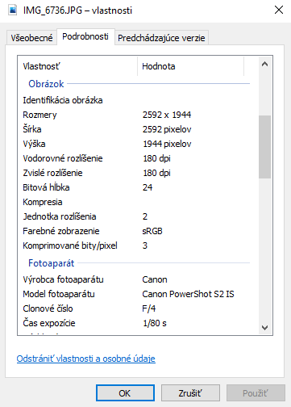
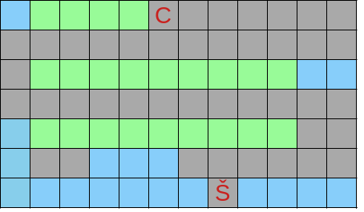
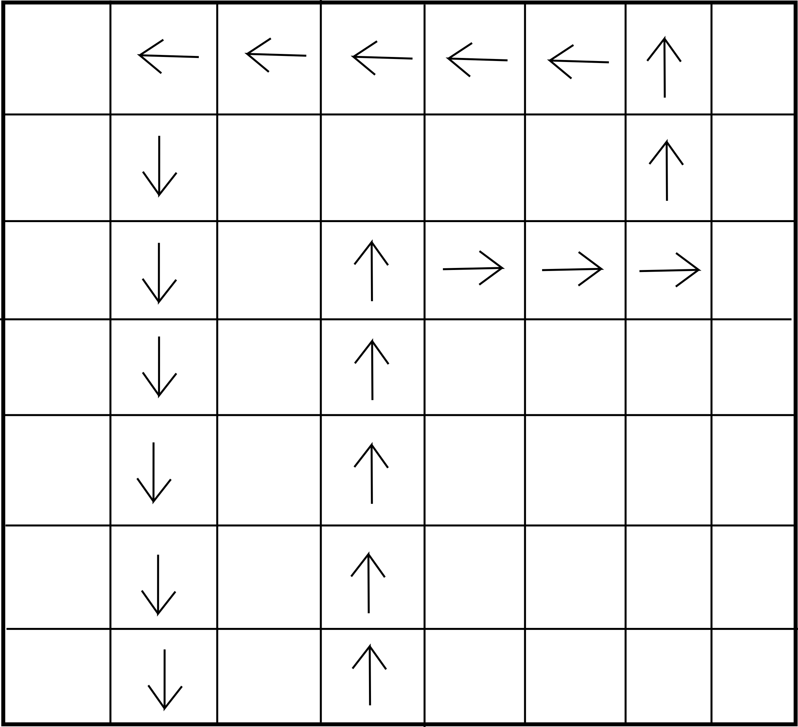

## Úlohy

1. Ako sa nazýva základná jednotka informácie? ____
2. Ako sa nazýva systém znakov na prenášanie informácie? ____
3. Najčastejšie používaný farebný model pri kódovaní obrázkov sa nazýva: ____
4. Premeňte medzi násobkami hodnôt údajov (zaokrúhlujte najviac na dve desatinné miesta, tam kde je to potrebné):
    - 460 kB = ____ kbit
    - 7 224 315 B = ____ MB
    - 985 kB = ____ B
    - 100 Mbit = ____ MB
5. Premeňte medzi násobkami hodnôt údajov (zaokrúhlujte najviac na dve desatinné miesta, tam kde je to potrebné):
    - 850 kB = ____ kbit
    - 3 064 230 B = ____ MB
    - 3,5 TB = ____ GB
    - 125 MB = ____ kB
    - 100 Gbit = ____ GB
6. Premeňte čísla medzi v zátvorkách uvedenými pozičnými číselnými sústavami:
    - 1212 (10) = ____ (2)
    - 4C (16) = ____ (2)
    - 001101000011 (2) = ____ (10)
7. Premeňte čísla medzi v zátvorkách uvedenými pozičnými číselnými sústavami:
    - 1325 (10) = ____ (2)
    - 1A2 (16) = ____ (2)
    - 2748 (10) = ____ (16)
    - 101100101 (2) =  ____ (10)
8. Doplňte paritný bit do binárneho čísla namiesto písmena P, ak používame párnu paritu. Napíšte výslednú spávu (celý binárny reťazec)
    - 1010011011110P011011 = ____
9. Doplňte paritný bit do binárneho čísla namiesto písmena X, ak používame nepárnu paritu. Vyjadrite výsledok ako dve hexadecimálne cifry.
    - 1001011X = ____
10. Vymenujte a stručne popíšte jednotlivé kroky postupu, ktoré sú potrebné na digitalizáciu zvukovej informácie: ________
11. Vypočítajte vzorkovaciu frekvenciu, na ktorú sme nastavili diktafón pri vyhotovovaní mono zvukovej nahrávky rečníckeho prejavu o dĺžke 5 minút formátu AIFF pri bitovej hĺbke 16 bitov.
Výsledný súbor má 18 750 kB.
    - Výsledok: ______ kHz
12. Vypočítajte veľkosť stereo audio nahrávky koncertu o dĺžke 45 minút a 22 sekúnd formátu WAV z prenosného diktafónu so vzorkovaciou frekvenciou 48 kHz, bitovou hĺbkou 16 bitov.
    - Výsledok: ______ kB
13. Stačí vzorkovacia frekvencia 96000 Hz na verné vzorkovanie ľubovoľného zvuku? Na základe akého faktu ste sa rozhodli?
    - áno
    - nie
14. Zistite akú veľkosť by mal nekomprimovaný súbor obrázka, ktorého metadáta vidíte na priloženej snímke obrazovky. Výsledok: ____ B

    
15. Zakódujte cestu robota po záhrade, keď vychádza z políčka označeného Š a končí na políčku označenom C, pričom ide najkratšou možnou cestou. Vie sa pohybovať iba v štyroch základných smeroch: S = hore, V = vpravo, J = dole,  Z = vľavo. Robot môže ísť iba po šedých políčkach (cesta). Modrá je voda a zelený je záhon. Komprimujte zostavenú cestu prostredníctvom RLE (Run-Length Encoding).
    - Cesta robota: ____
    - RLE komprimovaná cesta: ____
    
16. Dešifrujte uvedenú správu s použitím Cézarovej šifry s kľúčom X:
    - S WFJB PX PQXSXGR PKBERIFXZR
    - Otvorený text: ____
17. Zašifrujte uvedený otvorený text s použitím Cézarovej šifry s kľúčom S:
    - VLAK TA POCKA V NAJBLIZSEJ STANICI
    - Zašifrovaný text: ____
18. BONUS: Sčítajte čísla v binárnej sústave
    - 1111100 + 11010 = ____
19. Aký je rozdiel medzi rastrovým a vektorovým obrázkom? Napíšte aspoň dva súborové formáty rastrových obrázkov.
20. Nakreslite Von Neumannovu blokovú schému počítača.
21. Uveďte a popíšte tri parametre CPU počítača a napíšte k nim ich bežné hodnoty, aké majú súčasné zariadenia
22. Aké 3 kroky musíme vykonať pri digitalizácii zvuku a stručte popíšte princíp každého z nich.
23. Vymenujte jedno vstupné a jedno výstupné zariadenie osobného počítača
24. Zašifrujte text Cézarovej šifry s použitím svojho mena ako kľúča
25. Doplňte paritný bit do každého bajtu správy a výsledok ponechajte v hexadecimálnej sústave.
26. Vysvetlite princíp asymetrického šifrovania
27. Stiahnite si jeden textový súbor, jednu zvukovú nahrávku a jeden obrázok. Mali by ste ich vedieť zobraziť alebo prehrať u seba na počítači, v opačnom prípade si skúste stiahnuť iný súbor (súbory s príponami .txt, .jpg, .mp3 by mali všade fungovať).

    - Úloha č.1: Podľa vlastností stiahnutých súborov zistite ich skutočnú veľkosť a tiež vypočítajte veľkosť súborov podľa spôsobu, ktorý sme si demonštrovali na hodine. Napr. nás zaujíma aké rozlíšenie, bitovú hĺbku a veľkosť má obrázok v skutočnosti, a koľko má podľa výpočtu. (Pre podrobnejšie informácie o súboroch môžete dobrovoľne vyskúšať aj program Media Info. https://mediaarea.net/en/MediaInfo)
    - Úloha č.2: Stiahnite si obrázok "farby.png" a podľa farebnej pipety zistite RGB trojice čísel, ktoré majú jednotlivé farebné prúžky.
    - Úloha č.3 (dobrovoľná): Vyskúšajte si v programe Audacity (https://www.audacityteam.org/) čo sa stane s nahrávkou, keď zmeníte  vzorkovaciu frekvenciu (návod: https://www.youtube.com/watch?v=LzZxJ_QyOyc). Vypočujte si a zhodnoďte.

---

## Riešenia

1. Ako sa nazýva základná jednotka informácie? bit
2. Ako sa nazýva systém znakov na prenášanie informácie? kód
3. Najčastejšie používaný farebný model pri kódovaní obrázkov sa nazýva: RGB
4. Premeňte medzi násobkami hodnôt údajov (zaokrúhlujte najviac na dve desatinné miesta, tam kde je to potrebné):
    - 460 kB = 3680 kbit
    - 7 224 315 B = 6,89 MB
    - 985 kB = 1008640 B
    - 100 Mbit = 12,5 MB
5. Premeňte medzi násobkami hodnôt údajov (zaokrúhlujte najviac na dve desatinné miesta, tam kde je to potrebné):
    - 850 kB = 6800 kbit
    - 3 064 230 B = 2,92 MB
    - 3,5 TB = 3584 GB
    - 125 MB = 128000 kB
    - 100 Gbit = 12,5 GB
6. Premeňte čísla medzi v zátvorkách uvedenými pozičnými číselnými sústavami:
    - 1212 (10) = 10010111100 (2)
    - 4C (16) = 1001100 (2)
    - 001101000011 (2) = 835 (10)
7. Premeňte čísla medzi v zátvorkách uvedenými pozičnými číselnými sústavami:
    - 1325 (10) = 10100101101 (2)
    - 1A2 (16) = 110100010 (2)
    - 2748 (10) = ABC (16)
    - 101100101 (2) =  357 (10)
8. Doplňte paritný bit do binárneho čísla namiesto písmena P, ak používame párnu paritu. Napíšte výslednú spávu (celý binárny reťazec)
    - 1010011011110P011011 = 10100110111100011011
9. Doplňte paritný bit do binárneho čísla namiesto písmena X, ak používame nepárnu paritu. Vyjadrite výsledok ako dve hexadecimálne cifry.
    - 1001011X = 97
10. Vymenujte a stručne popíšte jednotlivé kroky postupu, ktoré sú potrebné na digitalizáciu zvukovej informácie: ________
11. Vypočítajte vzorkovaciu frekvenciu, na ktorú sme nastavili diktafón pri vyhotovovaní mono zvukovej nahrávky rečníckeho prejavu o dĺžke 5 minút formátu AIFF pri bitovej hĺbke 16 bitov.
Výsledný súbor má 18 750 kB.
    - Výsledok: 32 kHz
12. Vypočítajte veľkosť stereo audio nahrávky koncertu o dĺžke 45 minút a 22 sekúnd formátu WAV z prenosného diktafónu so vzorkovaciou frekvenciou 48 kHz, bitovou hĺbkou 16 bitov.
    - Výsledok: 510375 kB
13. Stačí vzorkovacia frekvencia 96000 Hz na verné vzorkovanie ľubovoľného zvuku? Na základe akého faktu ste sa rozhodli?
    - áno
14. Zistite akú veľkosť by mal nekomprimovaný súbor obrázka, ktorého metadáta vidíte na priloženej snímke obrazovky. Výsledok: 15116544 B
15. Zakódujte cestu robota po záhrade, keď vychádza z políčka označeného Š a končí na políčku označenom C, pričom ide najkratšou možnou cestou. Vie sa pohybovať iba v štyroch základných smeroch: S = hore, V = vpravo, J = dole,  Z = vľavo. Robot môže ísť iba po šedých políčkach (cesta). Modrá je voda a zelený je záhon. Komprimujte zostavenú cestu prostredníctvom RLE (Run-Length Encoding).
    - Cesta robota: SVVVSSZZZZZZZZZZSSVVVVVS
    - RLE komprimovaná cesta: S1V3S2Z10S2V5S1
    
16. Dešifrujte uvedenú správu s použitím Cézarovej šifry s kľúčom X:
    - S WFJB PX PQXSXGR PKBERIFXZR
    - Otvorený text: V ZIME SA STAVAJU SNEHULIACI
17. Zašifrujte uvedený otvorený text s použitím Cézarovej šifry s kľúčom S:
    - VLAK TA POCKA V NAJBLIZSEJ STANICI
    - Zašifrovaný text: NDSC LS HGUCS N FSBTDARKWB KLSFAUA
18. BONUS: Sčítajte čísla v binárnej sústave
    - 1111100 + 11010 = 10010110
