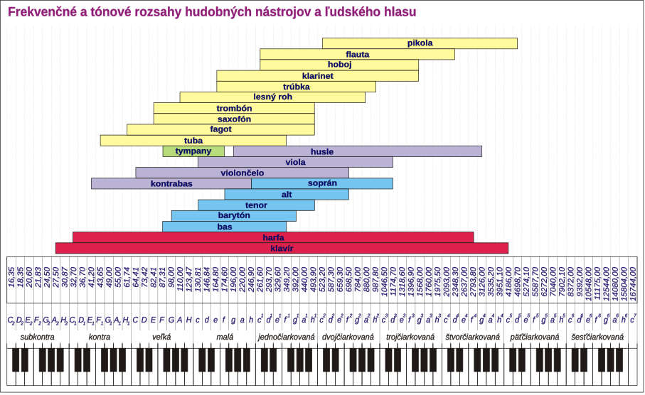

## Kódovanie textu

1. Zistite pomocou ASCII tabuľky aký text je kódovaný touto postuponosťou bajtov:
    > 1000010 1110010 1100001 1110100 1101001 1110011 1101100 1100001 1110110 1110011 1101011 1111001 100000 1101000 1110010 1100001 1100100
2. Spočítajte z koľkých bitov sa správa skladá

## Zvukový súbor

1. Akú veľkosť má 20 sekundová zvuková nahrávka so vzorkovaciou frekvenciou 48 000 Hz a bitovou hĺbkou 16 bitov. Odpoveď vyjadrite v kB (nie kbit).
2. Určite veľkosť nekomprimovaného zvukového súboru nahrávky telefónneho hovoru o dĺžke 3 minúty 20 sekúnd so vzorkovaciou frekvenciou 8 KHz, bitovou hĺbkou 8 bitov, mono. Odpoveď uveďťe v MB (Megabajtoch) zaokruhlené na 2 desatinné miesta.
3. Akú minimálne vzorkovaciu frekvenciu potrebujeme na záznam klarinetu? (nápoveda: využite Nyquistovu vetu o vzorkovaní)
4. Akú veľkosť bude mať stereo nahrávka z úlohy 2c, keď máme nekomprimovaný 14 sekundový záznam s bitovou hĺbkou 24 bitov?

## Rastrová grafika

1. Vypočítajte veľkosť čiernobielého (nie monochromatického!) rastrového obrázka s rozmermi 32 x 32 pixelov v odtieňoch šedej.
2. Chceme kvalitne zoskenovať starú čiernobielu fotografiu a na USB kľúci nám zostáva 40 MB voľného miesta. Skener nastavíme na rozlíšenie 6000 x 4000 pixelov a TrueColor.
    - Koľko megapixelov má vysledný obrázok?
    - Akú veľkosť bude mať výsledný sken v MB?
    - Zmestí sa nám obrázok na USB kľúč?
    - Aké nastavenie môžeme zmeniť, aby sme zachovali kvalitu skenu, ale zmenšili veľkosť obrázka, tak aby sa zmestil na USB kľúč?

---

## Riešenia

1. Úloha
    1. Bratislavsky hrad
    2. 17 znakov = 17 B (bajtov) 17 * 8 = 136b (/alebo aj 17 * 7 = 119b)
2. Úloha
    > 48 000  * 16 * 20 = 15 360 000 b
    > 48 000 * 2 * 20 = 1 920 000 B
    > 1 920 000 B / 1024 = 1875 kB

