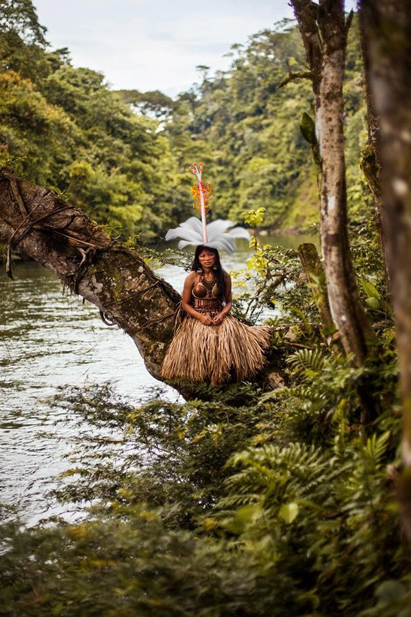
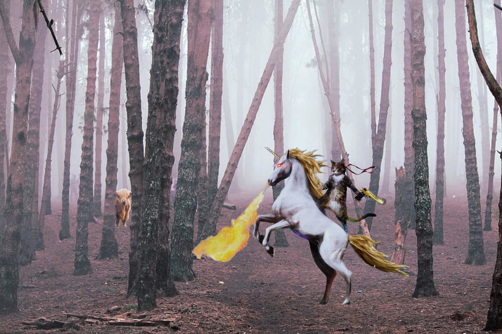
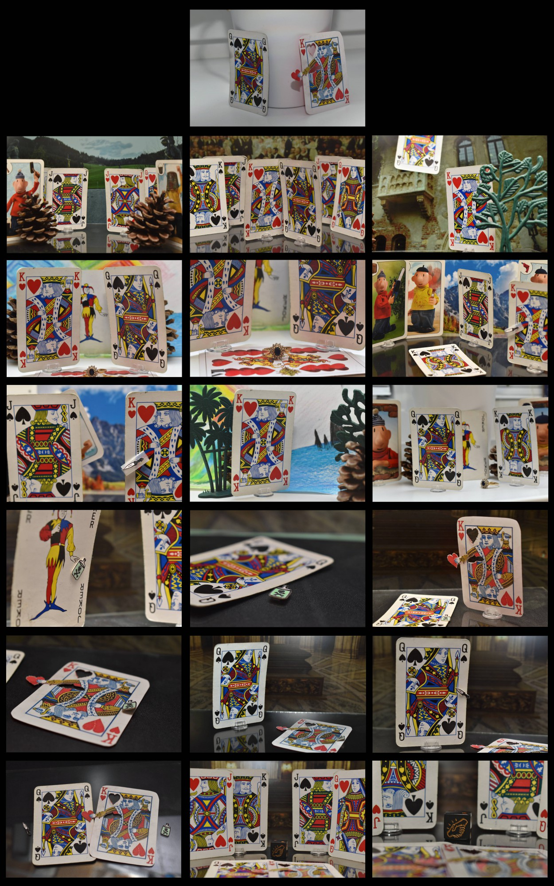
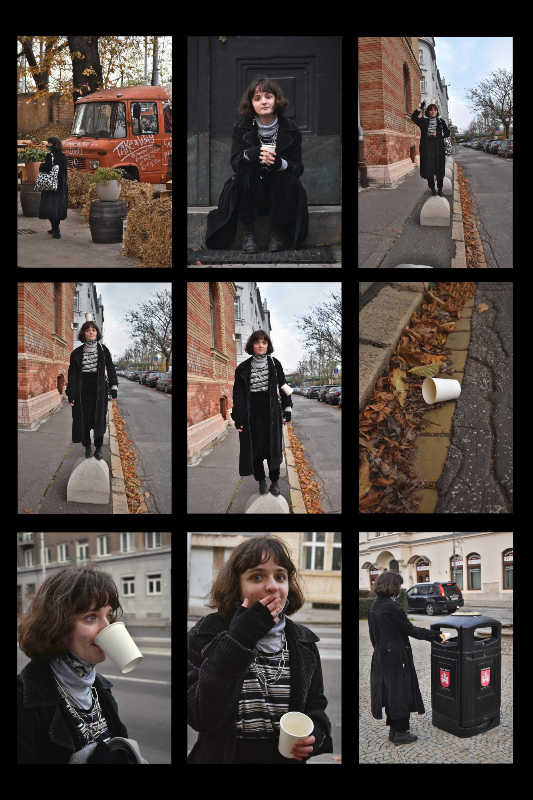
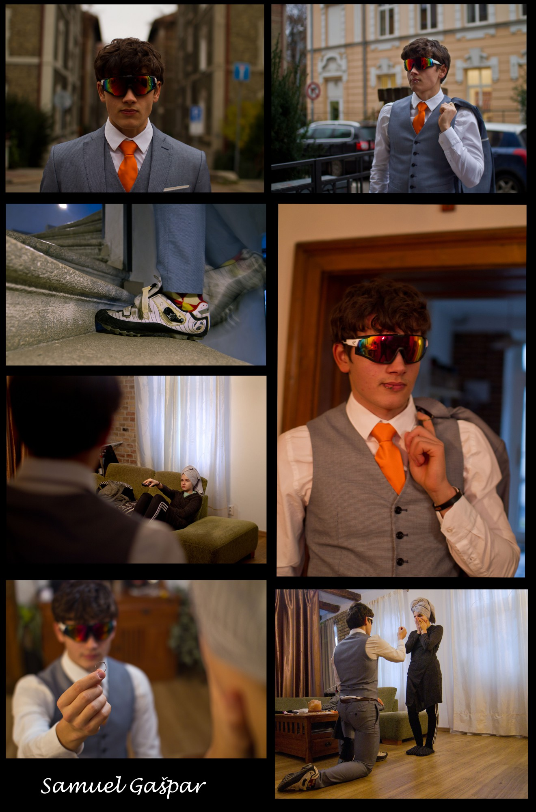

Neoodeliteľným prvkom multimediálneho obsahu súčasnosti sú všeljaké obrázky, objavujúce sa najčastejšie v podobe fotografii, ale aj ako ilustrácie, či diagramy. Ako sa hovorí: obrázok je hoden aj tisíc slov. Prvým krokom je vybrať, vytvoriť alebo odfotiť požadovaný objekt záujmu, ktorý sa prirodzene odvíja od cieľovej tématiky. Napriek všetkému úsiliu sa stáva, že je nutné častokrát grafiku prispôsobovať alebo vylepšiť a z toho dôvodu siahneme po schopnom grafickom editore s potrebnými nástrojmi, v našom prípade je ním [GIMP](https://www.gimp.org/).

## Úloha
Vyberte si jeden z ponúkaných variant projektu, ktorú spracujete vhodne zvolenou vlastnou témou s použitím vyžadovaných postupov a nástrojov.

## Výsledok
- všetky zdrojové obrázky,
- jeden vyexportovaný obrázok typu JPG,
- súbor projektu programu GIMP (XCF) s kartami všetkých upravovaných obrázkov aj výslednej koláže.

## Variant A: Fotopríbeh
Umenie vizuálneho rozprávačstva narozdiel od písaného príbehu sprostredkúva dej čisto prostredníctom sekvencie obrázkov bez priamej možnosti zakomponovať doplňujúci text.

**Odfotografujte minimálne 4 fotografie**, ktoré budú na seba logicky nadväzovať a tento sled fotiek ako celok opíše zvolenú tému príbehu. Zamerajte sa na voľbu správnej kompozície a expozície, prípadne ak máte možnosti, tak nastavte závierku a clonu, aby ste dosiahli požadovaný vizuálny efekt.

**Pre každý obrázok realizuje vhodný orez a farebné korekcie** (napr.: jas, kontrast, sýtosť, farbený odtieň, vyváženie farieb). **Sériu fotografií zložte v GIMPe** do jedného výsledného obrázku.

**Zdroje:**

- [Príklad na fotopríbeh z ePhoto](https://img.ephoto.sk/data/users//23093/photos/166ea0959acad4f4c7c722a91160cb6fc20a4908_large.jpg)
- [Akrobat - fotopríbeh](https://bahnova.blog.sme.sk/c/252156/Akrobat-fotopribeh.html)
- [Ako sériou fotiek zachytiť príbeh?](https://digital-photography-school.com/shoot-sequence-photos-capture-story/)

## Variant B: Fotomontáž
Zložením rôznorodých fotografií dokážeme poskladať výjav, ktorý by len ťažko realizovateľný v skutočnom svete. Takéto obrázky nachádzajú uplatnenie v širokej škále sfér od produktovej reklamy na bilboarde až po ilustráciu pre sci-fi blog.

**Vyhľadajte na internete alebo vo fotobankách aspoň 3 obrázky**, ktoré s využitím nástrojov na **výrez, vrstiev, masiek a farebných korekcií** poskladáte do verohodnej **koláže**. Môžete pridať predmety na existujúce pozadie alebo vytvoriť niečo úplne nerealistické, až komické. Dôležité je, aby zvolené prvky do seba, čo najlepšie zapadali a tiež, aby ste našli obrázky s takou licenciou, ktorá dovoľuje popísané úpravy (napr. [Creative Commons](https://creativecommons.org/licenses/))

**Zdroje:**

- [Obrázky pod licenciou Creative Commons](https://search.creativecommons.org/)
- [Google obrázky](https://images.google.com/)
- [Pixabay - banka obrázkov](https://pixabay.com/sk/)
- [Pexels - banka obrázkov](https://www.pexels.com/sk-sk/)
- [Návod - ako vytvoriť fotomontáž?](https://www.adobe.com/creativecloud/photography/discover/photomontage.html)

## Galéria minulých projektov

### Fotomontáž
{ width="250" }
{ width="250" }
{ width="250" }
{ width="250" }

### Fotopríbeh
{ width="250" }
{ width="250" }
{ width="250" }
{ width="250" }
{ width="250" }