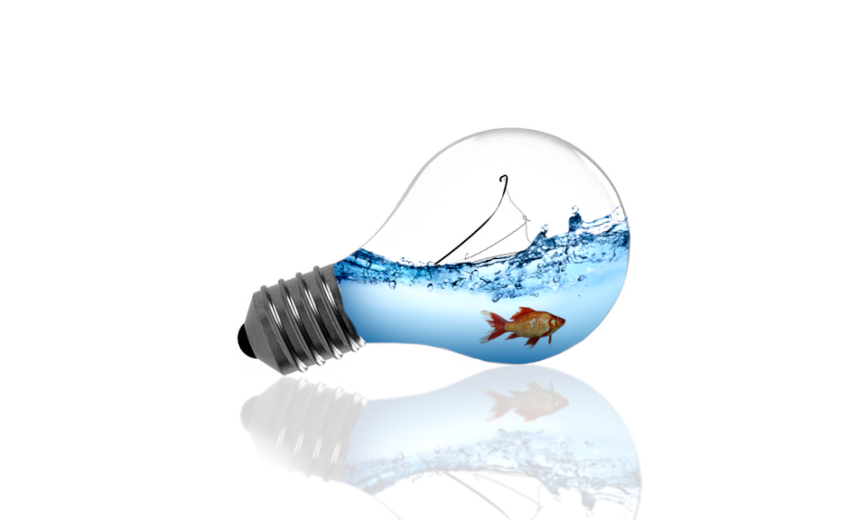
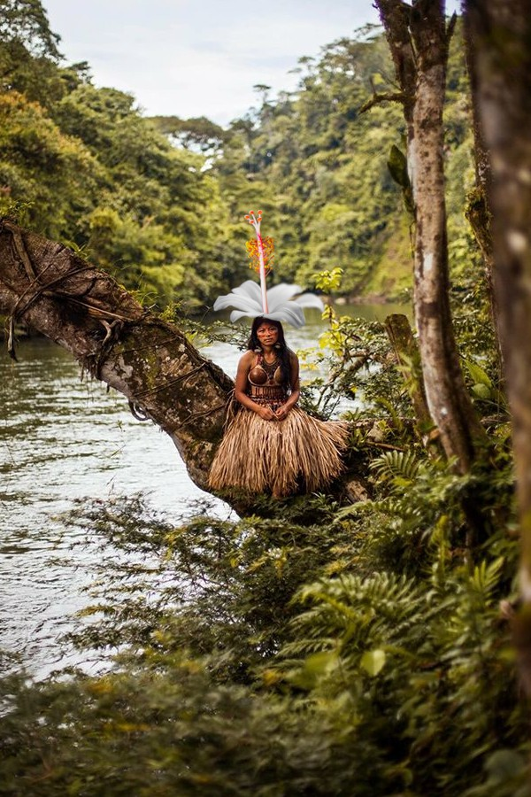
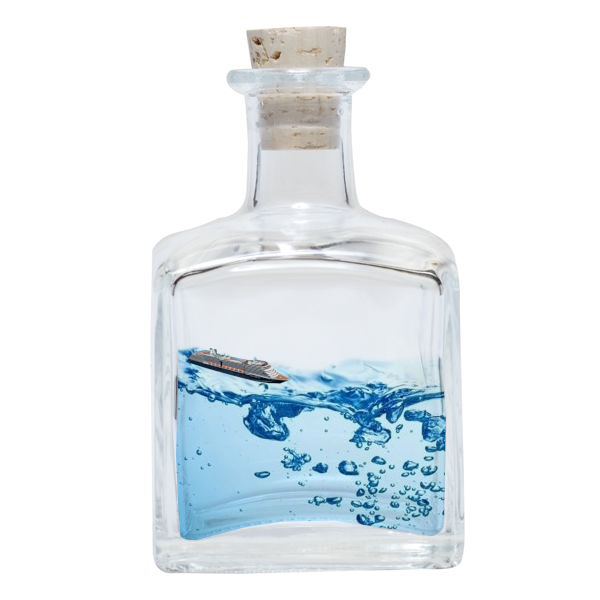
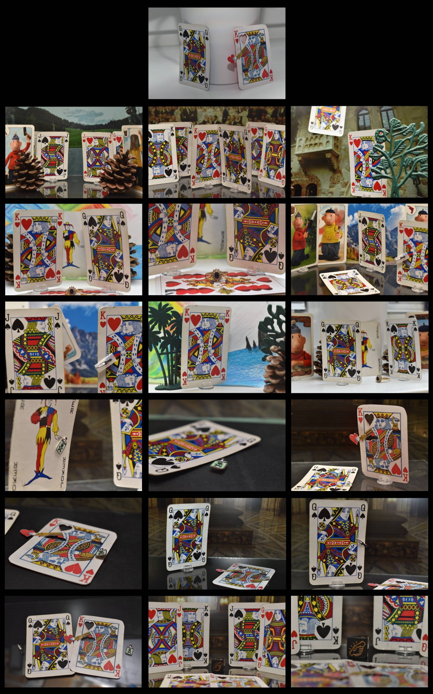
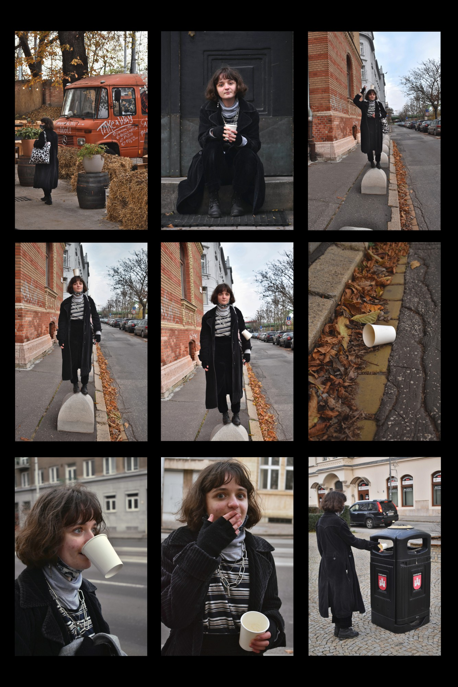
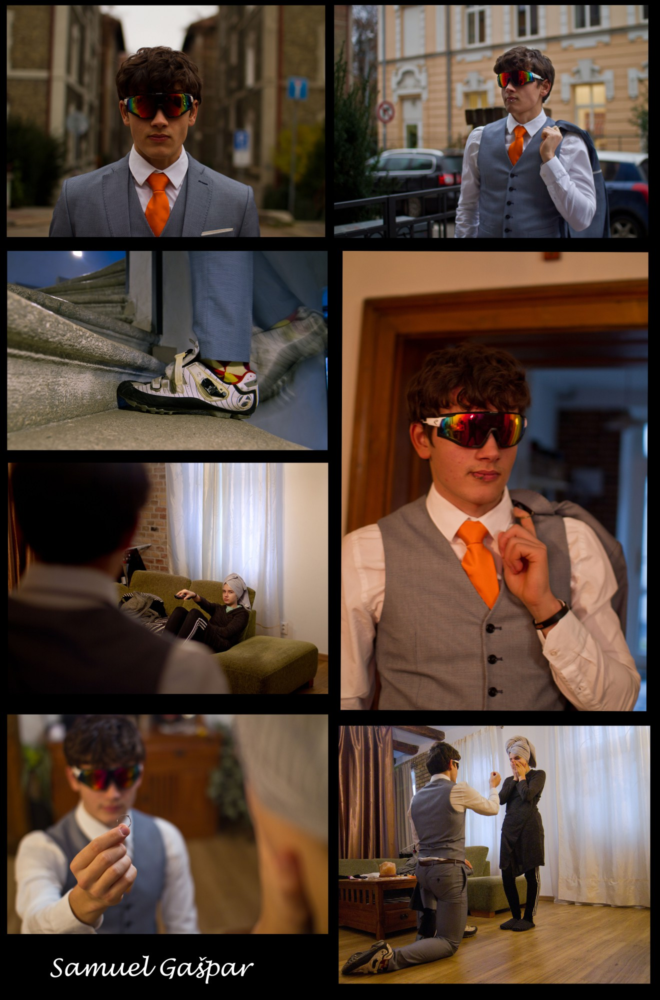
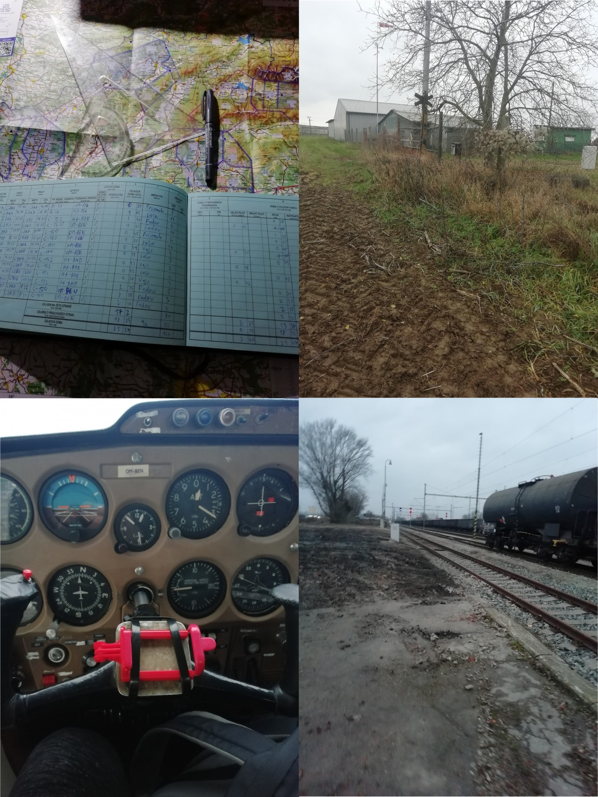

## Úprava fotografií v GIMP

1. **Digitálna fotografia** - nastavenia fotoaparátu - demonštrácia analógový Minolta fotoaparát so Zoom objektívom, Fotodióda - na multimeter, na Arduino GND a A0 pin.
2. **Farebné korekcie** - Uprav jeden horšie vyzerajúci obrázok, ktorý si vyberieš v *Učebné materiály > ColorGrading* alebo *Krajinka* alebo *NightPhotography*. Popíš a odôvodni úpravy, ktoré si spravil.
3. **Súborové formáty** - Odfotografuj dva predmety (smartfónom alebo fotoaparátom) - v interiéri, v exteriéri. Z EXIF údajov obrázkov vyčítajte v počítači nasledujúce údaje:
    - model fotoaparátu,
    - formát súboru,
    - rozlíšenie (výška x šírka, megapixele),
    - ohnisková vzdialenosť objektívu (aj 35mm ekvivalent),
    - rýchlosť závierky (resp. expozičný čas),
    - clonové číslo,
    - ISO.
4. **Vrstvy**:
    - Štvorce nad sebou s rôznymi farbami
    - Vystrihnutie a výmena pozadia
5. **Masky vrstiev**
    - Výmena pozadia cez masku
    - Desaturácia a farebné kvety v arborétu
    - HDR z jednej fotografie - duplikácia a rôzne tonality (jednofarebná maska, brush, gradient)
    - HDR z viacerých fotografií - lícovanie, maska odtieňovej šedej
    - Odfotografuj 3 rovnaké fotky s rôznymi úrovňami osvetlenia (exponované pre krajinu, vyvážene, pre oblohu). Poskladaj v GIMPe vlastné už nafotené obrázky viacerých expozícií jednej scény do HDR fotografie s využitím masiek vrstiev. V prípade potreby ich na seba nalícuj.
4. **Odkazy na GIMP zdroje**
    - [Davies Media Design](https://www.youtube.com/playlist?list=PL_7viLFyJ7sAnEAuzh8ltHGw5WcDW6LLz)
5. **Lícovavanie a Desaturácia**
    - farebné kvety v arborétu
6. **Retuš starých fotografií**
7. **Filtre** 
    - Rozostrenie
    - Doostrenie
    - Rozpixelovanie a rôzne typy efektov
8. Vyberte si z fotografiu z poskytnutých (alebo si nájdite / použite vlastné) a realizujte jednu z úprav:
    - **Odfarbenie**  - čiernobiele/sépia/iný monochromatický tón a zvýraznenie farbami iba určitej dôležitej časti (masky)
    - **Retuš rušivej časti obrázka**  - výrazné škrvrny / dopravná značka / elektrické vedenie, ...)
9. **Projekty**:
    - fotomontáž (poskladanie prvkov z viacerých fotografií)
    - nafotenie fotopríbehu (úprava farieb nafotených fotografií)
10. **Fotografie s CC licenciami**
    - [CC](https://creativecommons.org/licenses/)
    - [Pixabay](https://pixabay.com/sk/)
    - [Pexels](https://www.pexels.com/sk-sk/)

11. **Vektorová grafika**
    - Nakreslite v Inkscape vektorovú topografickú mapu vymyslenej krajiny s využitím hlavne vlastnosti nástroja path. Mapa musí vypĺňať celú stránku A4 na šírku a obsahovať všetky bežne sa vyskytujúce krajinné prvky - cesty, ulice, obydlia, vodné toky a plochy, vrchy (s vrstevnicami a tieňovaním výšky). Nezahŕňajte mierku ani súradnicovú mriežku.

## Vytváranie animácii v Pencil2D

1. **Poskladaj krátku animáciu (min. 5 snímkov)** z výrezov fotografií najdených na internete. V animácii budú vystupvať aspoň 2 postavičky a nepohyblivé pozadie.
Téma je voľná, ale ako námet môžeš použiť scénu z rozprávky.
2. **Vytvor animáciu pohybu (min. 10 snímkov)**:
    - Nakreslenie rastu kvetu, vkladanie prednakresených obrázkov
    - Smajlík
    - Auto/Vlak
    - Chodiaci panáčik
    - Skákajúci panáčik
    - Pád kvapky
    - Západ slnka
    - Oblaky po oblohe stmavujúce sa na dážď
    - Rast kvetu
    - Ročné obdobia na strome
    - Akvárium
    - Závodné auto na trati zo vzduchu
    - Realizácia fázovej animácie
    - stop motion, jednoduchá animácia
3. **Pripravte si krátky scénar príbehu pre vlastnú stop motion (fázovú) animáciu** (slovným opisom alebo storyboardom) a rekvizity. Podobne ako pri ostatných animáciach stačí pre jedinú scénu.

## Projekt 

Neoodeliteľným prvkom multimediálneho obsahu súčasnosti sú všeljaké obrázky, objavujúce sa najčastejšie v podobe fotografii, ale aj ako ilustrácie, či diagramy. Ako sa hovorí: obrázok je hoden aj tisíc slov. Prvým krokom je vybrať, vytvoriť alebo odfotiť požadovaný objekt záujmu, ktorý sa prirodzene odvíja od cieľovej tématiky. Napriek všetkému úsiliu sa stáva, že je nutné častokrát grafiku prispôsobovať alebo vylepšiť a z toho dôvodu siahneme po schopnom grafickom editore s potrebnými nástrojmi, v našom prípade je ním [GIMP](https://www.gimp.org/).

## Úloha
Vyberte si jeden z ponúkaných variant projektu, ktorú spracujete vhodne zvolenou vlastnou témou s použitím vyžadovaných postupov a nástrojov.

## Výsledok
- všetky zdrojové obrázky,
- jeden vyexportovaný obrázok typu JPG,
- súbor projektu programu GIMP (XCF) s kartami všetkých upravovaných obrázkov aj výslednej koláže.

## Variant A: Fotopríbeh
Umenie vizuálneho rozprávačstva narozdiel od písaného príbehu sprostredkúva dej čisto prostredníctom sekvencie obrázkov bez priamej možnosti zakomponovať doplňujúci text.

**Odfotografujte minimálne 4 fotografie**, ktoré budú na seba logicky nadväzovať a tento sled fotiek ako celok opíše zvolenú tému príbehu. Zamerajte sa na voľbu správnej kompozície a expozície, prípadne ak máte možnosti, tak nastavte závierku a clonu, aby ste dosiahli požadovaný vizuálny efekt.

**Pre každý obrázok realizuje vhodný orez a farebné korekcie** (napr.: jas, kontrast, sýtosť, farbený odtieň, vyváženie farieb). **Sériu fotografií zložte v GIMPe** do jedného výsledného obrázku.

**Zdroje:**

- [Príklad na fotopríbeh z ePhoto](https://img.ephoto.sk/data/users//23093/photos/166ea0959acad4f4c7c722a91160cb6fc20a4908_large.jpg)
- [Akrobat - fotopríbeh](https://bahnova.blog.sme.sk/c/252156/Akrobat-fotopribeh.html)
- [Ako sériou fotiek zachytiť príbeh?](https://digital-photography-school.com/shoot-sequence-photos-capture-story/)

## Variant B: Fotomontáž
Zložením rôznorodých fotografií dokážeme poskladať výjav, ktorý by len ťažko realizovateľný v skutočnom svete. Takéto obrázky nachádzajú uplatnenie v širokej škále sfér od produktovej reklamy na bilboarde až po ilustráciu pre sci-fi blog.

**Vyhľadajte na internete alebo vo fotobankách aspoň 3 obrázky**, ktoré s využitím nástrojov na **výrez, vrstiev, masiek a farebných korekcií** poskladáte do verohodnej **koláže**. Môžete pridať predmety na existujúce pozadie alebo vytvoriť niečo úplne nerealistické, až komické. Dôležité je, aby zvolené prvky do seba, čo najlepšie zapadali a tiež, aby ste našli obrázky s takou licenciou, ktorá dovoľuje popísané úpravy (napr. [Creative Commons](https://creativecommons.org/licenses/))

**Zdroje:**

- [Obrázky pod licenciou Creative Commons](https://search.creativecommons.org/)
- [Google obrázky](https://images.google.com/)
- [Pixabay - banka obrázkov](https://pixabay.com/sk/)
- [Pexels - banka obrázkov](https://www.pexels.com/sk-sk/)
- [Návod - ako vytvoriť fotomontáž?](https://www.adobe.com/creativecloud/photography/discover/photomontage.html)

## Galéria minulých projektov

### Fotomontáž
{ width="250" }
{ width="250" }
{ width="250" }
{ width="250" }

### Fotopríbeh
{ width="250" }
{ width="250" }
{ width="250" }
{ width="250" }
{ width="250" }

