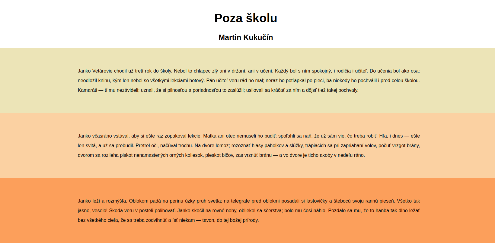

## Ukážka zápisu CSS štýlov
Poradie špecifickosti selektora od najnižšej po najväčšiu dôležitosť: značka, trieda, identifikátor
```css
<style>
// Selektor značky (<p>)
p {
    font-weight: bold;
}

// Selektor triedy (class="obrazok")
.obrazok {
    margin: 10px;
}

// Selektor identifikítoru (id="uvod")
#uvod {
    text-align: center;
    color: red;
}

// Pseudoselektor na nadídenie myšou
a:hover {
    cursor: pointer;
}
</style>
```

Použitie CSS súboru v HTML
```html
<head>
    <link rel="stylesheet" href="styles.css">
</head>
```

## Cvičenie

Pracujte s jedným z vašich článkov v HTML pre školský časopis. Článok obsahuje nadpisy, odseky, obrázky.

1. Nastav textu v odseku písmo Arial, veľkosti 13 pixelov, s riadkovaním 2, o trochu hrubším písmom (nie úplne bold), tmavosivou farbou, zarovnanie do bloku.
2. Nastavte veľkosť nadpisu prvej úrovne na 40 pixelov a nadpisu druhej úrovne na 25 pixelov s písmom Arial, zarovnanie na stred.
3. Vertikálne rozostupy medzi odsekmi budú aspoň 30 pixelov.
4. Každý odsek podfarbi iným odtieňom z farebnej palety. Napr. spôsobom ako je na znázornené tu: 
5. Nastav jednému obrázku obtekanie textu zľava s rozostupom medzi textom a obrázkom aspoň 10 pixelov.
6. Pod obrázkom umiesni jeho krátky popis šikmým písmom o veľkosti 11 pixelov.

