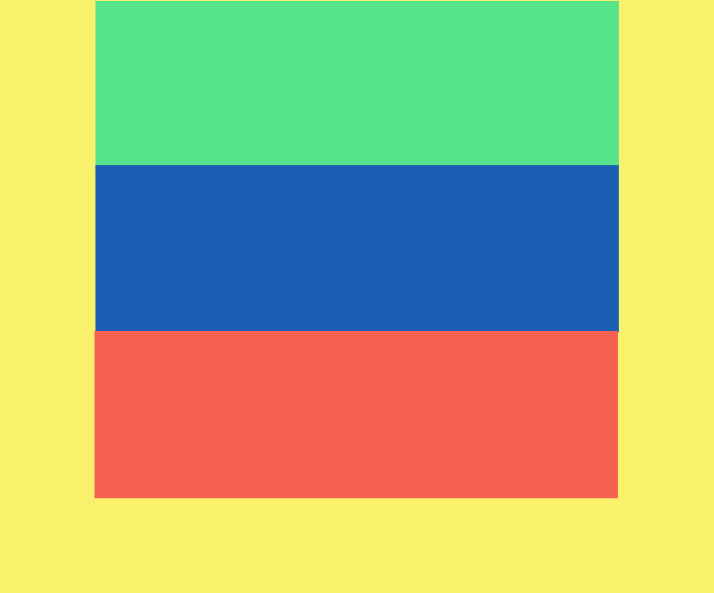
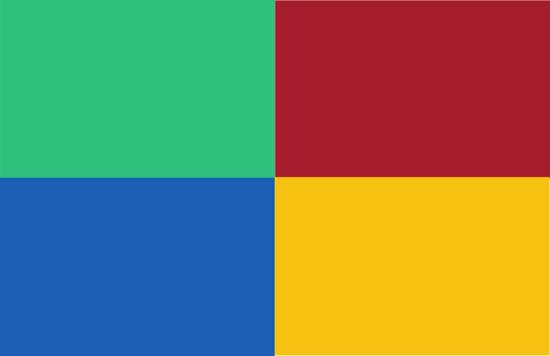
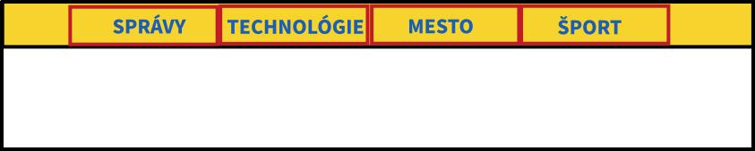

## Kapitola č.1 - Box Model

### Ukážka zápisu CSS štýlov
Poradie špecifickosti selektora od najnižšej po najväčšiu dôležitosť: značka, trieda, identifikátor
```css
<style>
// Selektor značky (<p>)
p {
    font-weight: bold;
}

// Selektor triedy (class="obrazok")
.obrazok {
    margin: 10px;
}

// Selektor identifikítoru (id="uvod")
#uvod {
    text-align: center;
    color: red;
}

// Pseudoselektor na nadídenie myšou
a:hover {
    cursor: pointer;
}
</style>
```

Použitie CSS súboru v HTML
```html
<head>
    <link rel="stylesheet" href="styles.css">
</head>
```

### Cvičenie

Pracujte s jedným z vašich článkov v HTML pre školský časopis. Článok obsahuje nadpisy, odseky, obrázky.

1. Nastav textu v odseku písmo Arial, veľkosti 13 pixelov, s riadkovaním 2, o trochu hrubším písmom (nie úplne bold), tmavosivou farbou, zarovnanie do bloku.
2. Nastav veľkosť nadpisu prvej úrovne na 40 pixelov a nadpisu druhej úrovne na 25 pixelov s písmom Arial, zarovnanie na stred.
3. Vertikálne rozostupy medzi odsekmi budú aspoň 30 pixelov.
4. Každý odsek podfarbi iným odtieňom z farebnej palety. Napr. spôsobom ako je na znázornené tu: 
5. Nastav jednému obrázku obtekanie textu zľava s rozostupom medzi textom a obrázkom aspoň 10 pixelov.
6. Pod obrázkom umiesni jeho krátky popis šikmým písmom o veľkosti 11 pixelov.


## Kapitola č.2 - Flex Box

### Ukážka zápisu
- [Obrázkový návod](https://css-tricks.com/snippets/css/a-guide-to-flexbox/)


### Cvičenie

Vytvor si nový HTML dokument. Obsahuje dva HTML elementy `<div>`, každý s rovnakou veľkosťou a inou farbou. Predloha:
```html
<html>
    <head>
        <style>
            .obdlznik {
                display: block;
                width: 50%;
                height: 200px;
            }
            #o1 {
                background-color: green;
            }
            #o2 {
                background-color: blue;
            }
        </style>
    </head>
    <body>
        <div class="obdlznik" id="o1"></div>
        <div class="obdlznik" id="o2"></div>
    </body>
</html>

```


1. **Tri obĺžniky vedľa seba** - Zmeň prelohu, aby sa tri obdĺžniky rovnakej šírky nachádzali vedľa seba v jednom riadku. Dokopy budú tri obĺžniky zaberať vždy celú šírku obrazovky, aj po zmene veľkosti okna prehliadača.

2. **Zarovnanie na stred** - Nastav stránku jednofarebné pozadie. Tri obĺžniky z predošlej úlohy budú umiestnené pod sebou, budú zaberať 60% celkovej šírky obrazovky a budú horizontálne zarované na stred stránky. 

3. **Zarovnanie textu** - Natiahnite farebné obĺžniky na celú šírku a len text v nich bude zaberať 60% šírky a bude zarovnaný na stred. Zarovananie samotného textu je do bloku.

4. **Tlačidlá** - Štyri obdĺžiky budú rovomerne vypĺňať okno prehliadača na výšku aj na šírku. Po kliknutí na obĺžnik sa odkazom dostaneme na inú stránku ľubovoľného online časopisu alebo novín. Každý štvorec bude odkazovať na inú stránku.
    - Rozšírenie: presne do stredu každého obdĺžnika umiestnite ikonku napr. z [FontAwesome](https://fontawesome.com/icons) alebo [Material Icons](https://fonts.google.com/icons). 

5. **Horizontálne menu** - Naštýluje predlohu HTML menu, tak aby boli odkazy umiestnené vedľa seba v jednom riadku. Odkazy majú byť klikateľné ako obdĺžniky.  Predloha:
```html
<nav>
    <ul>
        <li>
            <a href="https://hnonline.sk/finweb">Správy</a>
        </li>

        <li>
            <a href="https://zive.aktuality.sk/ai/">Technológie</a>
        </li>
        <li>
            <a href="https://www.bratislavskenoviny.sk/">Mesto</a>
        </li>
        <li>
            <a href="https://www.cas.sk/sport/">Šport</a>
        </li>
    </ul>
</nav>
```
6. **Vertikálne menu** - Upravte menu z predošlej úlohy, aby boli odkazy umiestnené naľavo obrazovky a pod sebou.


